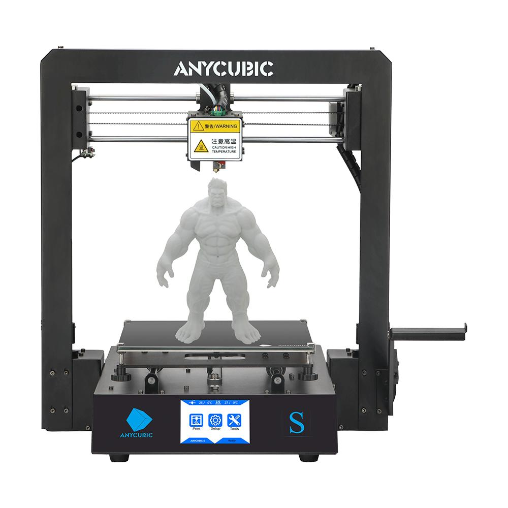
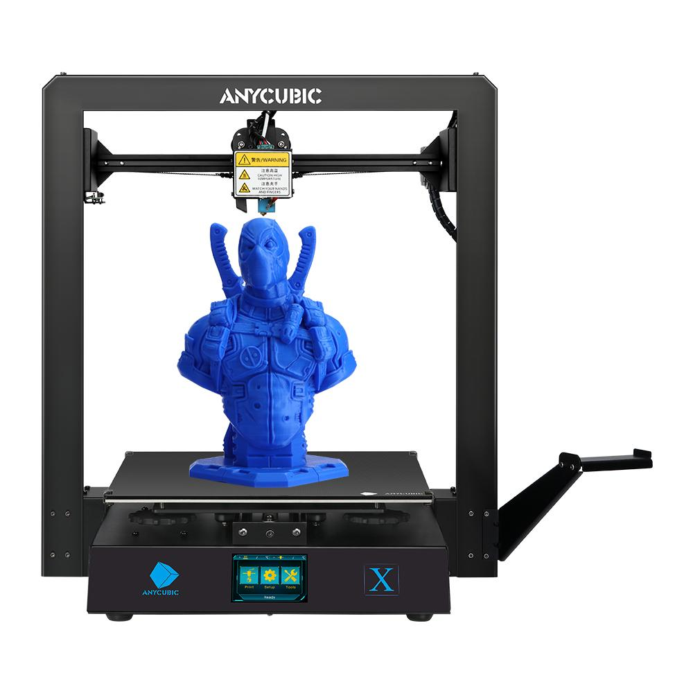
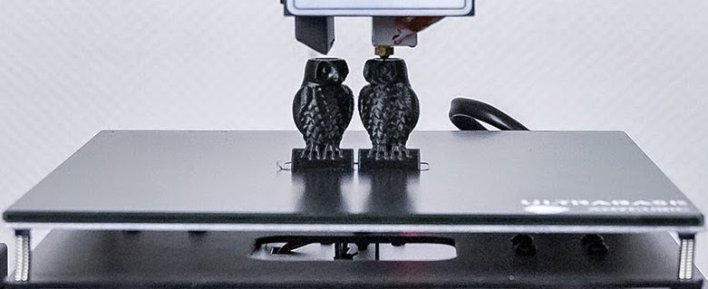

## Analisi, punti in comune e differenze

Negli ultimi anni abbiamo assistito ad una uscita sul mercato di un gran numero di modelli di stampanti 3D a filamento con un budget accessibile a tutte le tasche. In questo mare di modelli, alcuni spiccano per avere un rapporto qualità/prezzo e un'attenzione ai dettagli superiore.

Mi riferisco ad esempio a stampanti come la **Ender 3** della casa Creality o la **Anycubic I3 Mega**.

I nuovi modelli **[Anycubic I3 Mega S](https://amzn.to/3LIqgKh)** e [**Anycubic Mega X**](https://amzn.to/2Ji2J8z) sono un _upgrade_ della popolarissima **[Anycubic I3 Mega](https://amzn.to/36e3Rmk).**

In seguito puoi trovare la mia **recensione** di queste due stampanti, con un'**analisi delle loro caratteristiche principali** e i loro **punti in comune** e **differenze**. Premetto subito che la grossa differenza tra le due è la **dimensione del volume di stampa**, la Mega X è tra le stampanti con l'area più grande nella sua fascia di prezzo.

#### [ANYCUBIC I3 MEGA S](https://amzn.to/3LIqgKh)

[VEDI su AMAZON](https://amzn.to/3LIqgKh)

#### [ANYCUBIC MEGA X](https://amzn.to/2Ji2J8z)

[VEDI su AMAZON](https://amzn.to/2Ji2J8z)

\[toc\]

## Caratteristiche principali

### Montaggio e struttura

Entrambe le stampanti sono **pre-assemblate**, arrivano cioè praticamente montate al 95%.

La stampante é composta da due parti:

- La **base**, contenente tutte l'elettronica e il piatto
- Il **braccio verticale**, con l'estrusore e l'_hotend_

Per montare la stampante sará quindi soltanto necessario unire le due parti insieme attraverso 8 viti e collegare 3 cavi elettrici.

Altre 4 viti per unire alla base il braccio porta bobina e la stampante sará pronta per la fase successiva: la calibratura del piatto.

La **calibrazione del piatto** é manuale su quattro punti, le manopole di plastica sono grandi e comode e rendono l'operazione più facile e veloce rispetto ad altre stampanti dove bisogna contorcersi per arrivare a girare una piccola rotellina.

La struttura é tutta in metallo, cosa che rende questi modelli molto solidi e stabili.

In entrambe le stampanti **l'asse Z**, con doppio motore, é dotato di **due fine corsa indipendenti**, ciascuno con un bullone per la calibrazione. Durante la prima calibrazione si imposta una posizione orizzontale in cui vengono attivati entrambi i fine corsa. In questo modo se per qualsiasi motivo si dovesse inclinare la struttura che regge l'estrusore, l'asse Z rimarrà comunque sempre livellato.

Sono stampanti abbastanza **rumorose**, é possibile migliorare questo aspetto cambiando le ventole di raffreddamento.

### Piatto

Un punto di forza di queste stampanti è il **piatto riscaldato _ultrabase_**, brevettato da Anycubic.

É un **piano in vetro** con un particolare _coating_ che ha delle microperforazioni che permette agli oggetti di rimanere ben adesi in fase di stampa, quando il piano è caldo, e di staccarsi perfettamente una volta raffreddato.

Con questo tipo di piano sconsiglio vivamente di usare lacca o altri tipi di adesivo per facilitare la tenuta, se si hanno problemi di adesione pulire bene con un panno e alcool isopropilico. Soprattutto se la stampante è nuova, vi potrà sembrare che il piatto sia pulito ma in realtà accade spesso che ci siano residui di produzione che impediscono al filamento di aderire.

Sempre a riguardo del piatto, purtroppo il piatto di vetro è incollato al piatto di alluminio sottostante, oltre che con delle pinze a brugola. In caso di usura e conseguente necessità di sostituire il piatto, l’adesivo rende il lavoro inutilmente fastidioso. Questo inconveniente si avrá comunque solo la prima volta, perchè le clip sono più che sufficienti a tenere fermo il piatto e non è assolutamente necessario rimettere altro adesivo in seguito alla sostituzione.

### Estrusore

Un'altra caratteristica che hanno entrambe le stampanti rispetto al precendente modello della stessa casa é l'introduzione di un **estrusore di tipo _Titan_**, infatti il filamento non viene piú tirato direttamente dal motore, ma **spinto** attraverso un ingranaggio.

In questo modo si migliora notevolmente l'alimentazione del filamento e questo rende il processo di stampa piú fluido e uniforme, aiutando anche ad aumentare la precisione.

Questo tipo di modifica ha reso le stampanti adatte anche all'utilizzo di **filamenti elastici** come TPU, un tipo di filamento che viene utilizzato per stampare oggetti di plastica morbida e che di solito nelle stampanti a _Bowden_ come queste ha delle pessime rese.

### Volume di stampa

Se quello che ti interessa é stampare oggetti grandi, presta attenzione all’area di stampa perchè l'unica vera differenza tra il modello **Mega S** e **Mega X**.

La **[Anycubic Mega S](https://amzn.to/3LIqgKh)** ha un volume di stampa di 210x210x205mm, comunque di tutto rispetto ed in linea con quelle di altri stampanti dello stesso segmento.

La **[Anycubic Mega X](https://amzn.to/2Ji2J8z)** però aggiunge ben 10 centimenti in piú per ogni lato, portando il volume di stampa a 300x300x305mm. Un aumento notevole che rende questa stampante unica come pontezialitá in una fascia di prezzo accessibile. Esistono infatti stampanti con un'area di stampa anche piú grande, ma con prezzi decisamente piú elevati.

### Sensore di filamento e ripresa dopo interruzione di corrente

Entrambe le stampanti hanno la funzione di **ripresa di stampa** (per interruzione di corrente o altri inconvenienti) e un **sensore meccanico di fine filamento**, che mette in pausa la stampa in caso finisca la bobina, consentendo di aggiungere altro materiale e riprendere da dove ci si era interrotti.

Trovo molto pratiche entrambe le funzioni, riducono di molto la possibilità che un imprevisto faccia buttare stampe lunghe e impegnative.

### Software e connettivitá

Lo **schermo** sulla base é identivo per entrambi i modelli, a colori, da 3,5 pollici e touch.

Il **menú del software** pur essendo molto completo ha icone molto grandi e di conseguenza per accedere alle tutte le funzioni bisogna fare molti passaggi attraverso varie schermate. Questo potrebbe inizialmente confondere e rendere difficile localizzare l'impostazione desiderata.

Per quanto riguarda la connettivitá, i file di stampa si possono caricare attraverso una **scheda SD** o una **presa USB**, posizionate lateralmente. Per ora, non é previsto un modulo _Wi-Fi_ su nessuna delle stampanti.

* * *

## qualitá di stampa

La struttura metallica, rigida e molto stabile e l'incorporazione di un estrusore di tipo Titan rende la **qualitá** delle stampe in entrambi i modelli ottima, i risultati eccellenti, molto dettagliati e precisi.

* * *

## Contenuto della scatola - unboxing

Anycubic non ci delude nel packaging como sempre. Per entrambi i modelli tutte le parti sono ben impacchettate e non c'é pericolo di movimenti e rotture durante il trasporto.

All'interno troverai tutto ció che ti serve per montare la stampante e avviare una prima prova di stampa.

Ti lascio una lista del contenuto:

- Stampante (nelle due parti descritte sopra) e cavi
- Viti, cacciaviti, brugole necessarie e pinza
- Ago per pulire il _noozle_
- Scheda SD e lettore di scheda
- Cavo prolunga USB
- Spatola in metallo per staccare le stampe del piatto
- Libretto d'istruzioni
- Un paio di guanti chirurgici
- _Hotend_ intera con _noozle_ di ricambio
- Bobina da 1kg di _PLA_
- Sensore di fine filamento
- Porta bobine da avvitare

* * *

## Verdetto finale - Quale comprare?

Sia la [Anycubic Mega S](https://amzn.to/3LIqgKh) che la [Anycubic Mega X](https://amzn.to/2Ji2J8z) sono ottime macchine, robuste e affidabili che garantiscono molte ore di stampa a un prezzo piú che accessibile.

Data la facilitá di montaggio e di utilizzo sono stampanti consigliate anche ad un pubblico inesperto, come macchine iniziali su cui fare pratica.

Se devi scegliere tra questi due modelli, ti consiglio di valutare due fattori cercando di rispondere a queste domande:

- Quanto pensi ti possa essere utile avere un **volume di stampa** maggiore?
- Quanto vorresti **spendere**?

Ovviamente la Anycubic Mega X è più versatile per quanto riguarda le dimensioni della stampa, ma se pensi che non sarai interessato a fare stampe piú grandi forse puoi risparmiare comprando la Anycubic Mega S.

* * *

## Ho giá la Anycubic I3 Mega, vale la pena comprare il modello nuovo?

Se hai giá il modello precedente, la Anycubic I3 Mega, puoi facilmente e con pochi euro portare al livello successivo la tua stampante comprando un kit con il [nuovo estrusore](https://amzn.to/3miXKmA).

Oltre all'estrusione un altro updagrade che puoi fare é aggiungere il supporto per le bobine di filamento, di serie sui nuovi modelli. Per fortuna hai una stampante 3D e puoi crearne uno scaricando il [modello](https://www.thingiverse.com/thing:2647030).

* * *

#### [ANYCUBIC I3 MEGA S](https://amzn.to/3LIqgKh)

[VEDI su AMAZON](https://amzn.to/3LIqgKh)

#### [ANYCUBIC MEGA X](https://amzn.to/2Ji2J8z)

[VEDI su AMAZON](https://amzn.to/2Ji2J8z)
