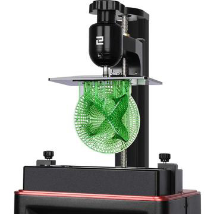
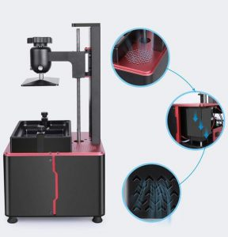
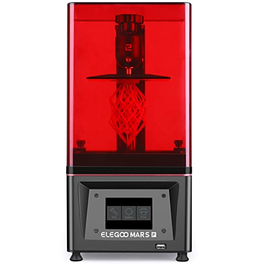

\[toc\]

## Recensione dei due modelli di stampante 3D a resina CON IL MIGLIOR RAPPORTO QUALITÀ - PREZZO SUL MERCATO: Elegoo mars e mars 2 pro, con Analisi delle caratteristiche, punti comuni e differenze.

Nonostante le stampanti che utilizzano resine fotopolimeriche siano state inventate prima di quelle a deposizione di filamento fuso (FDM), queste ultime hanno avuto una maggiore espansione grazie ai costi piú contenuti e ad una relativa facilità di uso.  Negli ultimi tempi però, con l’avvento delle luci LED molto meno costose e di nuovi tipi di resine un po’ meno tossiche sono arrivati sul mercato i primi modelli più accessibili sia in termini di budget che di utilizzo. 

La casa produttrice Elegoo non è stata tra le prime a produrre questo tipo di modelli ma ha senza dubbio realizzato, con la **[Elegoo Mars](https://amzn.to/36k2eCm)** prima e la **[Elegoo Mars 2 Pro](https://amzn.to/38omkOP)** recentemente, una delle **stampanti 3D a resina più vendute e apprezzate** per la sorprendente **qualitá** delle stampe e il **prezzo** molto contenuto.

In questo articolo potrai trovare la mia **recensione di queste due versioni**, con l'**analisi delle caratteristiche principali, i punti in comune** e le **differenze**, insieme ad una serie di **considerazioni di carattere più generale sulla stampa a resina** che ti aiuteranno a decidere se questo tipo di tecnica e di stampante 3D sono adatte a te e ai tuoi progetti. 

Ho pensato di recensire questi due modelli perché la **Mars** è **molto economica** e magari ti interessa sapere se ha già quello che ti serve con un budget molto basso. Invece la **Mars 2 Pro** è l**a versione più evoluta al momento della serie Mars** e se non hai problemi di budget, secondo me non vale la pena di comprare il modello intermedio tra le due, che costa poco meno. Nella **tabella** sottostante puoi trovare riassunte le **specifiche tecniche delle due stampanti**, anche se, a mio parere, i dati grezzi non sono sufficienti a comprendere bene in che cosa consistono le funzionalità che Elegoo ha scelto di implementare per migliorare la prima Mars e che troverai descritte in dettaglio nell’articolo.

\[table id=mars-vs-mars2pro /\]

* * *

## Caratteristiche principali

### Montaggio e struttura

Entrambi i modelli sono pronti all’uso una volta tolti gli imballaggi, sono stampanti che praticamente **non necessitano di montaggio**. L'unica operazione richiesta è la **calibrazione** del piatto e il suo fissaggio con una vite a brugola, operazione molto semplice che richiede un massimo di dieci minuti per essere portata a termine.

<figure>

- <figure>
    
    
    
    <figcaption>
    
    Godzilla stampato con Elegoo Mars 2 Pro
    
    </figcaption>
    
    </figure>
    


</figure>

Il **corpo** è in **metallo** con un **_asse Z_** molto solido a scorrimento lineare fissato al piatto da viti a brugola. Qui troviamo la prima differenza, nella **nuova Elegoo Mars 2 Pro**: sia l’**asse** che le **viti** sono **più robusti e stabili** rispetto al precedente modello. 

Queste migliorie  si traducono in un aumento di stabilitá durante il movimento del piatto, minore necessitá di ricalibrare frequentemente e movimenti più precisi con conseguente **aumento della qualità di stampa**.

Entrambi i modelli hanno dei **piedini in gomma regolabili** in modo da poter mettere la stampante in piano, cosa molto utile perché la resina nel serbatoio sia tutta alla stessa altezza e non ci si debba ritrovare con stampe incomplete sul finale.

Il **nuovo modello Mars 2** **Pro** ha anche un nuovo **piatto in alluminio fresato** con una micro-lavorazione superficiale che aumenta l’adesione delle stampe, giá peraltro ottima nella versione antecedente della **Elegoo Mars**, per cui i pezzi rimangono ben adesi anche per stampe lunghe.

Anche la  **vasca**, o **serbatoio**, che contiene la resina durante la stampa è stata implementata rendendola più capiente e diminuendo la necessità di aggiungere resina in corso durante stampe molto lunghe. Apprezzabile anche che abbiano messo un segno di _MAX_ per segnalare la massima quantità di resina che si può versare. È utile soprattutto per le prime volte in cui la si utilizza, poi con l’esperienza diventa automatico.

### Volume e qualità di stampa

Il **volume di stampa** è lievemente **più grande** nella **Mars 2 Pro**: 129x80x160mm contro i 115x65x150mm del modello precedente. Non un cambiamento entusiasmante, ma comunque apprezzabile. Da un punto di vista più generale, avrai notato che le dimensioni dell’area di stampa sono più piccole rispetto alla maggior parte delle stampanti a filamento e questo è un fattore che potresti dover considerare a seconda di quali progetti vorrai realizzare.

Se quello che vuoi è creare oggetti grandi e non ti interessa che abbiano particolari quasi perfetti allora chissà che la scelta migliore per te non sia l’acquisto di una stampante a filamento. Puoi trovare delle recensioni su diversi modelli qui e qui.



```
Le stampanti a resina sono indicate per chi è interessato a creare oggetti abbastanza piccoli e molto dettagliati, ad esempio, miniature per giochi di ruolo e action figures.
```

Le ridotte dimensioni sono infatti controbilanciate da un **livello dei dettagli** nettamente **superiore** e superfici di stampa **perfettamente lisce**.

Lo **schermo**, lo stesso in entrambe le versioni, è **da 3,5 pollici, a colori e touch**.

La vera novità della **Elegoo Mars 2 Pro** è la **nuova matrice monocroma di LED UV** ,  implementata con 28 led da 50W disposti sotto tutta la superficie dello schermo che permettono un’esposizione molto più uniforme. 

La **maggiore potenza della matrice LED** provoca un indurimento della resina piú rapido e costante su tutto il piano di stampa, le differenze tra i vari strati solidificati che giá erano minime diventano quasi impercettibili e la **definizione dei dettagli** è **maggiore**.

Questo upgrade porta inoltre ad una **notevole** **riduzione dei tempi** (da 8 a 2 secondi per strato). Innovazione molto apprezzabile per chi ha giá un po’ di esperienza nella stampa a 3D e sa quanto l’attesa delle stampe sia la parte piú lunga e noiosa del processo, anche perché non si vede l’ora di tenere tra le mani il pezzo finito.

Infine, il fatto che sia monocromatica ha il vantaggio aggiunto di **aumentare la sua vita media**, si passa da centinaia a migliaia di ore di funzionamento, con un indubbio risparmio di denaro sul lungo periodo.

### Sicurezza

Altro due **upgrades** interessanti riguardano al tema **sicurezza**: abbiamo un **filtro a carboni attivi** e una  **guarnizione in gomma sulla copertura superiore**, in modo che l’aria da dentro alla stampante sia costretta a uscire attraverso il filtro, attenuando di molto l’odore della resina.

<figure>



<figcaption>

[Elegoo Mars 2 Pro](https://amzn.to/38omkOP) - Dettaglio filtri

</figcaption>

</figure>

Questo tuttavia non toglie che il luogo migliore dove tenere questo tipo di stampanti sia un luogo ventilato o ventilabile.

* * *

## Software e connettività

Nella **nuova Elegoo Mars 2 Pro** a lato dello schermo troviamo la **porta usb** che è stata spostata sul davanti, un altro piccolo particolare che aumenta la comodità di uso rispetto alla Mars, in cui la porta si trova sul retro della stampante.

Il **software** della stampante è molto intuitivo e di facile utilizzo, si nota come sia stato progettato per essere il piú possibile funzionale e pratico. Ad esempio, durante la stampa mostra il layer in corso, la percentuale di stampa completata e il tempo totale e restante. 

Inoltre, se si mette in **pausa** la stampa il piatto si solleva sopra la resina e permette di **vedere praticamente da subito se i pezzi hanno aderito**, in seguito si puó riprendere la stampa da dove si era fermata. Questa funzione è molto utile soprattutto se si stanno utilizzando resine nuove o modelli molto lunghi per non perdere tempo in attese inutili.

Come **Software di Slicing** consiglio **Chitubox**, un software abbastanza intuitivo e facile da usare. La **versione gratis** permette di cambiare le dimensioni e orientare i modelli per poterne stampare più di uno in contemporanea, **creare e gestire i supporti** in maniera automatica e creare modelli cavi per risparmiare materiale. In generale è assolutamente  in grado di soddisfare le necessità della maggior parte di utenti, senza dover ricorrere a versioni a pagamento.

Una **nota importante** a proposito del **tempo di stampa** è che, a differenza delle stampanti a filamento dove se si vuole fare più di un pezzo per volta i tempi si sommano, nelle stampanti a resina si possono fare **più modelli in contemporanea** perché la luce indurisce tutto quello che si trova nell’area di stampa allo stesso tempo, quindi l’unica discriminante sui tempi è l’altezza dei pezzi lungo l’asse z.

* * *

## Precauzioni nell'uso della resina

È indubbio che **le stampanti a resina** abbiano una curva di apprendimento molto piú bassa di quelle a filamento, siano cioè **molto piú semplici da usare fin dal primo momento**. 

L’altro lato della medaglia è che hanno bisogno di alcuni **accorgimenti** dovuti alla **tossicità della resina**. Sono delle procedure assolutamente alla portata di tutti, si tratta solo di prendere la mano e poi diventano automatiche.

La **resina** è **irritante** a contatto con la pelle e produce **vapori** che è meglio non respirare, quindi è necessario usare guanti chirurgici e mascherina quando si versa la resina nella vaschetta, quando si staccano i pezzi appena finiti e quando si filtra la resina rimasta dopo una stampa prima di riporla nella bottiglia.

Inoltre, nonostante la **Mars 2 Pro** abbia aumentato la **sicurezza** con guarnizione e filtro a carboni attivi, l’ubicazione migliore per questo tipo di stampanti rimane un **luogo ventilato e di dimensioni adeguate**.

È anche importante considerare che il luogo dovrebbe avere una temperatura superiore ai 20 gradi centigradi, perché al di sotto di questa temperatura le resine tendono ad avere problemi di solidificazione.

* * *

## Lavoro di post produzione

Un contro da considerare per queste stampanti, che vale per tutte le stampanti a resina è il **lavoro post stampa** sul pezzo, con i **lavaggi in alcool isopropilico** per togliere i residui di resina non solidificata e la necessità di comprare un **apparecchio UV** per la l’indurimento dei pezzi. 

La Elegoo ha prodotto da poco un **[apparato UV](https://amzn.to/36wg1Gr)** abbastanza economico che consente di _curare_ le stampe in maniera ottimale rispetto ai dispositivi UV per asciugare le unghie, che spesso vengono comprati per questo scopo e sono stati progettati per tutt’altro.

In alternativa, se pensi di avere una produzione molto alta e/o non hai problemi di budget, consiglio senza dubbio il sistema **[Wash and Cure](https://amzn.to/3k4GcZq)** di Anycubic, perché rende le operazioni molto piú semplici, i pezzi si lavano e curano meglio ed è possibile trattare  piú di un modello per volta. In sintesi, è un sistema che aumenta la comoditá e rende piú facile e veloce tutta l’operazione post stampa, con l’unico difetto di avere un prezzo abbastanza elevato.

Infine, esistono **[resine](https://amzn.to/3kby7C7)** che sono **lavabili in acqua**, ad esempio questa, che permettono di risparmiare il costo dell’ alcool isopropilico, non indifferente. 

In entrambi i casi, sia per resine normali o lavabili in acqua, è importante sapere che **i residui del lavaggio non devono mai essere versati negli scarichi di casa**, perché **altamente inquinanti.** Si possono accumulare, per esempio dentro bottiglie di plastica vuote, e portare quando si abbia tempo a smaltire in un ecocentro.

* * *

## Contenuto della cassa

- Stampante, adattatore e cavo
- Libretto di istruzioni
- Chiavi a brugola
- Cacciavite a brugola
- Mascherine con filtro (due)
- Guanti (tre paia)
- Spatola di metallo con i bordi arrotondati

- Spatola di plastica
- Viti di ricambio
- Supporto in plastica per appendere il piatto sul serbatoio in modo che possa sgocciolare la resina in eccesso
- Contenitore Becker graduato
- Imbuto monouso per filtrare (10)
- Cesoia per rimuovere i supporti
- Penna USB

* * *

## Vale la pena comprare il nuovo modello Elegoo Mars 2 Pro?

Volendo riassumere le **maggiori differenze** tra le due stampanti i campi sono tre: **velocità di stampa, definizione dei dettagli e sicurezza dell’utente.**

Sulla **definizione dei dettagli** ci sono opinioni contrastanti, probabilmente dovute al fatto che la definizione e la qualità sono già molto alte sul modello precedente e quindi c’è chi sostiene che la differenza, sebbene esista e secondo me si noti confrontando lo stesso pezzo stampato in doppio, sia poco percettibile.

Personalmente ho apprezzato molto gli upgrade in merito alla **sicurezza** e, inoltre, il nuovo schermo monocromatico ne fa **la stampante 3D a resina più veloce al momento sul mercato**. Data anche la **qualità** dei pezzi prodotti, davvero altissima a fronte di un prezzo tutto sommato contenuto, **il mio voto é un sì**, senza riserve.

Nondimeno, il **vecchio modello** ha delle ottime prestazioni e se il tuo limite è il **budget** e vuoi una stampante a resina molto economica, ma di buona qualità, puoi tranquillamente acquistarlo per iniziare.

Nota: esiste un modello di **stampante 3d a resina di grandi dimensioni**: la **[Elegoo Saturn](https://amzn.to/2UQIHHF)**. Con un volume di stampa di quasi 3 volte quello della Mars, è una delle stampanti 3D a resina più grandi sul mercato, se sei interessato a leggera la sua recensione la puoi trovare [qui](/blog/recensione-stampante-3d-elegoo-saturn/).

<figure>


<figcaption>

[Elegoo Mars](https://amzn.to/3lcA8PY)

</figcaption>

</figure>

[VEDI IN AMAZON](https://amzn.to/3lcA8PY)

<figure>



<figcaption>

[Elegoo Mars 2 Pro](https://amzn.to/38omkOP)

</figcaption>

</figure>

[VEDI IN AMAZON](https://amzn.to/38omkOP)
