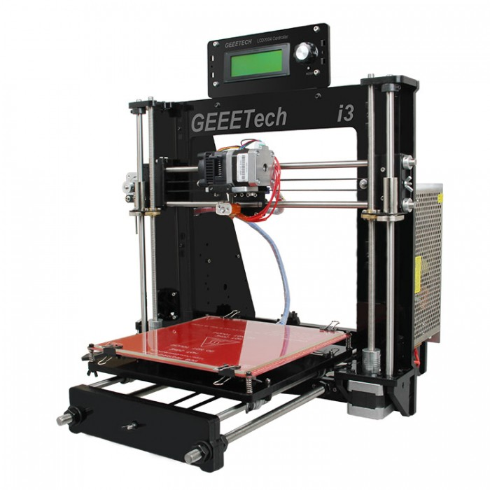
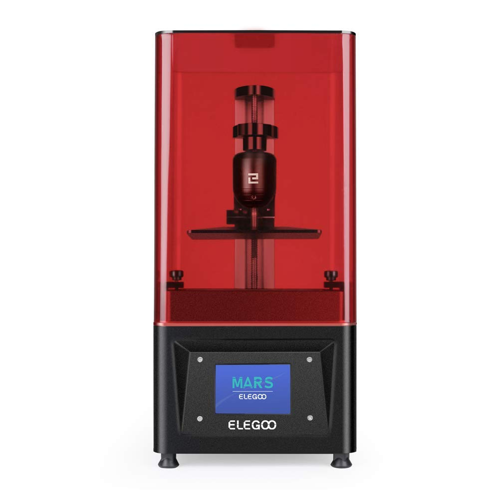
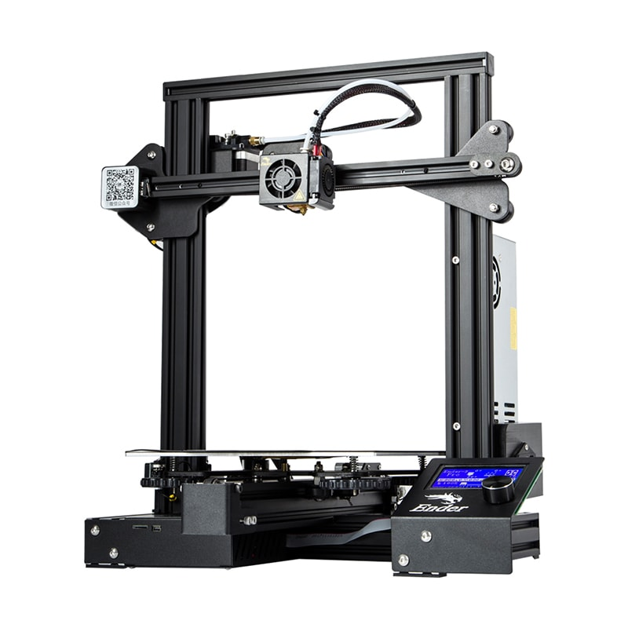

\[toc\]

Uno dei fattori che condizionano di piú l’acquisto di una stampante è il **prezzo** della stampante 3D stessa. 

Ovviamente non è l’unico fattore, ci sono da considerare anche la **facilitá di montaggio**, che per alcuni puó essere importante e per altri meno, il **tipo di materiale** che la stampante puó utilizzare, che tipo di **progetti** si vogliono realizzare e naturalmente la **qualitá** e la **definizione dei dettagli** delle stampe. Ad essere onesti, peró, se le altre caratteristiche sono accettabili,  **il prezzo** rimane un fattore decisivo, almeno nella maggior parte dei casi.

## Come ho selezionato le stampanti 3d

Di seguito trovate la mia selezione delle **migliori stampanti 3D economiche**, sono tutte comprese nella fascia di prezzo dai 150 ai 250 euro, con fluttuazioni di qualche decina di euro che possono dipendere dal periodo dell’anno in cui si fa l’acquisto. 

Esistono sicuramente stampanti piú economiche, ho peró cercato di mantenere il piú possibile alto il **rapporto qualitá/prezzo**, perché mi sembra abbastanza inutile comprare una stampante per un prezzo molto basso e poi non riuscire a usarla perché stampa male.

Il prezzo piú basso di queste stampanti si ottiene sacrificando comoditá o gadget. Ad esempio, sono stampanti che necessitano un montaggio un po’ piú complicato, non hanno schermi touch di ultima generazione o hanno un software meno intuitivo.

In alternativa sono stampanti, come nel caso della _Elegoo Mars_ e dell’_Ender 3_, in cui l’uscita di un nuovo modello ha fatto calare il prezzo, pur restando delle ottime macchine con cui lavorare.

## Analisi comparativa delle 5 migliori stampanti 3D economiche

### Geeetech Prusa i3 Pro B

_Consigliato a utenti esperti o dotati di pazienza e voglia di sperimentare_

[vedi in amazon](https://amzn.to/3jzW3zG)

La **[Geeetech Prusa i3 Pro B](https://amzn.to/3jzW3zG)** é una delle stampanti più **economiche** sul mercato, è una **stampante in kit** il cui montaggio puó rivelarsi abbastanza laborioso, nulla che non si possa risolvere con pazienza e una ricerca di video dimostrativi, soprattutto se conoscete la lingua inglese.

La **struttura** è di acrilico e questo la rende meno robusta delle stampanti in scheletro di alluminio, bisogna avere anche una certa attenzione nello stringere le viti in fase di montaggio per non rischiare di creare crepe.

Pur essendo una stampante economica monta il **piano di vetro**, piú piatto e di facile calibratura rispetto a quelli in alluminio, che tendono ad essere concavi al centro. Sia il piatto che l’estrusore si scaldano rapidamente, in 3-4 minuti dall’accensione la macchina è pronta per la stampa. 

**L’area di stampa** é di **200x200x180mm**, oggettivamente non enorme, va bene per stampe medio-piccole.

La **calibrazione** del piatto è manuale, cosa che non ci stupisce più di tanto visto il prezzo economico, ma come per altre stampanti è possibile comprare e montare un sensore di autolivellamento. 

Purtroppo non ha la funzione di ripresa dopo un’interruzione di corrente, cosa abbastanza seccante se nella vostra zona ci sono spesso dei blackout. 

Manca anche una ventola che raffreddi il pezzo in fase di stampa e questo puó incidere sulla qualitá dei **dettagli**, quindi ti consiglio di aggiungerne una per ovviare al problema.

  
Uno dei lati piú positivi di questa stampante è infatti la possibilitá di apportare modifiche. Non ha problemi di **compatibilitá**, il che la rende ideale per chi ama _smanettare_ e costruirsi una stampante su misura con gli optional preferiti.

**PRO**

- Prezzo

- Piatto in vetro

**CONTRO**

- Montaggio laborioso

- Struttura in acrilico

- Senza funzione di ripresa

[VEDI IN AMAZON](https://amzn.to/3jzW3zG)

* * *

### Elegoo Mars

_Consigliato a neofiti della stampa 3D a resina con un prezzo contenuto senza perdere in qualità._

[vedi in amazon](https://amzn.to/30uZnV6)

La [Elegoo Mars](https://amzn.to/30uZnV6) è una stampante a **resina** economica e affidabile, praticamente pronta per stampare appena tolta dalla scatola. Esistono due versioni identiche che differiscono per il colore della copertura blocca raggi UV, rossa e arancione. 

La stampante ha un corpo in **metallo** con un asse Z molto solido con una guida lineare e cuscinetti metallici regolabili con viti a brugola.

Lo **schermo touch** da 3,5 pollici, con una buona visuale e anche la possibilitá di regolare il touch, mi ha positivamente sorpreso, é decisamente a livello di stampanti di categoria superiore.

Il **software** è di proprietà, semplice e intuitivo, e permette di stampare i pezzi lasciando una certa percentuale di vuoto all’interno, con un risparmio di materiale e costi. È importante ricordare in questi casi di aggiungere nel programma dei fori per la fuoriuscita della resina liquida dall’interno del pezzo. 

La porta usb si trova sul retro ed è effettivamente un po’ scomoda, infatti nel nuovo modello, [vedi recensione qui](https://modeltoreal.com/migliori-stampanti-3d#Elegoo_Mars_Pro), è stata spostata sul frontale, vicino allo schermo.

**L’area di stampa** è di 115x65x150mm, più piccola rispetto a quella di una stampante a filamento (FDM). Le stampanti a resina, infatti, sono indicate per chi é interessato a creare oggetti molto dettagliati, ad esempio, miniature per giochi di ruolo o action figures. A controbilanciare la riduzione dell’area di stampa, vi è il livello dei dettagli, inarrivabile da una stampante a filamento. Inoltre le superfici, dopo l’indurimento del pezzo, risultano quasi perfettamente lisce.

Un contro da considerare per questa stampante, che vale per tutte le **stampanti a resina**, è il lavoro post stampa sul pezzo, con i lavaggi in alcool isopropilico e la necessitá di comprare un apparecchio UV per la l’indurimento dei pezzi. Esistono resine che sono lavabili in acqua, [ad esempio questa](https://amzn.to/2SrgQtm), che permettono di risparmiare il costo dell’alcool isopropilico, non indifferente.

Altro fattore da considerare è che le resine producono vapori tossici per cui sarebbe meglio disporre di un luogo abbastanza ampio e ventilato dove tenere la stampante, oltre ad utilizzare guanti e mascherina.

**PRO**

- Prezzo

- Facilitá di uso

- Qualità dei dettagli

**CONTRO**

- Dimensioni dell’area di stampa

- Necessità di apparecchio UV

- Costo della resina

- Costo dell’alcool isopropilico

- Uso di guanti e mascherina

[VEDI IN AMAZON](https://amzn.to/30uZnV6)

* * *

### Creality Ender 3

_Consigliato a principianti della stampa 3D ad un prezzo economico, la più venduta della sua categoria._

[vedi in amazon](https://amzn.to/3jvYNOA)

La [Creality Ender 3](https://amzn.to/3jvYNOA) é una robusta stampante con il corpo in alluminio. Viene venduta in kit, necessita quindi di assemblaggio, a un prezzo decisamente interessante.

Il **montaggio** non è difficile, oltre alle istruzioni fornite dal fabbricante puoi trovare moltissimi tutorial sul web. In un paio d’ore potrai avere la stampante pronta per il collaudo. Alcune versioni arrivano in parte _premontate_, in questo caso ti consiglio vivamente di controllare tutte le viti e il livellamento perché può succedere che il premontaggio in serie non sia molto preciso.

Uno dei lati positivi è il veloce riscaldamento del piatto e del noozle. A proposito del piatto, ti consiglio caldamente di acquistare il modello con piatto in vetro perché quello in alluminio ha spesso il difetto di non essere perfettamente piano, requisito essenziale per avere buone stampe.

Gli ultimi modelli hanno anche una lamina magnetica ruvida, flessibile e soprattutto rimovibile, posta sopra al letto in alluminio o vetro, che é molto comoda per la rimozione dei pezzi stampati.

**L’area di stampa**, 220x220x250 mm, non enorme ma generosa, permette di realizzare praticamente tutti i tipi di progetti, pur avendo una stampante molto compatta, che occupa sulla scrivania lo spazio di un portatile.

È presente anche la **funzione di ripresa** dopo un’interruzione di corrente, che è molto comoda per non rischiare di buttare una stampa quasi finita dopo ore di lavoro. 

Parlando di difetti, è una stampante un po’ rumorosa, quindi sarebbe decisamente meglio evitare di tenerla nella camera da letto durante stampe notturne.

Inoltre, la calibrazione del piatto, un’operazione che richiede 10-15 minuti,  va fatta manualmente e praticamente ad ogni stampa. È comunque possibile comprare per poche decine di euro un [sensore di autolivellamento](https://amzn.to/3iwlH6Y) che ti renda il compito più semplice e soprattutto più rapido e montarlo a posteriori.

L’enorme vantaggio di questa stampante risiede nella vastissima community di utenti, sia italiana che internazionale, che permette di risolvere praticamente qualsiasi tipo di problema e ne fa la stampante perfetta per chi si appresta a fare i primi passi nel mondo della stampa a 3D.

**PRO**

- Affidabilità

- Qualità di stampa

- Supporto community

**CONTRO**

- Rumorosa

- Calibrazione manuale

[VEDI IN AMAZON](https://amzn.to/3jvYNOA)

* * *

### GEEETECH A10 Pro

_Ottima stampante Entry-level, valida per gli utenti inesperti, ma con ampie possibilità di sperimentazione e upgrades per i più esperti._

[vedi in amazon](https://amzn.to/3iwdCPU)

La [Geeetech A10 PRO](https://amzn.to/3iwdCPU) è una stampante robusta e solida che viene venduta ad un prezzo piú che abbordabile in kit semi assemblato. Il **montaggio** è molto rapido, in meno di 30 minuti si può mandare la prima prova di stampa.

Ci sono quattro viti per collegare il corpo della stampante all’asse _x/z_ e altre quattro per collegare l’alimentatore e il piccolo display LCD, infine i cavi elettrici per i cablaggi, che sono ben identificati. Le istruzioni non lo scrivono, ma consiglio di controllare ed eventualmente fissare i dadi nella parte che arriva già montata, soprattutto quelli sotto al piatto che spesso _balla_ un po’.

Il **piatto riscaldato** è in vetro ed è unito al sottostante piatto di alluminio con clips. Inoltre abbiamo una copertura ruvida e quasi porosa in stile _ultrabase_ della Anycubic che Geeetech ha rinominato **_superplate_**. Le stampe aderiscono bene al piatto senza ausilio di colla o nastri in fase di stampa, staccandosi con facilità una volta raffreddate. Questo rende la vita molto piú semplice soprattutto per un utente inesperto, permettendo di ottenere da subito stampe di buona qualità.

Pur essendo una stampante compatta ha una buona **area di stampa** (220x220x260mm), che permette di stampare progetti da piccole fino a medie dimensioni.

Un punto di forza di questa stampante è sicuramente la **scheda madre** GT2560 V3.0. È una scheda potente e **opensource** che permette la sostituzione e la personalizzazione sia del firmware che dell’hardware. Questo ne fa la stampante ideale per quegli utenti interessati a fare modifiche ed upgrades, dall’aggiunta di accessori come il BLTouch per il livellamento automatico o un display 3D touch, per entrambi c’è giá la predisposizione al montaggio.

Altro upgrade interessante è la possibilità di mettere un **doppio estrusore** per stampare in due colori o con due materiali diversi.

Lo schermo LCD con selezione dei comandi a rotella fa il suo lavoro, ma lascia un po’ a desiderare rispetto agli schermi a colori e touch di stampanti meno economiche. 

In questo modello sono presenti sia il sensore di fine filamento, sia la funzione resume dopo calo di corrente. Due upgrades molto utili, richiesti a gran voce dalla community, che permettono di non sprecare tempo e denaro.

A proposito di tempo e denaro, ti consiglio di ordinare una bobina di filamento in contemporanea con l’acquisto della stampante, perché il filamento fornito non basta nemmeno ad arrivare a metá del file di prova.

È una stampante un po’ rumorosa, anche se non a livelli estremi, è comunque possibile renderla piú silenziosa cambiando drivers e ventole di raffreddamento.

Nota negativa l’estrusore in plastica, abbastanza comune in queste stampanti economiche, che ha difficoltà a estrudere bene e spesso si rompe dopo qualche mese di uso. Il consiglio migliore che ti posso dare è di sostituirlo, anche non subito, con un estrusore in metallo.

**PRO**

- Facile e veloce da montare

- Stabile e solida

- Scheda madre opensource

- Piano tipo _ultrabase_, buona aderenza

**CONTRO**

- Estrusore in plastica

- Rumorosa

- Schermo LCD vecchio stile

[VEDI IN AMAZON](https://amzn.to/3iwdCPU)

* * *

### GIANTARM Geeetech A20

_Consigliata a chi vuole un'area di stampa ampia e la possibilità di fare upgrades._

[vedi in amazon](https://amzn.to/30ybFvZ)

La [Giantarm Geeetech A20](https://amzn.to/30ybFvZ) è la sorella maggiore della Geeetech A10 Pro di cui abbiamo appena parlato. Anche in questo caso si tratta di una stampante preassemblata in cui si devono solo avvitare 4 viti per unire il corpo al ponte che contiene l’estrusore, piú qualche collegamento elettrico a prova di errore.

Troviamo anche qui un'ottimo piano riscaldato con copertura _superbase_ e la **scheda madre** GT2560 V3.0, **opensource**, che permette di implementare la configurazione, ad esempio, con [sensore di autolivellamento](https://amzn.to/3d1NivJ), schermo touch, driver più silenziosi e doppio estrusore.

Tra l’altro esiste una versione di questa stampante 3D già di fabbrica con doppio estrusore per poter stampare a due colori o con due diversi materiali, di cui puoi [trovare la descrizione qui](https://modeltoreal.com/migliori-stampanti-3d-doppio-estrusore#GIANTARM_Geeetech_A20M).

La differenza piú notevole rispetto all versione A10 è la dimensione dell’**area di stampa** più ampia: 255x255x255mm contro i 220x220x260mm della A10. Si perde un mezzo centimetro in altezza, ma la base è decisamente più grande, se quello che ti interessa è stampare pezzi medio grandi questa stampante fa per te. Di fatto è quella con l’area di stampa più ampia nella fascia di prezzo delle stampanti economiche.

Altra differenza riguarda il **corpo della stampante,** benché le componenti elettroniche siano praticamente le stesse, sono contenute da una scatola metallica, in cui è inserito anche lo schermo, sempre a cristalli liquidi anche se migliore rispetto alle versioni precedenti.

Trovo molto comodo avere tutti i componenti della stampante chiusi in una scatola metallica, in questo modo si evita che il cavo che connette lo schermo penda sotto la stampante e si strappi al primo spostamento, cosa che succede piú spesso di quanto si creda con la A10.

Anche questa stampante è un po’ rumorosa, per quanto si possa decisamente migliorare cambiando i driver e le ventole in caso di necessità.

L’estrusore in plastica, che non mi convince molto, rimane quello dei modelli precedenti. Come ho già detto, consiglio di cambiarlo con uno metallico, piú preciso e duraturo.

**PRO**

- Facile e veloce da montare

- Grande area di stampa

- Base metallica chiusa

- Scheda madre opensource potente e implementabile

**CONTRO**

- Estrusore in plastica

- Schermo LCD datato

- Rumorosa

[VEDI IN AMAZON](https://amzn.to/30ybFvZ)

* * *

## Tabella comparativa delle migliori stampanti 3D economiche

Di seguito puoi trovare la tabella che riassume alcune delle caratteristiche e dettagli più importanti delle stampanti descritte in questo articolo.

\[table id=migliori-economiche /\]
