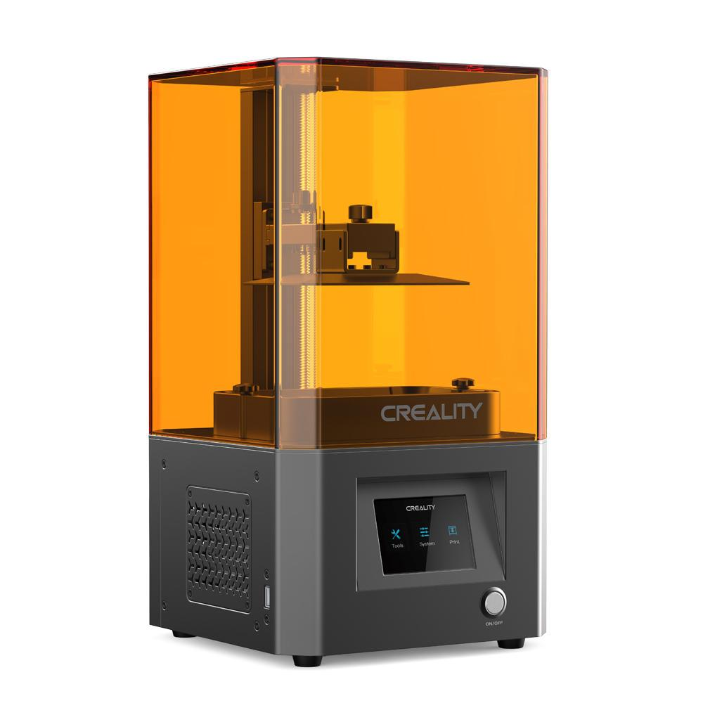
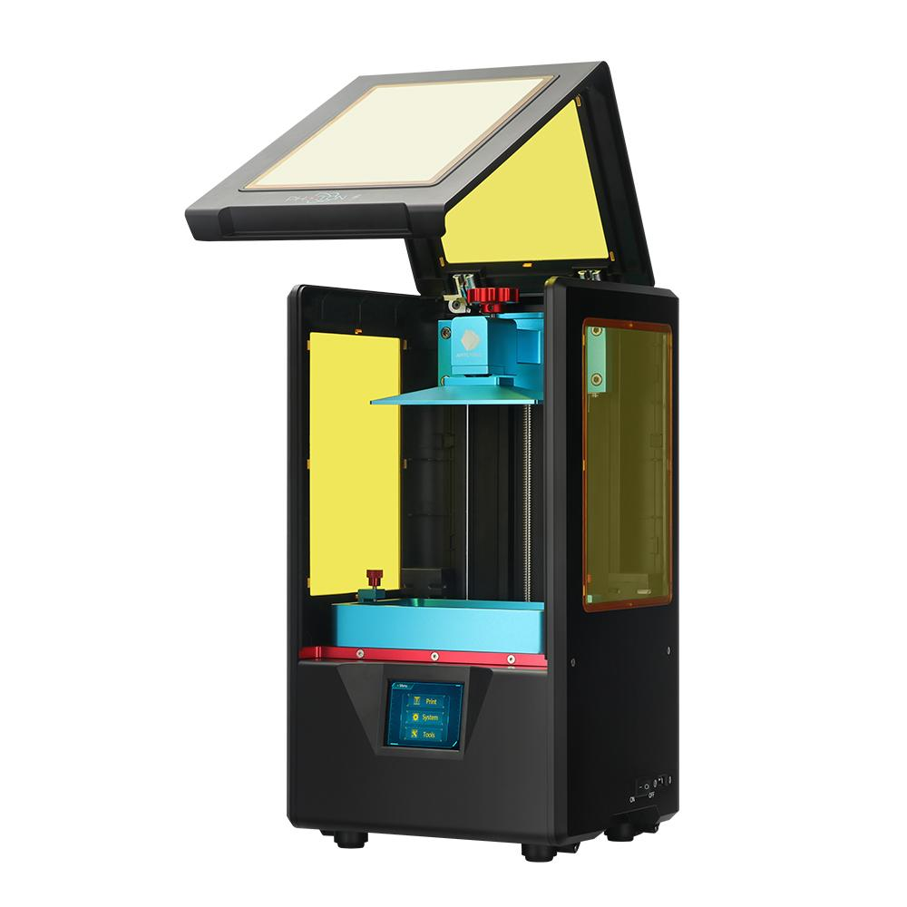
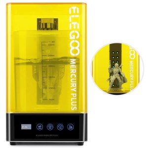

\[toc\]

Le stampanti 3D a resina, in cui viene utilizzata **luce** per **solidificare resine fotopolimeriche**, sono state inventate all’inizio degli anni ottanta. La tecnologia complessa e il costo ne hanno peró impedito la diffusione fino a pochi anni fa, soprattutto rispetto alle stampanti a filamento (FDM) che presentano una meccanica piú semplice ed economica.

Con l’avvento dei **LED**, molto meno costosi delle lampade UV, e lo sviluppo di resine piú sensibili alla luce sono arrivati sul mercato i primi modelli di stampante a resina precisi, veloci e soprattutto con **prezzi accessibili**.

Una considerazione generale sulle stampanti a resina è che il loro **volume di stampa** di solito è **inferiore a quello delle stampanti a filamento**, caratteristica controbilanciata da una **definizione dei dettagli e una precisione estremamente piú alte**. Sono stampanti che vengono utilizzate per creare **miniature** molto dettagliate, **_action figures_** o, in ambito professionale, **modelli odontotecnici** o di **gioielleria**.

Negli ultimi anni abbiamo assistito all’uscita di un gran numero di modelli diversi, alcune case produttrici ne hanno messi sul mercato a volte due nello stesso anno con caratteristiche poco diverse. In questo panorama la scelta è sicuramente complicata, soprattutto se ancora non si è esperti nel campo. 

Nell’articolo che segue troverai una descrizione delle caratteristiche principali con pro e contro di quelle che per me sono le **tre migliori stampanti a resina per qualità/prezzo** al momento, sia per uso _hobbistico_ casalingo che per piccoli servizi di stampa professionali o artigianali.

Se sai ancora poco della stampa a resina e vuoi **approfondire l’argomento**, dopo la recensione dei modelli troverai qualche **considerazione di carattere generale su vantaggi e svantaggi della stampa 3D a resina**, sulla **sicurezza** nel maneggiare la resina e sul **lavoro di post-produzione** sui pezzi. A questo proposito ho aggiunto anche una mini guida sugli **apparecchi** in vendita **per il lavaggio e l’indurimento delle stampe**, da quelli più economici a quelli più completi.

## Creality LD002R

<figure>

<figcaption>

Creality LD002R

</figcaption>

</figure>

[VEDI su AMAZON](https://amzn.to/39l3fxb)

La [LD002R](https://amzn.to/39l3fxb) è il quarto modello di stampante a resina prodotta dalla casa Creality, famosa per la sua [Ender 3](https://amzn.to/3q5A07J), una delle stampanti a filamento più vendute di sempre.

Nonostante il nome, non proprio evocativo di facile memorizzazione, questo modello ha ottenuto una buona posizione sul mercato, competendo con modelli di fascia più elevata come la nuova _[Photon S](https://amzn.to/2JhDmDB)_ o la _[Elegoo Mars 2 Pro](https://amzn.to/39oSj1E)_. 

Il suo lato attrattivo rispetto alle concorrenti è indubbiamente il **prezzo**, la LD002R ha peró altre caratteristiche interessanti, vediamole in dettaglio.

Il **corpo della stampante** è tutto in **alluminio** e dà impressione di soliditá oltre ad essere bello in termini di design, anche il coperchio in plexiglass arancione è compatto e ben rifinito. L’**asse lineare Z** ha una solo guida ma è stabile e robusto, anche grazie al fatto di essere connesso a una struttura in metallo invece che plastica. 

Il **serbatoio** è **capiente e graduato**, troviamo segnalati 140, 170 e 225 ml. Il poter avere facilmente sott’occhio la quantitá di resina è molto comodo, soprattutto se il programma di Slicing dà una previsione delle quantitá necessarie. Si può facilmente mettere la giusta quantitá di resina ed evitare sprechi.

Il **piatto** è in alluminio fresato, in alcuni casi la stampante può arrivare un piatto perforato, tipico di stampanti più grandi e industriali, in entrambi i casi le stampe aderiscono bene e senza problemi.

Il piatto si calibra attraverso 4 viti, il sistema non è così comodo come quello di altre stampanti che di viti ne hanno solo 2, però una volta regolato è molto difficile che si scalibri, potrai dimenticartene per parecchie stampe.

Il **volume di stampa** è di 119x65x160mm, non enorme ma sufficiente per quasi tutti i progetti, con uno **schermo LCD** a **2K** con 2560x1440 pixels di definizione, per cui la definizione e la precisione dei dettagli è soddisfacente. Un consiglio, che vale per tutte le stampanti a resina, è di pulire bene con alcool lo schermo UV e il fondo del serbatoio prima di iniziare ad usarla, perché spesso hanno residui di costruzione e ombre non visibili che possono dare problemi.

La **velocitá di stampa**, non avendo un LCD monocromo è nella norma ma inferiore a quella della nuova Elegoo Mars 2 Pro.

Per caricare i file e gestire le operazioni di stampa abbiamo una **presa USB** sul lato sinistro e uno **schermo touch** da 3,5 pollici con superficie morbida e un software abbastanza intuitivo e facile.

Il **sistema di filtraggio** è composto da un **doppio ventilatore** e un **sacchetto di carbone attivo**. I due ventilatori purtroppo sono sempre accesi anche quando la stampante è spenta, basta che sia attaccata alla corrente. Scelta, abbastanza discutibile, che fa sì che la LD002R sia una stampante **rumorosa**.

Il filtro a carbone attivo non è molto efficace e non è nemmeno chiaro se e quando debba essere sostituito, in ogni caso è consigliato utilizzare la stampante in un luogo areato.

**PRO**

- Prezzo contenuto

- Corpo interamente in alluminio

- Serbatoio graduato

**CONTRO**

- Rumorosa

- Sistema di filtraggio dell’aria non ottimale

[VEDI su AMAZON](https://amzn.to/39l3fxb)

* * *

## Anycubic Photon S 

<figure>

<figcaption>

Anycubic Photon S

</figcaption>

</figure>

[VEDI su AMAZON](https://amzn.to/3HmNwfz)

La **[Photon S](https://amzn.to/2JhDmDB)** è una versione migliorata della Photon di casa Anycubic, una delle stampanti più vendute nel 2018, vediamo insieme in che cosa consistono gli _upgrades_ e le sue caratteristiche principali.

Come per tutte le stampanti a resina, **non necessita di montaggio** e l’unica operazione che sarà necessario fare e la **calibrazione del piatto**, operazione facile e veloce ma nondimeno molto importante per la buona riuscita delle stampe.

Il _case_ è praticamente lo stesso del precedente modello, disponibile in due colori, bianco o nero, con un **coperchio abbattibile** che dà accesso all’area di stampa. Riguardo al coperchio c’è un punto a cui mi sento di fare una critica. La stampante è ben costruita ma le cerniere del coperchio montate su plastica fanno sì che il coperchio sia un po’ ballerino, ovvero si muova anche lateralmente durante l'apertura, dando un’idea di fragilità che si sarebbe potuta facilmente evitare. Devo però dire che non sono mai stato molto entusiasta di questo tipo di apertura, rispetto alla soluzione di un coperchio rimovibile, perché trovo che renda le operazioni inutilmente complicate restringendo l’area di manovra.

L’**asse lineare z** invece, è super **robusto**, Anycubic ha **raddoppiato le guide lineari**, rendendo il tutto molto più stabile e aumentando la definizione soprattutto in caso di pezzi grandi che raggiungano il limite del volume in altezza. 

Anche **il piatto**, in alluminio fresato, è giá stato testato dalla precedente versione, e non dà sorprese, assicurando una buona adesione in fase di stampa. **Il serbatoio** è capiente e di facile rimozione attraverso due viti. Un upgrade che mi avrebbe fatto piacere vedere è il segno di _max_, per non rischiare di riempire troppo la vaschetta e ritrovarsi con la resina che tracima quando il piatto scende. È un inconveniente evitabile con un minimo di pratica, ovviamente, ma speriamo che Anycubic lo aggiunga a breve.

Il **volume di stampa** è nella norma per questo tipo di stampanti (115x65x165mm), rispetto al precedente modello sono stati aggiunti 10 cm sull’asse z. 

Invece la **matrice UV LED** è stata migliorata con una distribuzione della luce più uniforme e una definizione di 2K (2560x1440pixels) che garantisce un’ottima qualitá dei dettagli.

Per quanto riguarda la **connettivit**à la Photon S ha una presa USB sul lato destro, per caricare i file. Lo **schermo** è touch, da 2,8 pollici, forse un po' piccolo ma con icone grandi che aiutano la visione. A proposito della visione, vi consiglio di posizionare la stampante su un tavolo non troppo basso perché, la visione perfetta dello schermo si ha solo quando lo si guarda da davanti, rendendo necessario piegarsi spesso all’altezza della stampante durante l’uso.

Il **software** è abbastanza intuitivo, con menù facilmente navigabili, anche senza aver letto attentamente le istruzioni. Anche qui, come per la Elegoo Mars 2 Pro, è possibile pausando la stampa vedere se il pezzo si é attaccato, perchè il piatto si solleva sopra la vasca di qualche centimetro.

In tema di **sicurezza** questa versione ha un **filtro a carboni attivi** che riduce di molto l’odore della resina.

A differenza di altre marche, nella confezione è incluso mezzo litro di resina, di solito verde, per poter iniziare subito a giocare con la stampante.

### Photon Workshop, il programma Slicer dedicato di Anycubic.

Faccio una piccola premessa, prima di scrivere le mie impressioni sul software **Slicer** dedicato di Anycubic: non sono un’amante dei software dedicati, cioè sviluppati dalla casa produttrice delle stampante. Posso capire chi li preferisce perché hanno il vantaggio di avere settaggi già preconfigurati, come, ad esempio, i tempi di esposizione, però secondo me i software opensource hanno più flessibilità e, di solito, vengono aggiornati più frequentemente.

Anycubic non lascia scelta di utilizzare altri software, quindi se per te è un problema, questo è un fattore che potresti dover tenere in considerazione per l’acquisto.

Detto questo, **Photon Workshop** ha già preinstallati tutti i settaggi per le resine Anycubic, è abbastanza facile da usare e ha la funzionalitá di posizionare i supporti in maniera automatica, anche se è sempre bene controllare. 

Due **difetti** da sottolineare sono che **non supporta la funzione di fare pezzi vuoti**, che consente di risparmiare abbastanza sulla resina e che **non c’è modo di salvare settaggi per differenti tipi di resina**. Per cui, se sei uno a cui piace sperimentare con diverse marche ti consiglio di tenere nota dei settaggi su un quaderno e prepararti al noioso compito di reinserirli spesso.

**PRO**

- Ottima qualitá di stampa

- Filtro a carboni attivi

**CONTRO**

- Prezzo

- _Case_ plastica con aria poco solida

- Serbatoio senza segno di _max_

- Software dedicato

[VEDI su AMAZON](https://amzn.to/3HmNwfz)

* * *

## Elegoo Mars 2 Pro

<figure>

<figcaption>

Elegoo Mars 2 Pro

</figcaption>

</figure>

[VEDI su AMAZON](https://amzn.to/39oSj1E)

La [Elegoo Mars 2 Pro](https://amzn.to/39oSj1E), come per la maggior parte delle stampanti a resina, è pronta all’uso una volta tolti gli imballaggi, e **non necessita di montaggio**. L'unica operazione richiesta è la **calibrazione** del piatto e il suo fissaggio con due viti a brugola, operazione molto semplice che richiede un massimo di cinque minuti per essere portata a termine.

Il corpo è in metallo con un **asse Z** molto solido a scorrimento lineare fissato al piatto da viti a brugola. Le **viti** sono **più grandi e robuste** rispetto ai precedenti modelli, rendendo più semplici le operazioni di calibratura e aumentandone la vita utile.  

L’aumento di solidità dell’asse z, inoltre, si traduce in un aumento di stabilitá durante il movimento del piatto, minore necessitá di ricalibrare frequentemente e movimenti più precisi con conseguente **aumento della qualità di stampa**, anche per stampe che raggiungono il limite massimo dell’asse z.

Sono presenti anche **piedini in gomma regolabili** in modo da poter mettere la stampante in piano, cosa molto utile perché la resina nel serbatoio sia tutta alla stessa altezza e non ci si debba ritrovare con stampe incomplete sul finale.

Il **piatto** è in alluminio fresato con una micro-lavorazione superficiale che aumenta l’adesione delle stampe, giá peraltro ottima nella versione antecedente della **Elegoo Mars**, [più economica](https://amzn.to/2KPCTJP), per cui i pezzi rimangono ben adesi anche per stampe lunghe.

Anche **il serbatoio** che contiene la resina durante la stampa è stata implementato rendendolo piú capiente e diminuendo la necessitá di aggiungere resina in corso durante stampe molto lunghe. Apprezzabile anche l’aggiunta del **segno di** **_MAX_** per segnalare la massima quantità di resina che si può versare e non ritrovarsi con la resina che trabocca quando il piatto si abbassa dentro al serbatoio per iniziare la stampa.

Il **volume di stampa** è di 129x80x160mm, leggermente piú grande rispetto alla Creality LD002R e alla Photon S. 

La vera novità della **Elegoo Mars 2 Pro** è la **nuova matrice monocroma di LED UV**, implementata con 28 led da 50W disposti sotto tutta la superficie dello schermo che permettono un’esposizione molto più uniforme. 

La **maggiore potenza della matrice LED** provoca un indurimento della resina piú rapido e costante su tutto il piano di stampa, le differenze tra i vari strati solidificati che giá erano minime diventano quasi impercettibili e la **definizione dei dettagli** è **maggiore**.

Questo upgrade porta inoltre ad una **notevole** **riduzione dei tempi di stampa** (da 8 a 2 secondi per strato) che rende la [Elegoo Mars 2 Pro](https://amzn.to/39oSj1E) **la stampante a resina più veloce sul mercato**. Caratteristica molto apprezzabile per chi ha già un po’ di esperienza nella stampa a 3D e sa quanto l’attesa delle stampe sia la parte più lunga e noiosa del processo, anche perché non si vede l’ora di tenere tra le mani il pezzo finito.

Infine, il fatto che sia monocromatica ha il valore aggiunto di **aumentare la sua vita media**, si passa da centinaia a migliaia di ore di funzionamento, con un indubbio risparmio di denaro sul lungo periodo.

Altri due **upgrades** interessanti riguardano il tema **sicurezza**: abbiamo un **filtro a carboni attivi** e una  **guarnizione in gomma sulla copertura superiore**, in modo che l’aria da dentro alla stampante sia costretta a uscire attraverso il filtro, attenuando di molto l’odore della resina. Questo tuttavia non toglie che il luogo migliore dove tenere questo tipo di stampanti sia un luogo ventilato.

Lo **schermo** è da 3,5 pollici, a colori e touch, con icone grandi e ben visibili. La **porta USB**, che nei primi modelli della Mars era sul retro della macchina, è stata spostata sul fronte, a lato dello schermo, per maggiore comodità.

Il **software** della stampante è molto intuitivo e di facile utilizzo, si nota come sia stato progettato per essere il più possibile funzionale e pratico, tanto da togliere quasi la necessità di leggere le istruzioni.

Una funzione utilissima del software è la possibilità, se si mette in **pausa** la stampa, di **vedere praticamente da subito se i pezzi hanno aderito**, perché il piatto si solleva di qualche cm sopra la vasca. In seguito si può ovviamente riprendere la stampa da dove si era fermata. Questa funzione è molto utile soprattutto se si stanno utilizzando resine nuove o modelli molto lunghi per non perdere tempo in attese inutili.

**PRO**

- Velocità di stampa

- Alta definizione dei dettagli

- Ottimo rapporto qualità prezzo

- Filtro a carbone attivo e guarnizione

**CONTRO**

- Ventole di raffreddamento un po' rumorose

[VEDI su AMAZON](https://amzn.to/39oSj1E)

* * *

## Tabella comparativa specifiche tecniche

\[table id=mtr-resina /\]

* * *

## Vantaggi e svantaggi delle stampanti a resina

Un **primo vantaggio** che riguarda praticamente tutte le stampanti a resina è che vengono vendute **già assemblate**, quindi la messa in opera è di pochi minuti e consiste praticamente nella calibratura del piatto di stampa. 

È indubbio che **le stampanti a resina** abbiano una curva di apprendimento molto piú bassa di quelle a filamento, siano cioè **molto piú semplici da usare fin dal primo momento** e non prevedano tutti gli accorgimenti e i settaggi delle temperature di estrusione e del piatto di cui hanno bisogno le stampanti 3D a filamento.

Un **secondo vantaggio** delle stampanti a resina rispetto alle FDM è la possibilità di utilizzare tutta l’area di stampa per **creare piú pezzi contemporaneamente** senza che questo aumenti i tempi di lavoro. 

**Nelle stampanti a filamento il tempo della stampa aumenta se si cercano di fare piú pezzi alla volta**. Questo proprio perché fisicamente il _noozle_ che deposita il filamento fuso deve passare prima su un pezzo e poi spostarsi per andare sul secondo pezzo, raddoppiando quindi i tempi.

Nelle stampanti a resina, **la luce** che indurisce la resina **viene proiettata su tutti i pezzi contemporaneamente**, l’unico **fattore che incide sul tempo** è l’**altezza delle stampe lungo l’asse z**, non il loro numero. Combinare con attenzione le varie stampe in modo che l’area di stampa ne contenga il piú possibile ti porterá un notevole risparmio in termini di tempo e bolletta elettrica. 

Uno dei punti negativi che tutte le stampanti di questo tipo hanno in comune è che sono necessari alcuni **accorgimenti** durante l’uso dovuti alla **tossicitá della resina**. Non è il caso di farsi spaventare, peró, le procedure sono alla portata di tutti, si tratta solo di prendere la mano e di creare delle buone abitudini e routines.

Un altro **svantaggio** che vale per tutte le stampanti a resina è il **lavoro post produzione** sul pezzo, sia dal punto di vista di tempo che di costi, con i lavaggi in alcool isopropilico e la necessità di utilizzare un apparecchio UV per l’indurimento dei pezzi.

### Precauzioni e sicurezza nel maneggio della resina

La **resina** è **irritante** a contatto con la pelle e produce **vapori** che è meglio non respirare. É necessario quindi usare **guanti chirurgici** e **mascherina** sia quando si versa la resina nella vaschetta che quando si staccano i pezzi appena finiti o quando si filtra la resina rimasta dopo una stampa prima di riporla nella bottiglia.

Inoltre, nonostante le stampanti più recenti abbiano aggiunto dispositivi per aumentare la protezione dell’utente, come ad esempio filtri a carboni attivi e ventole, l’**ubicazione migliore** per questo tipo di stampanti rimane un **luogo ventilato e di dimensioni adeguate**.

È anche importante considerare che il luogo dovrebbe avere una temperatura superiore ai 20 gradi centigradi, perché al di sotto di questa temperatura la maggior parte delle resine tende ad avere problemi di solidificazione.

### Lavoro di post produzione e apparecchi dedicati

Un fattore importante da considerare, anche in termini di costi, per la stampa a resina è il **lavoro post produzione** sui pezzi stampati. È necessario trattare le stampe una volta finite con **lavaggi in alcool isopropilico** per togliere i residui di resina non solidificata e esporle a **luce UV** perchè induriscano del tutto. 

Per quanto sia possibile indurire le stampe in resina lasciandole esposte alla luce solare, per la sua componente UV, è un sistema che mi sento di sconsigliare, perché i risultati sono poco affidabili. Non potendo controllare tempi e intensità di esposizione ci si puó ritrovare con pezzi ingialliti o con crepe.

La Elegoo ha prodotto da poco [l’Elegoo Mercury Resin Curing Box](https://amzn.to/3ldO6Af), un **apparato UV** che consente di curare le stampe in maniera ottimale con un prezzo contenuto. Consta di una base rotante che permette l’esposizione costante del pezzo ai LED UV e di un temporizzatore per decidere i tempi di esposizione.

In alternativa, se pensi di avere una produzione molto alta e/o non hai problemi di budget, consiglio senza dubbio il sistema **[Wash and Cure](https://amzn.to/3ldOGOr)** di Anycubic o l’**[ELEGOO Mercury Plus Washing & Curing Machine](https://amzn.to/3kstmrm)**[.](https://amzn.to/3kstmrm)

Entrambi i dispositivi hanno un funzionamento molto simile. Abbiamo un **contenitore sigillato per l’alcool isopropilico**, in cui è possibile immergere il pezzo appena stampato e dotato di una ancoretta che opera il **mescolamento del liquido nel recipiente**, permettendo di lavare la stampa senza fatica né spargimenti di alcool. Nel contenitore è presente anche un **cestello** metallico che permette di rimuovere agevolmente i modelli.

Abbiamo poi una **fonte di LED UV**, tra i 365 e 405 nanometri, compatibili con praticamente tutte le resine disponibili sul mercato, una **piattaforma rotante** e un **timer** per impostare i tempi di cura.

In sintesi, sono apparecchi che permettono di **semplificare moltissimo tutta l’operazione post-stampa**, rendendo automatico sia il lavaggio che la polimerizzazione finale del pezzo e consentendo di trattare più di un modello per volta, con l’unico difetto di avere un prezzo abbastanza elevato.

Infine, esistono **resine** che sono **lavabili in acqua**, [ad esempio questa](https://amzn.to/39lV83B), che permettono di risparmiare il costo dell’alcool isopropilico, non indifferente. 

In entrambi i casi, sia per resine normali o lavabili in acqua, è importante sapere che **i residui del lavaggio non devono mai essere versati negli scarichi di casa**, perché **altamente inquinanti.** Si possono accumulare, per esempio dentro bottiglie di plastica vuote, e portare quando si abbia tempo a smaltire in un ecocentro.
