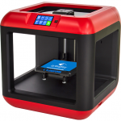
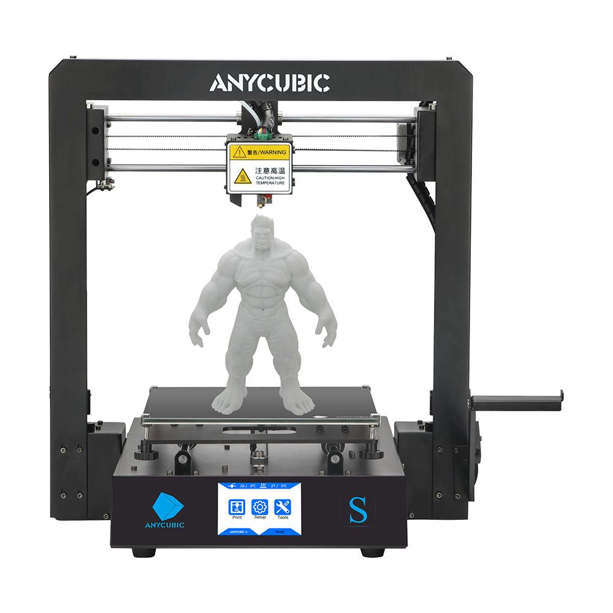
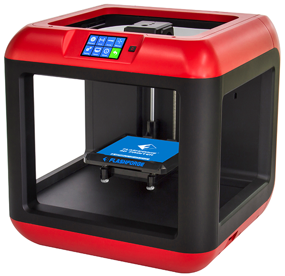
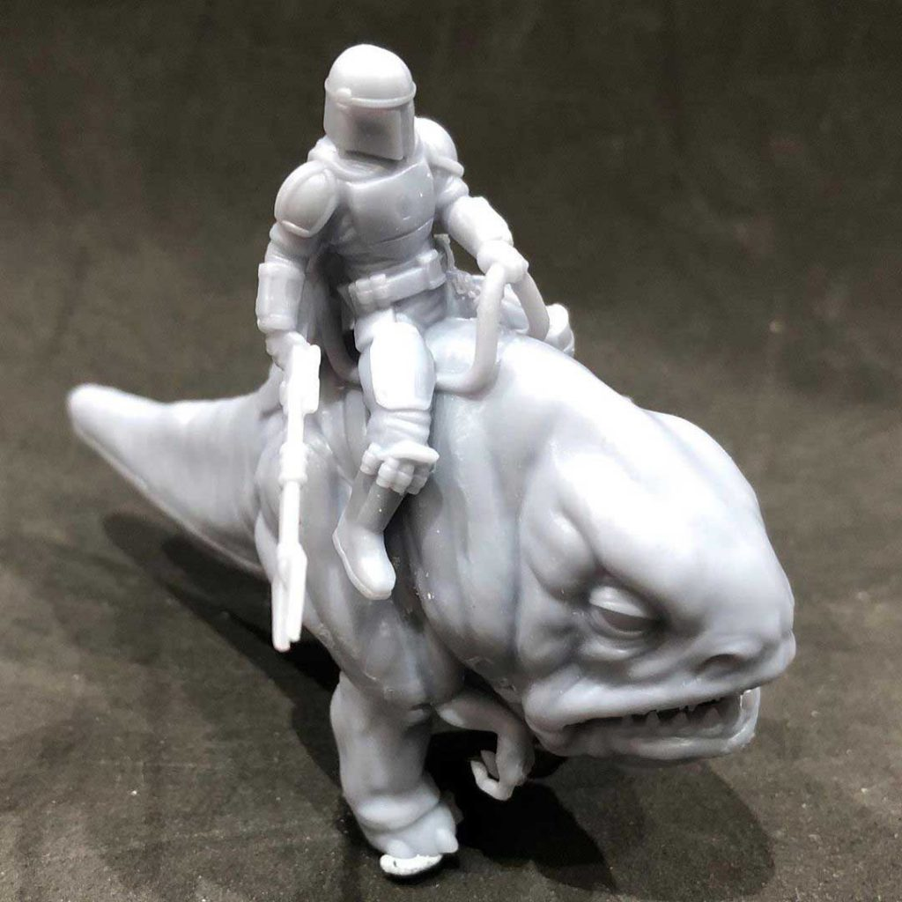
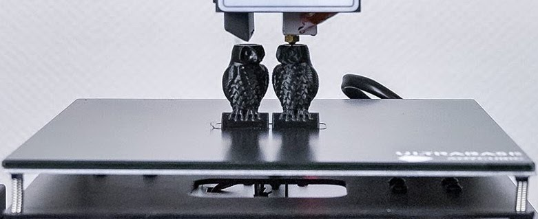
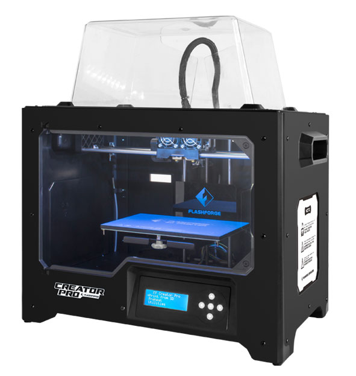
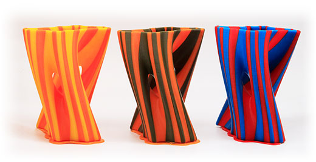
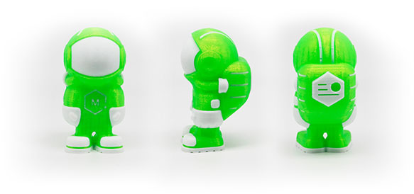
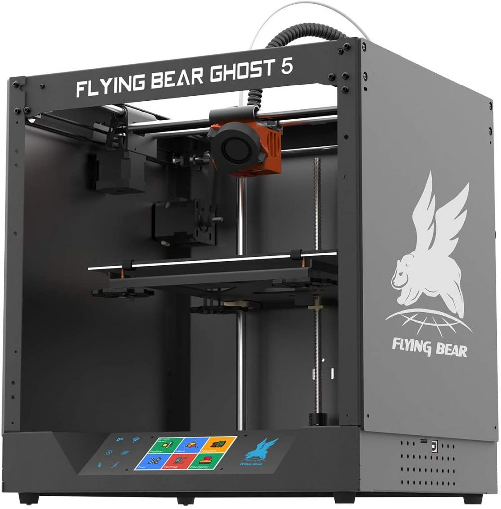
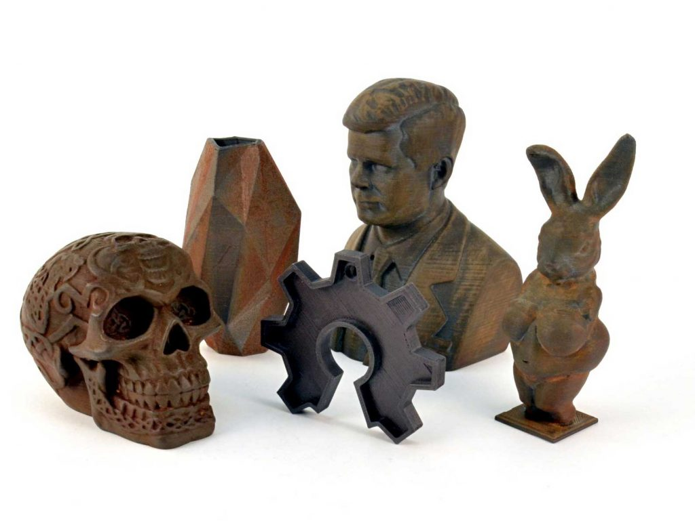

## Guida comparativa qualitá/prezzo per le migliori stampanti 3D del 2024

Il mercato delle stampanti 3D ha fatto i primi passi timidamente negli anni ‘90 e da allora abbiamo assistito ad una continua evoluzione, con nuovi modelli che escono ogni anno, cosa che non ci stupisce affatto considerando le enormi  potenzialità di questa tecnologia.

Inoltre, e questo è un fatto molto positivo, negli anni la qualità di stampa è migliorata e i prezzi delle stampanti sono scesi creando una comunità sempre più grande di appassionati.

La grande quantità di modelli e caratteristiche tecniche da considerare rende però difficile la scelta, soprattutto (ma non solo) per chi non è ancora esperto. Tra tutte le informazioni che si possono trovare in rete è importante sapere a quali caratteristiche conviene fare più attenzione durante la scelta di quale stampante acquistare, per evitare frustrazioni e perdita di tempo e denaro.

Per questo motivo, ho deciso di fare una piccola guida per aiutare nell’acquisto della stampante migliore per differenti necessità (non siamo tutti uguali), descrivendo per ognuna quelle che mi sembrano le caratteristiche più importanti e scegliendo modelli che abbiano un buon rapporto qualità/prezzo.

## Quale stampante 3D comprare? Selezione rapida

Se non hai voglia di leggere le informazioni che seguono, ti lascio qui una selezione veloce delle tre **migliori stampanti 3D**, secondo la mia esperienza personale, in base a questi criteri:

- La migliore stampante che **non richieda fatica** o troppo **studio dei parametri** per iniziare (si può letteralmente stampare 10 minuti dopo averla tirata fuori dalla scatola): [**Flashforge Finder**.](https://amzn.to/3iD9ygV)

- La migliore stampante per **qualità/prezzo**, con la comunità di utenti più estesa in Italia. È il nuovo modello di una delle stampanti più vendute in assoluto: **[Ender 3 V2](https://amzn.to/2HWVXEr)**.

- La **migliore stampante di gamma medio-alta**, con tutto quello che serve a non farvi sentire la necessità di comprarne un’altra a breve termine: **[Anycubic I3 Mega S](https://amzn.to/33tJ2C7)**.

**PRONTA ALL'USO**

[VEDI prezzo](https://amzn.to/3iD9ygV)

**QUALITÁ/PREZZO**

[VEDI prezzo](https://amzn.to/2HWVXEr)

**TOP CHOICE**

[VEDI prezzo](https://amzn.to/33tJ2C7)

* * *

## Analisi comparativa delle migliori stampanti 3D

\[toc\]

Come dicevo, ci sono moltissimi dati tecnici e caratteristiche che si possono tenere in conto per l’acquisto di una stampante 3D, penso però che ci siano delle considerazioni a priori che è importante fare e che già indirizzano molto nella scelta del tipo di modello:

- **Prezzo**: quanto denaro vuoi spendere?

- **Qualità**: quanto vuoi che siano definiti i dettagli di stampa? Ad esempio, vedremo la differenza tra una stampante a resina e una a filamento.

- **Montaggio**: sei disposto a montare la stampante o la vuoi pronta all’uso?

- **Dimensione**: quanto grandi sono gli oggetti che vuoi creare?

- **Finalità**: stampare in 3D è per te un hobby o vuoi farne la tua fonte di reddito?

Fatta questa premessa, continuiamo con l’analisi comparativa delle **5 migliori stampanti 3D per qualità/prezzo**.

### FlashForge Finder

__La stampante per chi vuole entrare nel mondo delle stampe 3D senza complicarsi troppo la vita, la più semplice da utilizzare sul mercato. Adatta anche ai bambini.__

[VEDI PREZZO](https://amzn.to/3iD9ygV)

La [FlashForge Finder](https://amzn.to/3iD9ygV) è una stampante _ready to use_, arriva già montata e pronta all’uso, il _case_ esterno è in plastica, con un disegno compatto e molto stabile. 

Il software non è _opensource_, è quello della casa di produzione, facile e intuitivo, il lato negativo è che per aggiornarlo alle nuove versioni, saremo obbligati a comprarle.

Sul frontale troviamo lo **schermo touch** a colori da 3,5 pollici, a lato di questo troviamo anche l’interruttore di accensione. Niente acrobazie per raggiungere pulsanti in posizioni scomode con questa stampante.

 Si può connettere via **wifi** con il pc ma presenta comunque una **presa usb** sul lato destro. 

Tra le funzioni per rendere più semplice l’utilizzo abbiamo la **calibrazione assistita** da un **sensore di livellamento** e il **sensore** in caso finisca il **filamento** durante la stampa. Funzione piú che necessaria perchè la bobina del filamento viene inserita in un alloggiamento dietro la stampante e non è visibile.

Le **dimensioni di stampa** sono di 140x140x140 mm, decisamente ridotte rispetto ad altre stampanti, cosa da considerare se si ha la necessitá di fare stampe grandi. Tolto questo fattore limitante la qualità di stampa è ottima.

È importante considerare che il piatto non è riscaldato, quindi questa stampante può utilizzare solo filamenti di PLA e, seppur con qualche difficoltà, TPU, per creare oggetti flessibili.

Viene fornito un tubetto di colla solida, simile a quella che abbiamo usato tutti alle elementari, per aiutare a far aderire i pezzi. Inoltre, il **piatto è estraibile** per facilitare il recupero del pezzo stampato.

È una stampante molto **silenziosa**, si possono fare stampe lunghe in totale tranquillità anche di notte.

Il suo più grande pregio è quello di essere molto semplice da usare, il che la rende perfetta per chi vuole iniziare senza perdersi in assemblaggi e lunghi settaggi, d’altro canto la sua ridotta area di stampa e scelta dei materiali potrebbero far desiderare di passare ad altri modelli in futuro.

**PRO**

- Pronta all’uso

- Facile da usare

- Calibrazione assistita

- Connessione wifi

- Silenziosa

**CONTRO**

- Area di stampa ridotta

- Ridotta scelta dei materiali di stampa

- Software proprietario

[VEDI prezzo](https://amzn.to/3iD9ygV)

* * *

### Creality Ender 3 V2

__Migliore stampante per qualitá/prezzo, consigliata ad utenti inesperti con voglia di sperimentare.__

[VEDI PREZZO](https://amzn.to/2HWVXEr)

La [Creality Ender 3 V2](https://amzn.to/2HWVXEr) è la nuova uscita in casa Creality, mantenendo i lati positivi del modello precedente, di cui puoi trovare [la descrizione qui](https://modeltoreal.com/migliori-stampanti-3d-economiche#creality-ender-3), apporta una serie di migliorie che gli utenti chiedevano da tempo, vediamole in dettaglio.

La **qualità** e risoluzione di stampa sono davvero ottime, i dettagli sono molto definiti, tra i migliori che ho visto finora in una stampante FDM (a filamento). Questo effetto dovuto ad una serie di _upgrades_: asse Y irrobustito e più stabile e cinghie di qualità superiore con tensori a rotella, che evitano l’uso continuo di brugole.

Altra novitá, il **piatto in vetro al Carborundum** (carburo di silicio), perfettamente piano e più facile da calibrare, facilita l’adesione degli oggetti in fase di stampa e il loro distacco una volta freddi.

L’**area di stampa** si mantiene di 220x220x250mm, non enorme ma di tutto rispetto.

Ulteriore differenze di nota rispetto al vecchio modello sono la nuova **scheda madre** piú potente e la quasi **assenza di rumore** in fase di stampa. 

La nuova [Ender 3 V2](https://amzn.to/2HWVXEr) è una stampante molto silenziosa, fa più rumore la ventola di raffreddamento della scheda madre della stampante stessa, ventola che peraltro si può cambiare per pochi euro con una di quelle silenziose da pc.

È presente anche **la funzione di ripresa** della stampa dopo un’interruzione di corrente, sempre molto gradita e utile per evitare di buttare una stampa quasi finita dopo ore di lavoro.

Infine, può sembrare una stupidaggine, ma i piedini di gomma più grandi e spessi aumentano davvero la stabilità e contribuiscono alla migliore qualità di stampa.

Parlando invece di quello che mi è piaciuto meno, lo **schermo** della Ender 3 V2 è più grande, da 4,3 pollici, e a colori, ma non è touch e l’angolo di visione è abbastanza stretto. È funzionale, ma si poteva decisamente fare di meglio.

In questa versione hanno aggiunto anche un cassetto portattrezzi, niente di eccezionale, ma è comodo per avere tutto a portata di mano.

Continua invece a mancare il sensore di autolivellamento, acquistabile a parte.

**PRO**

- Affidabilità

- Robustezza

- Piano in vetro migliorato

- Qualità di stampa

**CONTRO**

- Calibrazione manuale

- Schermo non touch

- Montaggio

[VEDI prezzo](https://amzn.to/2HWVXEr)

* * *

### Elegoo Mars Pro

__Migliore stampante a resina per rapporto qualitá/prezzo sul mercato. Consigliata per utenti che vogliano cimentarsi con questa differente tecnica di stampa.__

[VEDI PREZZO](https://amzn.to/33vesIi)

La nuova [**Elegoo Mars Pro**](https://amzn.to/33vesIi) è la versione rinnovata e aggiornata della **stampante a resina** con il **miglior rapporto qualità prezzo sul mercato**.

La stampante è pronta per lavorare appena uscita dalla scatola, non è necessario montare nulla. Il corpo è in metallo con un asse Z molto solido a scorrimento lineare fissato al piatto da viti a brugola. Sia l’asse che le viti sono più robusti e stabili rispetto al precedente modello, più economico, di cui potete trovare [la recensione qui](https://modeltoreal.com/migliori-stampanti-3d-economiche#elegoo-mars). 

Queste migliorie si traducono in una maggiore facilità di calibrazione del piatto e movimenti più precisi con conseguente **aumento della qualità di stampa**.

Il piatto in alluminio fresato ha una micro-lavorazione superficiale che migliora l’adesione delle stampe, a volte anche troppo, i pezzi rimangono ben adesi anche per stampe lunghe.

<figure>

<figcaption>

Mandalorian

</figcaption>

</figure>

Sebbene l’**area di stampa**, di 115x65x150mm, sia abbastanza piccola rispetto a  quella di una stampante a filamento, il **livello dei dettagli** è nettamente **superiore** e le superfici delle stampe risultano perfettamente lisce. Le stampanti a resina sono infatti indicate per chi è interessato a creare oggetti abbastanza piccoli e molto dettagliati, ad esempio, miniature per giochi di ruolo e _action figures._ 

La vera novità di questo modello è la **nuova matrice di luce UV**,  implementata con 28 led da 50W disposti sotto tutta la superficie dello schermo che permettono un’esposizione molto più uniforme. Questo provoca un indurimento della resina costante su tutto il piano di stampa che porta non solo ad una notevole **riduzione dei tempi**, fino al 30% in meno, ma anche ad un **aumento dei dettagli**.

Lo **schermo** touch da 3,5 pollici rimane lo stesso della precedente versione, a lato troviamo la porta usb che è stata spostata sul davanti, un altro piccolo particolare che aumenta la comodità di uso.

Riguardo al tema **sicurezza**, abbiamo un filtro a carboni attivi ed una guarnizione in gomma sulla copertura superiore, in modo che l’aria da dentro alla stampante sia costretta a uscire attraverso il filtro, togliendo quasi del tutto l’odore della resina. Ciò detto, l’ubicazione migliore per questo tipo di stampanti rimane un luogo ventilato e di dimensioni adeguate.

Un contro da considerare per questa stampante, che vale per tutte le stampanti a resina, è il lavoro post stampa sul pezzo, con i lavaggi in alcool isopropilico e la necessità di comprare un apparecchio UV per l’indurimento dei pezzi. Esistono però resine che sono lavabili in acqua, [ad esempio questa](https://amzn.to/3ive8xF), che permettono di risparmiare il costo dell’alcool isopropilico, non indifferente.

**PRO**

- Prezzo

- Qualità dei dettagli

- Filtro a carboni attivi

- Guarnizione sul coperchio

**CONTRO**

- Necessità di apparecchio UV

- Costo della resina

- Costo dell’alcool isopropilico

- Uso di guanti e mascherina

[VEDI PREZZO](https://amzn.to/33vesIi)

* * *

### Anycubic I3 Mega S

____Una stampante consigliata a tutti, sia per chi vuole iniziare sia per chi è già esperto, per l’ottimo rapporto qualità prezzo e qualità e definizione delle stampe.____

[vedi prezzo](https://amzn.to/33tJ2C7)

La [Anycubic Mega S](http://amzn.to/33tJ2C7) è una stampante **pre-assemblata**, arriva già montata al 95% in due parti: la **base**, contenente tutti i componenti e il **braccio verticale**, con l’estrusore e l’_hotend_. Per montare la stampante sará quindi soltanto necessario unire le due parti insieme attraverso 8 viti e collegare 3 cavi elettrici, un’operazione davvero alla portata di tutti. Il **corpo** è tutto **in metallo**, è una stampante robuste e solida e questo si riflette nell’ottima **qualità** dei pezzi prodotti. 

La **calibrazione del piatto** è manuale su quattro punti, le manopole di plastica sono grandi e comode e rendono l’operazione più facile e veloce rispetto ad altre stampanti dove bisogna contorcersi per arrivare a girare una piccola rotellina.

La presenza di un **doppio asse _Z_** con due motori e **due finecorsa indipendenti**, permette di mantenere l’asse Z sempre livellato e non perdere in qualità anche quando si stampano pezzi più alti. 

  
Un punto di forza di questa stampante è il **piatto riscaldato _ultrabase_**, brevettato da Anycubic. È un **piano in vetro** con un particolare _coating_ che ha delle microperforazioni che permette agli oggetti di rimanere ben adesi in fase di stampa, quando il piano è caldo, e di staccarsi perfettamente una volta raffreddato

Altra importante innovazione che la [Anycubic Mega S](http://amzn.to/33tJ2C7) ha rispetto al precedente modello è l’introduzione di un **estrusore di tipo _Titan_**, per cui il filamento non viene piú tirato direttamente dal motore, ma **spinto** attraverso un ingranaggio. In questo modo si migliora notevolmente l’alimentazione del filamento e questo rende il processo di stampa piú fluido ed uniforme, aiutando anche ad aumentare la precisione. Questo tipo di modifica ha reso la stampante adatta anche all’utilizzo di **filamenti elastici** come TPU, un tipo di filamento che viene utilizzato per stampare oggetti di plastica morbida e che di solito nelle stampanti a _Bowden_ come queste ha delle pessime rese.

Il **volume di stampa** è di 210x210x205mm, di tutto rispetto ed in linea con quelle di altri stampanti dello stesso segmento. Se però ti interessa un volume di stampa piú grande, sappi che esiste il modello Anycubic Mega X, con volume di 300x300x305mm, di cui puoi leggere la recensione [in questo articolo](https://modeltoreal.com/recensione-anycubic-i3-mega-s-e-anycubic-mega-x/).

Purtroppo è una stampante abbastanza **rumorosa**, anche se è possibile migliorare questo aspetto cambiando le ventole di raffreddamento.

Sono presenti sia la funzione di **ripresa di stampa interrotta** (per interruzione di corrente o altri inconvenienti) che un **sensore meccanico di fine filamento**, che mette in pausa la stampa in caso finisca la bobina, consentendo di aggiungere altro materiale e riprendere da dove ci si era interrotti. Entrambe le funzioni riducono di molto la possibilità che un imprevisto faccia buttare stampe lunghe e impegnative.

Lo **schermo** sulla base è a colori, da 3,5 pollici e touch, inclinato per permettere una buona visione e con ottima reazione alla pressione. Il **menú del software** pur essendo molto completo ha icone molto grandi e di conseguenza per accedere alle tutte le funzioni bisogna fare molti passaggi attraverso varie schermate. Questo potrebbe inizialmente confondere e rendere difficile localizzare l’impostazione desiderata.

Per quanto riguarda la connettivitá, i file di stampa si possono caricare attraverso una **scheda SD** o una **presa USB**, posizionate lateralmente. Per ora, non é previsto un modulo Wi-Fi.

Riguardo alla **qualitá di stampa**, la struttura metallica, rigida e molto stabile e l’incorporazione di un estrusore di tipo Titan rende la precisione delle stampe molto soddisfacente, con particolari dettagliati e precisi.

in sintesi la [Anycubic Mega S](http://amzn.to/33tJ2C7) è un’ottima macchina, robusta e affidabile che garantisce molte ore di stampa a un prezzo piú che accessibile. Data la facilitá di montaggio e di utilizzo è una stampante consigliata anche ad un pubblico inesperto.

**PRO**

- Assemblaggio facile

- Struttura solida

- Piatto di alta qualità

- Estrusore tipo Titan

**CONTRO**

- Rumorosa

- Software poco intuitivo

[VEDI prezzo](https://amzn.to/33tJ2C7)

* * *

### FlashForge 3D Creator Pro

__Stampante di gamma medio alta, versatile e a doppio estrusore. Consigliata a utenti con un po’ più di esperienza.__

[vedi prezzo](https://amzn.to/3o6jbdv)

La **[Flashforge 3D Creator Pro](https://amzn.to/3o6jbdv)** è una stampante di gamma medio-alta, molto versatile e a doppio estrusore, disponibile a un prezzo accessibile rispetto a stampanti dello stesso segmento.

È una **stampante a camera chiusa** con una porta di plexiglass e un coperchio a cupola rimovibile, il che la rende una scelta intelligente per chi volesse usare diversi materiali di stampa.  La camera di stampa chiusa, infatti, è ideale per materiali come l’**ABS** che hanno bisogno di temperature costanti. In questo modo si riduce l’effetto di _warping_ (deformazione per contrazione durante il raffreddamento) durante la stampa ed anche l’esposizione ai vapori nocivi che l’ABS emette quando è caldo. Per stampare con materiali come il **PLA**, invece, che danno il loro meglio a temperature piú basse e in un ambiente ventilato, è possibile rimuovere il coperchio e la porta anteriore.

La **struttura** è robusta e non necessita praticamente di montaggio, si tratta di togliere gli imballaggi e plastiche varie e connettere un paio di cavi. Nota di merito per il design è la striscia di **luci led all’interno della camera** per illuminare l’area di stampa.

Il **piatto di stampa** in alluminio con **6,5 mm di spessore**, non si deforma ad alte temperature e presenta una pellicola porosa con buona aderenza durante la stampa che permette agli oggetti di staccarsi facilmente una volta raffreddata. È comunque possibile acquistare un piatto in vetro e sovrapporlo a quello in alluminio, bloccandolo con clips, soprattutto se siete interessati a fare stampe in ABS.

Purtroppo non c’è la possibilitá di inserire un sistema di autocalibrazione. La **calibrazione del piatto** viene fatta manualmente utilizzando 3 viti, invece di 4: una al centro del piatto sul davanti e due agli angoli sul lato posteriore. Questo sistema rende la calibrazione un po’ più macchinosa del solito, ma essendo la stampante a camera chiusa mantiene la calibrazione più lungo.

Un difetto della stampante è che il **piatto non** sia **estraibile**, perchè lo spazio ridotto di manovra rende a volte difficoltoso staccare il pezzo dopo la stampa.

Il **volume di stampa**, di 227x148x150 mm, è più che accettabile considerando che si tratta di una stampante a struttura metallica chiusa, caratteristica che dovrebbe aumentare la **qualitá di stampa** per effetto della riduzione delle vibrazioni durante l’uso.

Per quanto riguarda la **connettività** Flashforge ha dotato la stampante di connessione wifi, presa USB e scheda SD. Nota di demerito per lo **schermo LCD**, con movimento a pulsanti, è pratico ma un po’ datato e deludente per la sua categoria.

Manca il _resume print_ (ripresa dopo interruzione di corrente), altra cosa che ci si aspetterebbe da una stampante di questo livello.

Ultima, ma non meno importante, caratteristica della **Flashforge Creator Pro** è di essere una **stampante 3D a doppio estrusore**, ha quindi la possibilità di stampe 3D più complesse, in due colori o in diversi materiali.

La stampante è equipaggiata con due estrusori e due _noozle_ allineati che si muovono insieme e questo dovrebbe permettere stampe a doppia estrusione piú rapide proprio perché il tempo di spostamento è minore. È anche probabile che sia necessario un po’ di aggiustamento nel regolare i tempi di ritrazione, per evitare colature di materiale non voluto dal _noozle_ inattivo (_oozing_).

**PRO**

- Doppio estrusore

- Possibilità di stampe multi-materiali

- Robusta camera chiusa con tetto apribile

**CONTRO**

- Manca il resume print

- Piatto non estraibile

- Schermo LCD datato

[VEDI prezzo](https://amzn.to/3o6jbdv)

* * *

### FlyingBear Ghost 5

__Una stampante consigliata a tutti, sia per chi vuole iniziare sia per chi è già esperto, per l’ottimo rapporto qualità prezzo e qualità e definizione delle stampe.__

[VEDI IN AMAZON](https://amzn.to/3FkLCLS)

La [Flying Bear Ghost 5](https://amzn.to/3FkLCLS) è una **stampante in kit**, va quindi montata all’arrivo. Per quanto un po’ complicato, l’assemblaggio è comunque fattibile. Le **istruzioni per il montaggio** fornite dal produttore sono raggiungibili attraverso un QR code all’interno della confezione, il link ci porta a una **decina video online** che seguono passo passo tutte le fasi del montaggio. Oltre a questi, ci sono ovviamente vari tutorial su youtube.

La **guida cartacea all’interno della confezione**, invece, non riguarda le istruzioni per il montaggio ma fornisce tutta una serie di informazioni molto utili sui passi per procedere ad una stampa 3D, con consigli e risoluzione problemi, ottima per chi la acquista come prima stampante.

La caratteristica peculiare di questa **stampante** è di essere **chiusa** con pannellature, ha quindi un’armatura metallica a cubo tutto intorno che ne aumenta moltissimo la stabilità, rispetto alle altre stampanti, come ad esempio  la ender 3. Un pregio di questo tipo di stampanti è che  il piatto praticamente non si scalibra, o comunque non è necessario ricalibrarlo ad ogni stampa.

Il **piatto di stampa**  è in **vetro** ed ha un riscaldamento è davvero veloce, sia il piatto che il noozle raggiungono la temperatura impostata in meno di due minuti. 

Queste ultime due caratteristiche, velocità di riscaldamento e mantenimento della calibrazione, rendono molto meno noioso tutto il processo di preparazione alla stampa.

Anche l’adesione dei pezzi in fase di stampa funziona bene senza particolari accorgimenti e gli oggetti si staccano con facilità dopo il raffreddamento. 

Il **volume di stampa** (255x210x200mm) è buono, considerando  che la Flying Bear Ghost 5 è una stampante con _“case”_ chiuso e il valore aggiunto dall’aumento di  stabilità  e precisione dei dettagli, non è indifferente.

Rispetto alle versioni anteriori (4 e 4s) anche il fine corsa degli assi è stato migliorato,  la posizione di home è molto più precisa e questo permette di riprendere bene le stampe dopo un’interruzione improvvisa, senza che si formino sbavature nel pezzo. 

A questo proposito, mi piace molto che abbia sia il **sensore filamento** che la **funzione di ripresa dopo un’interruzione**, per mancanza di corrente o qualsiasi altro motivo.

L’**estrusore** è un **_dual gear_**, con doppia ruota dentata, il che permette un controllo maggiore sul filamento e si traduce in una maggiore precisione delle stampe e meno artefatti, soprattutto con plastiche morbide come il TPU.

Anche lo **schermo** è di ottima qualità, touch a colori da 3,5 pollici, molto luminoso e con un software intuitivo e curato nei dettagli. Si nota che è un software pensato per aumentare la comodità dell’utente. Anche in termini di **connettività** abbiamo l’imbarazzo della scelta: wifi, sd card e usb.

È una stampante molto silenziosa, va benissimo per le stampe notturne. 

Volendo trovare dei **lati negativi**, l’assemblaggio per quanto assolutamente fattibile è un po’ noioso, potrebbe arrivare un po’ più pre-assemblata. 

Inoltre, l’ingombro totale (392x342x420 mm) è abbastanza grande se rapportato al volume utile di stampa, avere il case chiuso ha molti altri vantaggi ma non quello di risparmiare spazio.

In conclusione, la **FLYING BEAR Ghost 5** è una stampante solida, con un’ottima definizione di stampa utilizzando diversi tipi di filamento e con una funzionalità e un’attenzione ai dettagli non comuni in stampanti di questa fascia di prezzo.

**PRO**

- Case chiuso, molto stabile

- Estrusore dual gear

- Molto silenziosa

- Ottima adesione

- Software curato

**CONTRO**

- Montaggio

- Ingombro

- Difficoltà di reperimento

[VEDI PREZZO](https://amzn.to/3FkLCLS)

* * *

## TABELLA comparativa delle migliori stampanti 3D

In questa tabella troverai una comparativa di alcune delle più importanti caratteristiche delle stampanti 3D finora trattate.

\[table id=migliori-stampanti-3d /\]

## Stampanti 3D a metallo

Succede abbastanza spesso che mi senta chiedere se esistono **stampanti 3D a metallo o stampanti ad alluminio**, non tanto per quanto riguarda il materiale con cui sono fatte, ma per quanto riguarda il materiale utilizzato per la stampa. In altre parole, che siano in grado di **stampare pezzi in metallo**.

La risposta è un po’ complicata. Esistono, senza dubbio, ma sono **stampanti industriali** che costano decine, se non centinaia, di migliaia di euro.

Sono stampanti speciali perché le temperature a cui arriva il metallo fuso non sono sopportabili dai materiali con cui sono fatte le stampanti 3D _normali_, per uso hobbistico o professionale.

Dobbiamo per questo rinunciare ad avere stampe metalliche? Assolutamente no!

Esiste infatti una categoria di filamenti in PLA particolare che vengono _caricati_ con **polveri metalliche**, in maniera molto simile a quanto succede con i filamenti _wood_ per le stampe in simil legno.

I piú comuni contengono polvere di **alluminio**, ma ci sono anche in **ottone, rame, ferro e dorati**.

È necessario qualche accorgimento durante la stampa perché i filamenti caricati tendono ad aderire meno al piatto, potrebbe essere necessario usare temperature un po’ piú alte e, sicuramente, una velocitá di stampa bassa. Inoltre, le polveri metalliche contenute nei filamenti sono abrasive ed à quindi altamente consigliato utilizzare un **ugello in acciaio** al posto di quelli in ottone. 

A parte queste accortezze, la resa è **ottima** e l’**aspetto** dei pezzi finiti molto **realistico**, ad esempio le stampe con filamenti caricati a ferro hanno proprietá magnetiche e possono addirittura arrugginire.

* * *

## Quale stampante 3D comprare?

Ho pensato di aggiungere a questo articolo una miniguida, di rapida lettura, sulle **principali caratteristiche** e **definizioni** delle **stampanti 3D** in modo da chiarirti le idee e aiutarti a scegliere **quale stampante 3D si adatta di piú alle tue necessitá** per **evitare perdite di tempo e denaro.** Non vuole essere una guida esaustiva e in certi casi sicuramente semplifica molto dei concetti su cui ci sarebbe molto da raccontare, peró se hai poca esperienza nel campo ti aiuterá a chiarire alcuni concetti base.

### Cosa si puó fare con una stampante 3D?

Le stampanti 3D permettono di stampare modelli creati al computer, quindi puoi arrivare a tenere in mano praticamente tutto quello che riesci a immaginare e modellare con un software CAD grafico.

Se non hai ancora le conoscenze per creare modelli da zero esistono siti come thingverse e myminifactory da cui si possono scaricare gratuitamente modelli di qualsiasi tipo. Si può andare da oggetti utili per la vita di tutti i giorni come un [supporto](https://www.thingiverse.com/thing:3418938) per capsule di caffé da collegare alla macchina, a mezzi da utilizzare in altri hobby, come questi supporti per creare una [libreria](https://www.thingiverse.com/thing:2400175). Si possono anche utilizzare per stampare oggetti estetici o di gioco, come le _action figures_ o le miniature per i giochi di ruolo.

### Comprare una stampante a FDM o Resina? Tecnologia di stampa e tipi di stampante.

Ci sono diversi tipi di tecnologie di stampa ma quasi tutte le stampanti acquistabili per uso casalingo ne utilizzano due:

#### **Stampanti 3D FDM** o **Fusion Deposition Modeling**

Le **stampanti 3D** che utilizzano questa tecnologia sono dette anche **_a filamento_** perchè si parte da un filo di materiale plastico che viene fuso. La creazione del modello avviene attraverso la deposizione di migliaia di micro-strati del filamento fuso sul piano di stampa e cresce verso l’alto, mano a mano che un nuovo strato di materiale si sovrappone ai precedenti. 

#### **Stampanti 3D SLA o** **a Resina**

In questo tipo di stampanti si utilizza la **luce** per **solidificare resine fotopolimeriche**. L’immagine dell’oggetto viene proiettata in modo da solidificare uno strato alla volta di resina, a partire dalla base che si sposta verso l’alto.

Quale scegliere tra le due? 

Una considerazione generale sulle stampanti a resina è che il loro **volume di stampa** di solito è **inferiore a quello delle stampanti a filamento**, caratteristica controbilanciata da una **definizione dei dettagli e una precisione ineguagliabili da una stampante FDM**. 

Sono stampanti che vengono utilizzate per creare **miniature** molto dettagliate, **_action figures_** o, in ambito professionale, **modelli odontotecnici** o di **gioielleria**.

Le **stampanti FDM** o **a filamento** per contro, ti permettono di creare modelli piú grandi e possono essere usate senza le accortezze necessarie all’utilizzo di un materiale che produce fumi nocivi.

Se ti interessa sapere di piú su questa tecnologia puoi trovare una guida piú dettagliata sulla stampa e le stampanti 3D a resina [qui](https://modeltoreal.com/migliori-stampanti-3d-resina/).

#### **Stampante FDM Cartesiana o Delta?**

Cartesiana. A costo di semplificare troppo, la maggior parte delle stampanti in commercio da piccole a medio/grandi sono cartesiane (il _noozle_ che depone il materiale si muove secondo gli assi cartesiani x, y e z) e a meno che tu non abbia esigenze particolari, ad esempio stampe enormi, non è necessario comprare una stampante Delta. 

### Caratteristiche importanti da considerare per l’acquisto di una stampante 3D

Sicuramente il **prezzo**, di cui abbiamo giá parlato all’inizio dell’articolo, è una componente fondamentale nella scelta ma non l’unica, considerando che ormai ci sono stampanti abbordabili per quasi tutti i budget.

Il **tipo di tecnologia** e l’**uso** che si vuole fare sono anche importanti. Come abbiamo visto poco fa potremmo essere orientati più verso una stampante a **resina** nel caso ci interessassero di più le _action figures_ o a **filamento** se, per esempio, volessimo fare accessori per il nostro drone.

Il **volume di stampa**, la **velocitá** e la **definizione dei dettagli**, sono altre caratteristiche che possono avere un peso nella scelta.

Potrebbe anche interessarti fare **stampe bicolori** o di **due materiali diversi contemporaneamente** e in questo caso pensare all’acquisto si una stampante a [doppio estrusore](https://modeltoreal.com/migliori-stampanti-3d-doppio-estrusore/).

Non ultimo da considerare è se siamo disposti a montare la stampante o ne preferiamo una già **pronta all’uso**. Negli ultimi anni si è visto sempre più aumentare il numero delle stampanti **semi-montate** o **pre-montate** perchè rispondono ad una necessità degli utenti. In queste stampanti di solito il montaggio finale prevede stringere 4-8 viti e collegare un paio di cavi elettrici, cosa veramente alla portata di tutti, permettendo anche al produttore di avere un imballaggio più compatto e meno costoso di quello che servirebbe per spedire una stampante interamente montata. Tutti felici, insomma.

## Dove comprare una stampante 3D?

Attualmente non esistono negozi fisici dedicati alle stampanti 3D, quindi l’acquisto di queste stampanti viene fatto quasi esclusivamente **online**. Visto che le case produttrici sono praticamente tutte all’estero e non è conveniente comprare direttamente dai siti dei produttori, la scelta migliore è utilizzare siti specializzati nelle vendite online di grande distribuzione.

Il sito che per me funziona meglio ed ha una [vasta scelta](https://amzn.to/3leAjLh) è **Amazon** sia per la sua politica di reso imbattibile che per la sua rapiditá di consegna. Nonostante i prezzi delle stampanti 3D negli anni siano diminuiti, l’acquisto di una stampante è comunque un investimento di denaro non indifferente e la tranquillitá di poter restituire o cambiare il prodotto con un clic per me vale piú delle poche decine di euro di differenza con altri siti.
