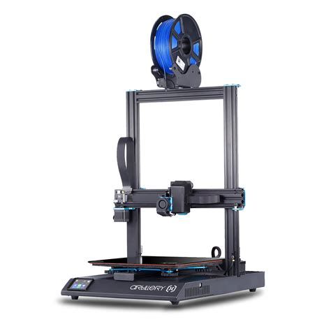
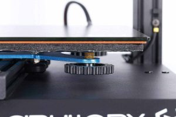
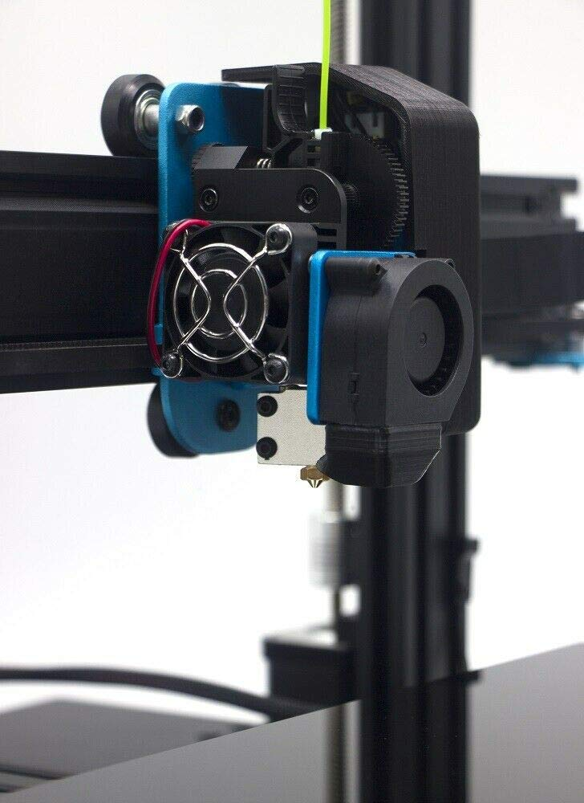
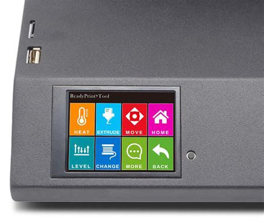
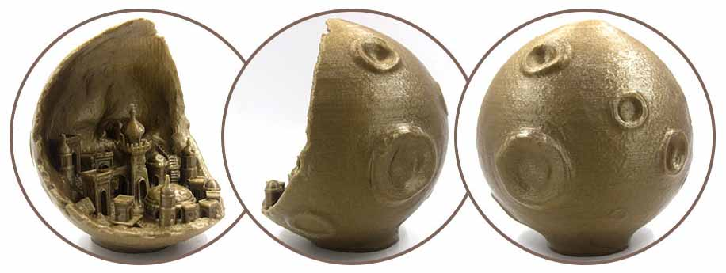
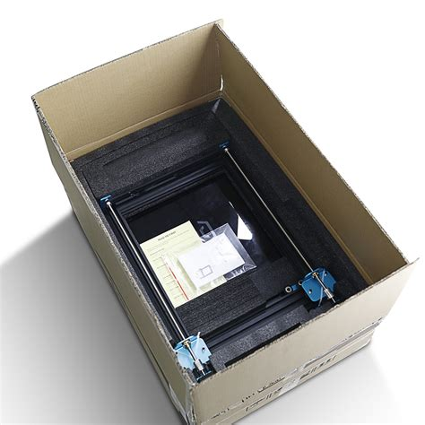

Nonostante **Artillery** sia una ditta relativamente giovane, fondata nel 2018, ha prodotto con la sua **[Artillery Sidewinder X1](https://amzn.to/3cCfyXD)** un degno concorrente al dominio di Creality nel settore delle **stampanti 3D FDM** di fascia media.

La prima Sidewinter X1, uscita nel 2018, era un prodotto accettabile ma decisamente migliorabile. Da allora sono arrivate sul mercato nuove versioni, implementate seguendo il _feedback_ e le richieste degli utenti. Questa ultima versione, la **[Artillery Sidewinder X1 V4](https://amzn.to/3cCfyXD)**, è una stampante solida come una roccia che offre una notevole serie di funzionalitá per il suo prezzo.

In questo articolo troverai una recensione rapida ma efficace di questo modello. Prenderó in esame per prima cosa le **caratteristiche tecniche** e le **funzionalità** in modo che tu possa farti un’idea di come è costruita, nonché delle sue capacità, elencando i punti forti e quelli deboli. Troverai poi una valutazione della **qualità di stampa**, dei **pro** e **contro** e, infine, quello che per me è il **verdetto finale** sulla stampante. Spero che questa recensione ti possa aiutare a decidere se è la stampante giusta per te.

[VEDI PREZZO](https://amzn.to/3cCfyXD)

\[toc\]

## Caratteristiche principali

### Montaggio

Per quanto riguarda il **montaggio**, iniziamo col dire che la **Artillery Sidewinter X1** è una stampante che ti arriva a casa **pre-assemblata**, cioè montata già al 95%. L’assemblaggio veloce sta prendendo sempre più piede in questo tipo di stampanti perchè è molto apprezzato dagli utenti e le varie ditte costruttrici se ne stanno rendendo sempre più conto.

Le istruzioni sono chiare e con foto, anche se quasi inutili, in quanto è solo necessario montare il ponte alla base con **quattro viti**, collegare un paio di **cavi a nastro** e avvitare il supporto della bobina di filamento perchè la stampante sia pronta. Ti consiglio però, come sempre in questi casi, di ricontrollare e dare una stretta a tutte le viti perché succede spesso che il premontaggio sia fatto in maniera un po’ frettolosa.

### Design e Struttura

L'Artillery Sidewinder X1 è una delle tante stampanti in stile Creality CR-10 emerse dopo l'immenso successo del modello. Tuttavia, la Sidewinder X1 non è un semplice clone, né per la tecnologia installata né per l'aspetto generale.

[VEDI IN AMAZON](https://amzn.to/3cCfyXD)

A differenza della sua fonte di ispirazione, l'Artillery Sidewinder X1 ha una solida ed elegante base che contiene l’alimentatore, la scheda madre e lo schermo. Ciò conferisce alla stampante 3D un aspetto professionale, abbastanza diverso da altre stampanti di prezzo simile in cui i vari componenti sono separati e danno più un’impressione “fai-da-te”.

Sempre restando in tema di **design**, ho menzionato nella sezione montaggio i **cavi a nastro**:  a differenza di un gran numero di stampanti desktop economiche in cui abbiamo in dotazione e delle mazzette di cavi tenuti insieme con fascette, l'Artillery Sidewinder X1 si differenzia con l’uso grandi cavi a nastro disposti in modo ordinato.

Tuttavia, stile e funzionalità non vanno sempre di pari passo, i cavi a nastro sono più delicati dei cavi normali e si possono usurare e si rompere all’altezza dei pin di connessione a causa del movimento rapido. Nella scatole della stampante ci sono cavi a nastro di ricambio, segno che Artillery è consapevole del problema, e si possono scaricare da Thingiverse modelli da stampare in 3D di coperture che proteggono il punto di giunzione.

Per quanto riguarda la **struttura**, robustezza e durata di una stampante sono spesso legate al suo telaio e la Sidewinter X1 in questo senso non delude, il **telaio è solido alluminio**, con un **asse X** di 60x20mm, quando la maggior parte delle stampanti si accontenta di un 40x20 mm nel migliore dei casi. L’**asse Z** è **doppio** e i due assi a vite sono sincronizzati attraverso una cinghia di connessione e una puleggia. Sebbene non sia la soluzione migliore, che sarebbe l’utilizzo di due fine corsa indipendenti, fa un lavoro accettabile. Avere un'impalcatura solida per l’asse Z garantisce meno oscillazioni quando si utilizza il volume di costruzione per fare stampe molto alte.

Il **supporto per le bobine** di filamento si trova sulla parte alta del ponte ed è **regolabile** per poter permettere di utilizzare bobine di diversa dimensione. Purtroppo la sua posizione e il fatto di dover svitare e riavvitare ogni volta due viti a brugola che sono sul retro della stampante lo rendono scomodo da usare, soprattutto se la stampante non si trova in una posizione che sia accessibile da tutti i lati. 

Esistono per fortuna una serie di **soluzioni alternative scaricabili gratuitamente** e stampabili in 3D, come ad esempio [questa](https://www.thingiverse.com/thing:3850399) ma ce ne sono altre, che ti consiglio di cercare se pensi che ti troverai spesso a utilizzare bobine di diverse dimensioni.

### Piatto e Volume di stampa

Il **piatto di stampa** della dell'Artillery Sidewinder X1 è costituito da una lastra di vetro ceramico, molto simile all'Anycubic Ultrabase. In breve, la superficie ruvida e porosa si espande quando viene riscaldata, permettendo l'adesione del materiale fuso e si restringe di nuovo quando si raffredda, provocando il distacco delle stampe.

Le dimensioni del piatto sono di **300x300x400 mm** di altezza, in termini di **volume di stampa**, questo pone la Sidewinder X1 al di sopra della media.

Caratteristica molto interessante di questa stampante è la **velocità di riscaldamento molto alta**, sia del **_noozle_** che del **piatto**, che possono arrivare, rispettivamente, a 200°C e 90°C in meno di un minuto, riducendo notevolmente i tempi di preparazione alla stampa. 

Purtroppo tra i lati negativi dobbiamo considerare che la dispersione termica su un piatto di questa grandezza non è uniforme e che la temperatura è più bassa lungo i bordi del piatto rispetto al centro, cosa che può causare alcuni problemi di adesione quando si stampano oggetti che occupano tutta la base con materiali inclini a deformarsi.

La **calibrazione del piatto** è **manuale**, con il solito sistema di far scorrere un foglio di carta tra il piatto di stampa e il _noozle_ e girare le manopole sotto il piano non sarà uniformemente livellato. È però presente un **sistema di livellamento assistito**, che porta il noozle automaticamente ai quattro angoli del piano e velocizza decisamente la procedura.

### Estrusore

L’artillery Sidewinter X1 V4 è dotata di un **estrusore diretto** in stile _Titan Aero_, un componente che aggiunge valore alla stampante, in quanto avere una configurazione a trasmissione diretta è una rarità nel segmento di prezzo di Sidewinder. In aggiunta a questo l’**_hotend_** Volcano, di alta qualità, presenta un'alta velocità di riscaldamento e una camera di fusione allungata che permette di lavorare con portate piuttosto elevate ed utilizzare efficacemente _noozle_ con un diametro di 0,8 mm.

Le caratteristiche di **estrusore** diretto e **_hotend_**, unite con la maggiore robustezza dell’asse X e il doppio asse Z consentono una corsa stabile della testina di stampa e la possibilità di usare senza problemi materiali flessibili come il TPU.

### Connettività e UI

Per quanto riguarda la **connettività** la stampante presenta una porta per **schede SD** e una **porta USB**, entrambe posizionate sul lato superiore della base, invece che su quello laterale. La posizione delle porte non è molto pratica in quanto tendono a riempirsi di sporcizia ma, visto che possediamo una stampante 3D, il problema è facilmente risolvibile scaricando e stampando un copri-prese [da questo link](https://www.thingiverse.com/thing:4105165).

Lo **schermo** è un touchscreen a colori da 3,5 pollici, con un’interfaccia facile da usare. Ci sono colori diversi per i vari sottomenù e la scelta delle varie funzioni è così intuitiva da rendere superfluo leggere le istruzioni.

### Sensore di Filamento e Funzione di Ripresa

La Sidewinter X1 V4 ha di serie sia il **sensore di filamento esaurito** che la **funzione di ripresa dopo interruzione** per mancanza di corrente.

Considerato che è una stampante con un volume di stampa più grande della norma è probabile che tu voglia utilizzarla per progetti piú grandi ed è anche più probabile che si esaurisca il filamento durante una stampa. Questa possibilità è stata ben gestita da Artillery,  perchè oltre al **sensore che interrompe la stampa** in caso di esaurimento del filamento **il piatto mantiene la temperatura**. Questo ti permette di tornare anche ore dopo per aggiungere nuovo materiale e riavviare la stampa, senza timore che la stampa si stacchi.

Ovviamente il piatto non rimane riscaldato dopo un’interruzione di corrente, però la **funzione di ripresa** ti permette di riprendere la stampa da dove si era fermata, dopo aver lasciato riscaldare nuovamente il piatto.

In entrambi i casi è importante che, in caso di necessità di spostare il piatto prima di riprendere la stampa, tu non lo faccia manualmente, ma utilizzi il touchscreen per muovere gli assi, altrimenti la stampante non ripartirà dal punto corretto.

### Livello di rumore

La Sidewinter X1 V4 è **una delle stampanti più silenziose sul mercato.** Artillery è arrivata a questo risultato montando dei **driver** per i motori passo-passo del carrello molto silenziosi.

È quasi sempre possibile acquistare a sostituire i driver in una stampante 3D per ottenere questo risultato, però è decisamente più comodo trovare già tutto predisposto di serie.

Inoltre, le uniche due **ventole** presenti nella stampante sono quelle per raffreddare la testina e il pezzo in stampa e anche quando sono entrambi accese il livello di rumore rimane basso, intorno ai 45 decibel, per darti un’idea molto simile a quello di un condizionatore portatile.

## Qualitá di stampa

La qualità delle stampe in **PLA** è ottima, anche se questo non ci sorprende, date le sue caratteristiche tecniche. Considerato che è una stampante aperta, la Artillery Sidewinter ha risultati inaspettatamente buoni anche con l’**ABS**, che notoriamente dà il suo meglio in stampant a camera chiusa. Il suo estrusore a presa diretta permette di lavorare bene anche con materiali flessibili come il **TPU**, che sono più difficili da utilizzare con le stampanti a Bowden.

In sintesi, è una stampante molto **versatile** per quanto riguarda i **materiali** che puoi utilizzare che, con un investimento di tempo per trovare le impostazioni ottimali, ti darà stampe di ottima qualità.

## Contenuto della scatola

Artillery afferma di aver eseguito test di caduta da 2 metri di altezza per verificare la tenuta dell’imballaggio, che sia vero o meno la stampante arriva indubbiamente ben imballata con molti strati di schiuma all'interno che garantiscono un’ottima protezione per il corpo e le aste della stampante.

Il contenuto della scatola, oltre ovviamente alle parti che costituiscono la stampante, include un astuccio con accessori e parti di ricambio, quali brugole e chiave inglese, penna usb, cavi a nastro e viteria di ricambio, noozle.

## Tabella PRO/CONTRO

**PRO**

- Struttura robusta in alluminio
- Funzione di fine filamento e ripresa ben progettate
- Estrusore diretto Titan
- Riscaldamento veloce di piano e testina di stampa
- Molto silenziosa
- Grande volume di stampa
- Versatilità di uso con diversi materiali

**CONTRO**

- Cablaggio delicato
- Distribuzione irregolare del calore sul piatto
- Il portabobina è piuttosto complicato e difficile da regolare

## Specifiche Tecniche

- Tecnologia: FDM
- Tipo di stampante: cartesiana
- Risoluzione dello strato: 0,1 mm altra recensione: 0,05 mm
- Volume di costruzione: 300 x 300 x 400 mm
- Velocità di stampa massima: 150 mm / s
- Precisione di posizionamento XYZ: 0,05 mm, 0,05 mm, 0,1 mm
- Filamento di stampa: PLA, ABS, TPU, Wood, materiali flessibili

- Diametro del filamento: 1,75 mm
- Diametro noozle: 0,4 mm
- Tipo di estrusore: estrusore a trasmissione diretta
- Temperatura massima della piastra di costruzione: 130° C
- Temperatura massima del noozle: 240° C
- Connettività: USB, scheda SD
- Tipo di ugello: vulcano
- Schermo: 3,5 pollici touchscreen
- Funzione recupero stampa: si
- Sensore di filamento: si

## Artillery Sidewinder X1 V4 - Verdetto finale

L'**[Artillery Sidewinder X1 V4](https://amzn.to/3cCfyXD)** si distingue da stampanti simili nella stessa fascia di prezzo presentando **componenti e funzionalità di qualità superiore**, come la trasmissione diretta con estrusore tipo Titan, i driver della scheda madre e le ventole super silenziosi, piano di stampa a riscaldamento ultra rapido e design robusto ed elegante.

Naturalmente, data la categoria di prezzo, la stampante ha le sue insidie. Ad esempio, i cavi a nastro che conferiscono alla stampante un aspetto così elegante tendono a rompersi nel tempo e la differenza di temperature tra il centro e i bordi del piatto di costruzione può dare problemi nell'utilizzo di filamenti sensibili alla temperatura o per stampe molto grandi che occupano tutto il piano.

Alcuni di questi problemi sono risolvibili grazie alla comunità di utenti che si è creata online e ha reso disponibili soluzioni alternative stampabili in 3D. Per altri casi, come ad esempio la irregolare dissipazione del calore sul piatto, purtroppo sono possibili solo soluzioni come il limitarsi a materiali meno sensibili al calore quando si vogliano fare pezzi di grandi dimensioni.

Nonostante questi difetti, è un dato di fatto che questa versione 4 dell'**Artillery Sidewinder X1** **vanti già di serie molte funzionalità con cui penseresti di aggiornare stampanti economiche simili** e che per le sue caratteristiche, funzionalità e qualità delle stampe sia un **buon acquisto** **sia per principianti**, **che per utenti esperti** che abbiano iniziato con una stampante economica e vogliano fare un upgrade.

## Modello Concorrente/Alternativo

Un modello alternativo per caratteristiche, grande volume di stampa e fascia di prezzo che mi sento di consigliare è l’**[Anycubic Mega X](https://amzn.to/2Ji2J8z)**. Puoi trovare una [recensione dettagliata](https://modeltoreal.com/recensione-anycubic-i3-mega-s-e-anycubic-mega-x/) su questa stampante in questo articolo, per confrontare le caratteristiche e vedere quale ti sembri più adatta alle tue necessità.
