\[toc\]

Le **stampanti 3D a doppio estrusore**, o come vengono impropriamente definite a volte **stampanti bicolori**, sono una categoria di stampanti relativamente recente che merita una guida a parte perché permettono di costruire oggetti ancora più particolari ed interessanti rispetto alle stampanti 3D classiche.

Come si intuisce dal nome sono stampanti 3D che presentano un **doppio estrusore** e possono quindi utilizzare **due filamenti contemporaneamente** durante il processo di stampa. I due filamenti possono essere dello **stesso materiale**, ma di **colori diversi**, permettendo di creare oggetti a due colori, oppure di due **materiali diversi**. Un'applicazione molto interessante in questo caso è quella di utilizzare un **filamento solubile in acqua** come il PVA per i **supporti.** In questo modo a fine stampa semplicemente lavando l'oggetto si può facilmente eliminarli. Questa **tecnica** permette di creare **oggetti complicati** in cui sarebbe fisicamente molto difficile eliminare i supporti manualmente.

La presenza di due estrusori, soprattutto se sono in grado di muoversi in maniera indipendente (**tecnologia IDEX**), permette anche di lavorare in **modalità duplicazione**, per poter creare **due oggetti identici o speculari contemporaneamente**, utilissimo quando si vogliono stampare oggetti in serie.

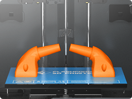

#### Modalitá speculare

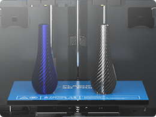

#### Modalitá DUPLICAZIONE

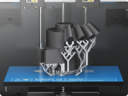

#### Supporti solubili

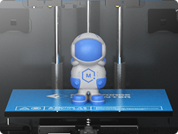

#### bicolore

## Quale stampante 3D a doppio estrusore comprare? Selezione rapida

In questo articolo troverai recensioni oneste con pregi e difetti delle **5 migliori stampanti 3D a doppio estrusore** sul mercato. Se però non hai voglia di leggere tutte le informazioni che seguono, ti lascio qui una selezione veloce delle tre migliori tra cui scegliere, secondo la mia esperienza personale, in base a questi criteri:

- [**Geeetech Mizar-M FDM**](https://amzn.to/3IZw9DI)**: migliore stampante** 3D a doppio estrusore **economica**. Nonostante il prezzo contenuto, presenta caratteristiche che si trovano in stampanti di più alta fascia, come i driver ultra silenziosi nella scheda madre e schermo touch a colori.

- **[Sovol SV04](https://amzn.to/43Dtg57): migliore stampante per qualità/prezzo.** Testine di stampa con movimento indipendente, scheda madre silenziosa e grande volume di stampa.

- **[FlashForge 3D Creator Pro 2](https://amzn.to/3TXf9UY): migliore stampante pronta all’uso**, struttura a camera chiusa e testine di stampa con movimento indipendente.

\[table id=7 /\]

## Guida comparativa delle migliori stampanti 3D a doppio estrusore

### **Sovol SV04**

[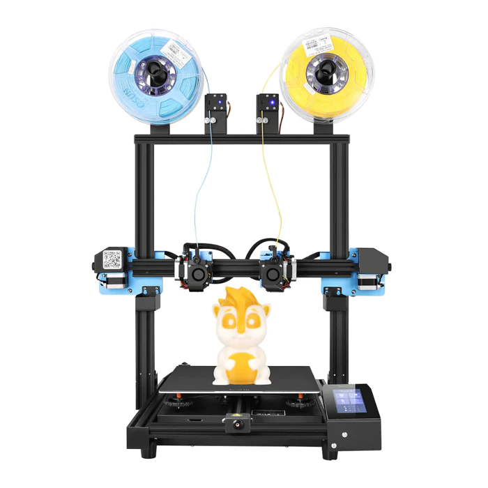](https://amzn.to/43Dtg57)

__La migliore stampante per qualità/prezzo. Molto versatile con due testine di stampa con movimento indipendente, scheda madre silenziosa e grande volume di stampa.__

[VEDI PREZZO](https://amzn.to/43Dtg57)

La ditta cinese Sovol è più conosciuta per la sua produzione di filamenti e accessori che per le stampanti, negli ultimi tre anni si è però ritagliata già un suo posto nel mercato delle stampanti a doppio estrusore per i suoi **prezzi vantaggiosi per le funzionalitá offerte**.

La **[Sovol SV04](https://amzn.to/43Dtg57)** è una stampante 3D che viene venduta in **kit preassemblato**, il **montaggio** è di circa 15 minuti e consiste nell’unire le due parti che compongono la stampante e i connettori elettrici. Come sempre, consiglio di dare una controllata a tutte le viti delle parti preassemblate per evitare brutte sorprese durante la prima stampa.

L’**_asse Z_** **è doppio** e monta due motori passo-passo che migliorano la stabilità e la precisione lungo l’asse verticale durante la stampa, aumentando anche la vita utile della stampante (la precisione nominale dichiarata è decisamente buona: 0,001 mm).

La Sovol SV04 utilizza un **piano di stampa magnetico flessibile,** che garantisce una buona adesione e permette di rimuovere facilmente le stampe finite e di pulire la superficie senza dover applicare pressione sul piano di stampa e rischiare di perdere la calibrazione.

La stampante è dotata anche di alcune funzionalità molto utili, come il sistema di **calibrazione automatica**, che semplifica notevolmente il processo di preparazione per la stampa, il **sensore di filamento esaurito** e il **recupero dell’attività di  stampa** dopo interruzione di corrente, che evitano di dover riavviare un’intera stampa da zero in caso di incidenti. L'interfaccia utente intuitiva e il **display a colori touch screen da 4,3 pollici** rendono la navigazione e la configurazione della stampante un'esperienza piacevole.

Il **volume di stampa** è piú che generoso, con i suoi **300 x 300 x 400 mm**, sufficiente per praticamente qualsiasi progetto.Una delle caratteristiche distintive della Sovol SV04 rispetto alle versioni precedenti è il suo **doppio estrusore indipendente**, che consente di stampare in due colori o materiali diversi contemporaneamente. La Sovol SV04 è una **stampante IDEX** (Independent Dual Extruder), il che significa che ha due estrusori indipendenti che possono muoversi separatamente lungo gli assi X e Y. Questo consente alla stampante di stampare oggetti multicolore o multi-materiale senza mescolare i materiali durante il processo di stampa.

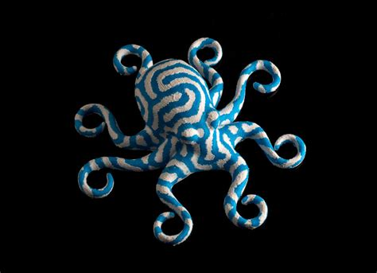

La **scheda madre** che la Sovol utilizza è una delle schede madri più recenti di Creality, con i driver TMC2209 per il motore passo-passo, questo rende la stampante relativamente **silenziosa** durante la stampa, anche se ovviamente si sente il rumore delle ventole di raffreddamento.

**PRO**

- Stampante IDEX molto economica

- Grande volume di stampa

**CONTRO**

- Connessione WIFI assente

- Dimensioni della stampante un po’ grandi

[VEDI IN AMAZON](https://amzn.to/43Dtg57)

* * *

### **Geeetech Mizar-M**

[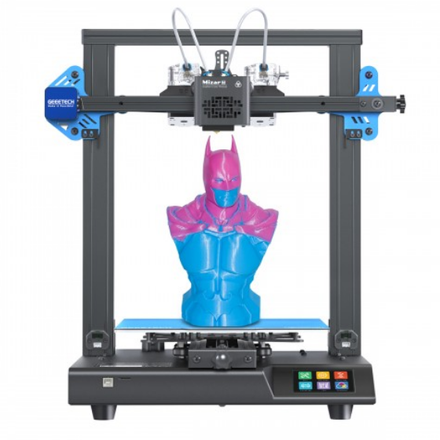](https://amzn.to/3IZw9DI)

__Stampante solida e affidabile con un prezzo più che contenuto. Permette di creare oggetti con gradienti di colore.__

[Vedi in amazon](https://amzn.to/3IZw9DI)

La stampante **Geeetech Mizar-M** ha il corpo in alluminio, solido e stabile, e si acquista in kit, ma **semi-assemblata**. Il **montaggio** è semplice e soprattutto veloce: è costituita dalla base che ospita tutti i componenti e da un arco che ha già montati motori ed estrusore. Si tratta solo di connettere queste due parti con quattro viti e pochi connettori elettrici. I connettori sono chiaramente identificati e possono essere inseriti solo nel verso corretto, l’assemblaggio è davvero a prova di errore.

Il **piatto** è in **alluminio**, si scalda molto rapidamente e ha un’**area di stampa** abbastanza generosa di **255x255x260 mm** che permette di fare stampe di dimensioni interessanti.

La **copertura del piatto** delle stampanti di casa Geeetech da qualche tempo è stata implementata con un rivestimento stile _ultrabase_ della marca _Anycubic_, che Geeetech ha rinominato **_superplate_**. Le stampe aderiscono bene al piatto senza ausilio di colla o nastri. Un’innovazione decisamente apprezzabile perché una buona aderenza all’inizio garantisce quasi sempre il successo della stampa. Inoltre, il **piano** è **magnetico** e poterlo togliere dalla stampante facilita moltissimo la rimozione delle stampe dal piano una volta completate.

La **calibrazione** del piatto è semplice e **automatica**, con **sensore di auto-livellamento**, resta comunque la possibilitá di calibrare il piatto manualmente, per utenti che amano il totale controllo. 

Presenti anche le **funzioni di ripresa di stampa dopo un’interruzione** e il **sensore di filamento esaurito.** Inoltre, la stampante dispone di un **sistema a doppio asse Z**, che garantisce una maggiore stabilità e precisione durante la stampa

È una stampante poco **rumorosa**, la scheda madre è dotata di **driver ultra silenziosi** che riducono di molto il livello di rumore durante la stampa, anche se rimane quello delle ventole di raffreddamento. Nulla di ridire sullo **schermo** **LCD touchscreen**, di buona dimensione e  reattivo. 

La peculiarità di questa  stampante è di avere un **doppio estrusore** che permette di fare stampe molto interessanti sia utilizzando due colori diversi, che due materiali diversi nello stesso pezzo.

Inoltre, e questa è la caratteristica che la rende unica, anche se ci sono due estrusori diversi i due filamenti vengono convogliati in un’**unica camera di fusione.** Questo rende possibile miscelare i due colori, decidendo la percentuale di ogni colore sia in modalità fissa che sfumata, per **stampe con gradiente di colore**. Questo tipo di settaggi apre le porte a diverse e interessanti possibilità, impostando più sfumature che possono cambiare a vari livelli.

Un'altra caratteristica degna di nota è il **gruppo estrusore intercambiabile**, che rende questa stampante una macchina unica. Il **Modulo Colori a Gradiente** è per la miscelazione dei colori e l'altro è un **Modulo Colore Separato** per la stampa multicolore.

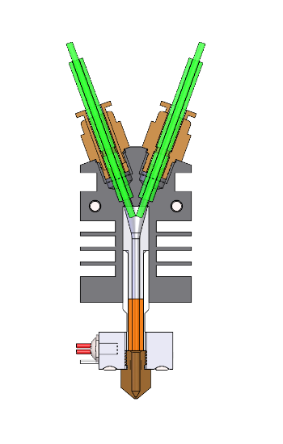

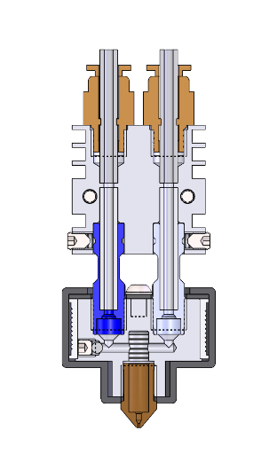

Geeetech ha ottimizzato e aggiornato il **Modulo Colori a Gradiente** della Mizar M: rispetto alla versione precedente, questo modulo ha un flusso di miscelazione dei colori ridisegnato e una struttura per evitare il blocco dell'estrusore. Questo miglioramento risolve efficacemente i problemi di miscelazione irregolare dei colori e di occlusione dell'estrusore. Attualmente, la nuova struttura è stata brevettata.

Un lato negativo della camera di fusione in comune per entrambi i filamenti è che per fare stampe bicolori non a gradiente è necessario spurgare la camera e riempirla del colore scelto. Questo viene fatto attraverso una **torre di scarico** che si stampa a lato del pezzo. Se non vi interessa creare stampe cn gradiente ma solo bicolori considerate che lo scarto puó arrivare al 50-60% in piú di materiale per ogni stampa, aumentando così i costi.

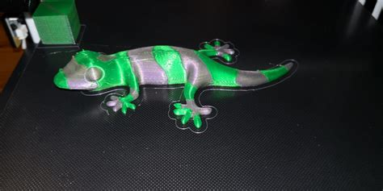

Sembra ovvio aggiungere che, nonostante la **Geeetech Mizar M** ci permetta di fare stampe con gradienti di colore, **non è possibile stampare due pezzi uguali contemporaneamente**, come invece è possibile con stampanti a doppio estrusore e doppio noozle.

La Geetech commercializza dei [filamenti _silk_](https://amzn.to/34l6wc0), particolarmente indicati per questo tipo di stampante, con finitura finale molto lucida e liscia, quasi “morbida”, al tatto.

**PRO**

- Stampe a gradiente di colore

- Montaggio semplice

- Calibrazione automatica

**CONTRO**

- Stampa di un solo pezzo per volta

- Torre di scarico

[VEDI IN AMAZON](https://amzn.to/3IZw9DI)

* * *

### Tenlog TL-D3 Pro

[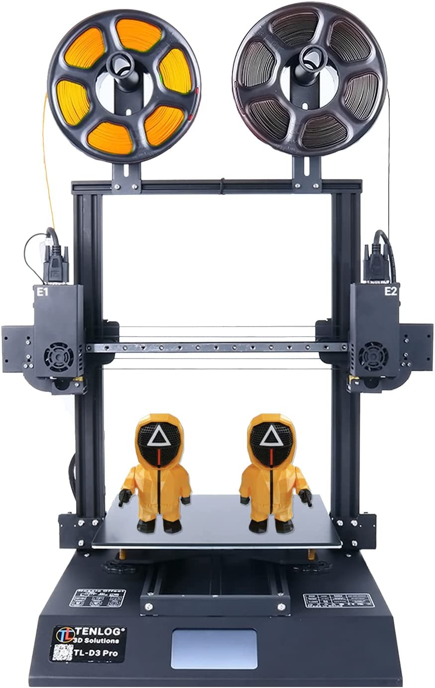](https://amzn.to/3MDG8Q4)

__La stampante a doppio estrusore con tecnologia IDEX più economica sul mercato, consigliata ad utenti con alte aspettative.__

[VEDI PREZZO](https://amzn.to/3PHhb9s)

La [**Tenlog TL-D3 Pro**](https://amzn.to/3PHhb9s) è una stampante prodotta da una casa relativamente nuova sul mercato e abbastanza sconosciuta che stupisce per l'**ottima qualità** del prodotto.

La caratteristica principale di questa stampante è la sua **tecnologia di doppia estrusione** **IDEX** (Independent Dual Extrusion): la maggior parte delle stampanti 3D a doppia estrusione ha entrambe le testine di stampa montate sullo stesso carrello, in questo caso, invece, le due testine di stampa hanno la **capacitá di muoversi indipendentemente lungo l’asse X**.

Questa tecnologia permette di **utilizzare contemporaneamente entrambe le testine di stampa** in modalità duplicazione sia normale che speculare, raddoppiando la capacità di produzione.

Inoltre, poter “parcheggiare” a lato l’estrusore che in quel momento non sta lavorando durante **stampe bicolori** o con **supporti solubili** **evita deposizioni indesiderate di materiale** nei punti dove non dovrebbe esserci, aumentando moltissimo la **precisione** di stampa.

Altra caratteristica interessante è che la TL-D3 Pro utilizza **estrusori a trasmissione diretta** per entrambe le testine di stampa, questo permette di gestire meglio la **ritrazione del filamento** nelle stampe bicolori e aiuta nell’utilizzo di **filamenti flessibili**.

Per quanto riguarda il **montaggio**, la stampante arriva **pre-assemblata**. Sarà necessario montare il corpo della stampante al ponte e montare le testine di stampa con una decina di viti.  In seguito ci saranno da collegare due connettori elettrici di tipo VGA sulle testine e saremo già pronti per effettuare la prima **calibrazione** del piatto, che è **manuale**.

Il **piatto di stampa** è in **vetro borosilicato** e presenta una buona adesione. È **riscaldato** fino a 110ºC mentre le testine arrivano a 300ºC, temperature che permettono di lavorare bene con la maggior parte dei filamenti.

Anche il **volume di stampa** è decisamente soddisfacente, con i suoi **300x300x350 mm** permette di fare dei pezzi già medio-grandi. Una considerazione da fare però è che se lavori in modalità duplicazione il volume di stampa sarà dimezzato.

Per quanto riguarda il **livello di rumore**, la scheda madre della TL-D3 Pro supporta sia i **driver passo-passo** TMC2208 che TMC2225, quindi la macchina è **molto silenziosa** durante il funzionamento, si sente solo la ventola. Particolare non trascurabile, quando la stampa è terminata tutte le ventole si fermano, quindi **Tenlog TL-D3 Pro** è totalmente silenziosa quando è accesa ma non stampa.Le funzionalità aggiuntive di Tenlog TL-D3 Pro includono un **display touchscreen a colori da 4,3 pollici**, attraverso cui vengono gestiti tutti i controlli della stampante e i **sensori di fine filamento** e per il **recupero dell’attività di  stampa** dopo interruzione di corrente.

**PRO**

- Doppia testine di stampa con tecnologia IDEX

- Estrusori a trasmissione diretta

- Silenziosa

- Resume print e sensore di fine filamento

**CONTRO**

- Calibrazione manuale

- Non sempre reperibile per le vendita in Europa

[VEDI PREZZO](https://amzn.to/3PHhb9s)

* * *

### FlashForge 3D Creator Pro 2

[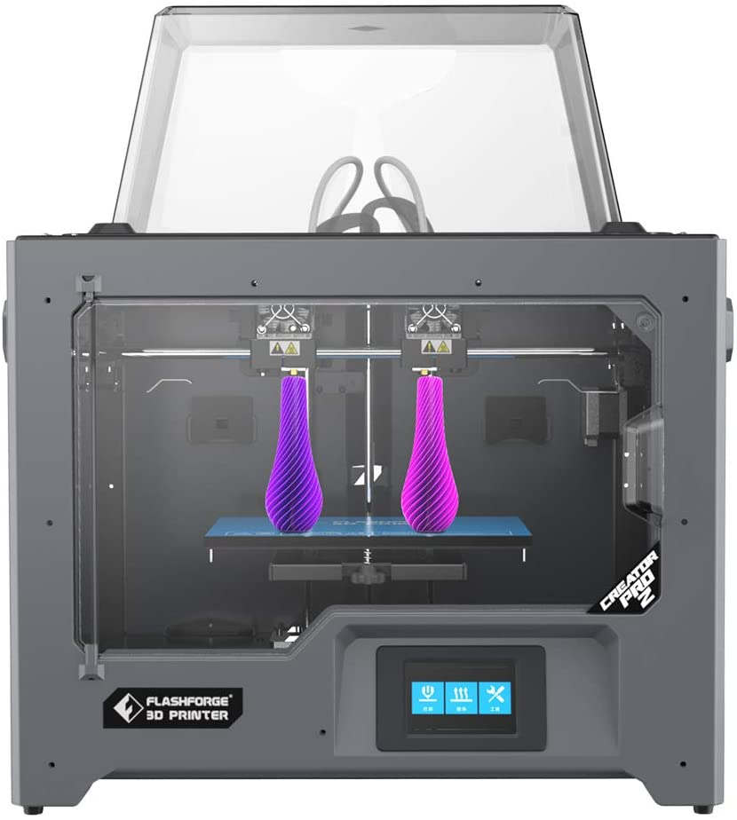](https://amzn.to/3aGbYdu)

__Stampante di gamma medio alta, versatile e facile da usare, con doppio estrusore indipendente (IDEX technology). Consigliata ad utenti senza problemi di budget.__

[vedi prezzo](https://amzn.to/3TXf9UY)

La [**Flashforge 3D Creator Pro 2**](https://amzn.to/3TXf9UY) è la versione aggiornata della stampante a doppio estrusore finora piú venduta dalla ditta. È una stampante molto versatile e con **tecnologia IDEX** (_Independent Dual Extrusion_), i due estrusori cioè possiedono un movimento indipendente lungo l’_asse X_.

È una **stampante** **a camera chiusa**, un tipo di  struttura che rende la macchina più **versatile** e adatta all’uso di diversi materiali di stampa. La **camera di stampa chiusa**, infatti, è ideale per materiali come l’**ABS** hanno bisogno di temperature costanti. In questo modo si riduce l’effetto di _warping_ (deformazione per contrazione durante il raffreddamento) durante la stampa e anche l’esposizione ai vapori nocivi che l’ABS emette quando è caldo. Per materiali come il **PLA** invece, che danno il loro meglio a temperature più basse e in un **ambiente ventilato**, è possibile rimuovere il coperchio e la porta anteriore.

La **struttura robusta** e compatta **non necessita** praticamente **di montaggio**, si tratta di togliere gli imballaggi e plastiche varie e connettere gli estrusori con un paio di viti ed i connettori elettrici. Nota di merito per il design, la fila di **luci led all’interno della camera** per illuminare l’area di stampa.

Il **piatto di stampa** in alluminio con **6,5 mm di spessore**, non si deforma ad alte temperature e presenta una pellicola porosa con buona aderenza durante la stampa che permette agli oggetti di staccarsi facilmente una volta raffreddata. È comunque possibile acquistare un piatto in vetro e sovrapporlo a quello in alluminio, bloccandolo con clips, soprattutto se siete interessati a fare stampe in ABS.

La **calibrazione del piatto** è **manuale** e senza possibilità di aggiungere un sensore ma data la struttura chiusa la stampante mantiene la calibrazione a lungo. La calibrazione e l'allineamento dei due estrusori è  invece assistita dal software.

Un difetto della stampante è che il **piatto non** sia **estraibile**, perché lo spazio ridotto di manovra rende a volte difficoltoso staccare il pezzo dopo la stampa.

La **Flashforge Creator Pro 2** è equipaggiata con **due estrusori** che **si possono muovere indipendentemente l’uno dall’altro lungo l’asse X**, con un sistema definito IDEX (_Independent Dual Extrusion)_, tecnologia che permette di **utilizzare contemporaneamente entrambe le testine di stampa** in modalità duplicazione sia normale che speculare, raddoppiando la capacità di produzione. Inoltre, ogni estrusore è dotato di un “**raschietto**”  che **toglie il materiale in eccesso** e mantiene puliti gli ugelli durante l'uso. Infatti, uno dei problemi della stampa 3D a doppia estrusione è la fuoriuscita di materiale dell'ugello inattivo durante la stampa (_oozing_), con conseguenti macchie indesiderate ed errori che rovinano il pezzo.

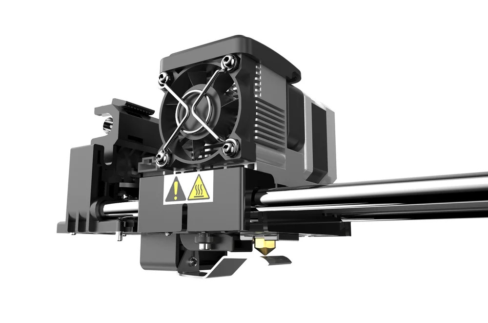

Il sistema è brevettato e funziona molto bene, è tuttavia probabile che sia anche necessario un po’ di aggiustamento nel regolare i tempi di ritrazione, per evitare eccessi di colature indesiderate.

Nota negativa, purtroppo, per il **volume di stampa**, di **200x148x150** mm, che perde 2,7 cm rispetto al vecchio modello. Le dimensioni ridotte e la struttura metallica chiusa, però contribuiscono a un’ottima **qualità di stampa** per effetto della riduzione delle vibrazioni durante l’uso.  Si tratta di un volume di stampa abbastanza piccolo purtroppo e che si riduce ancora della metà se si lavora in modo duplicazione; se sei interessato a volumi più grandi ti consiglio senza dubbio la **Tenlog TL-D3**, stampante meno lussuosa ma con la stessa tecnologia IDEX e un volume decisamente più grande.

Per quanto riguarda la **connettività** Flashforge ha dotato la stampante di presa USB e scheda SD.  Altra novità rispetto al modello precedente è lo **schermo Touch a colori di 3,5 pollici** che sostituisce il vecchio schermo LCD a pulsanti, ed era anche ora.

Continua a mancare la funzione di ripresa dopo interruzione (**_resume print_**), cosa che ci si aspetterebbe da una stampante di questa fascia di prezzo.

**PRO**

- Doppio estrusore indipendente

- Schermo Touch a colori

- Robusta camera chiusa con tetto apribile

**CONTRO**

- Volume di stampa ridotto

- Manca il resume print

- Piatto non estraibile

[VEDI PREZZO](https://amzn.to/3TXf9UY)

* * *

### **Snapmaker J1s**

[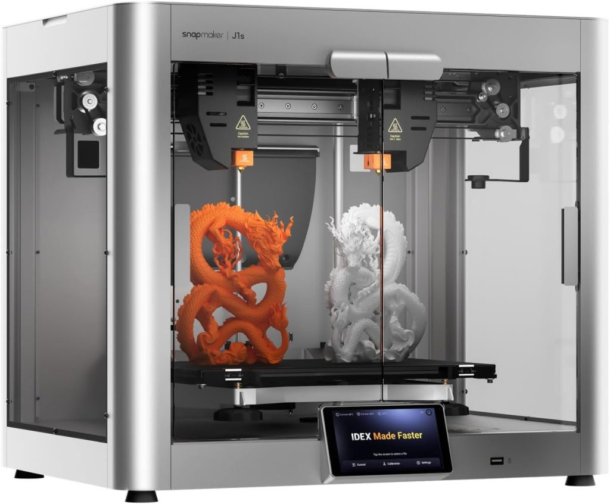](https://amzn.to/3J79SDX)

__Stampante a doppio estrusore IDEX di gamma alta, camera chiusa di alluminio, alta velocitá di stampa (350 mm/s). Non economica ma con alte prestazioni.__

[VEDI IN AMAZON](https://amzn.to/3J79SDX)

La **[Snapmaker J1s](https://amzn.to/3J79SDX)** é una stampante 3D a doppio estrusore con camera chiusa, robustissima: il case in alluminio ha ben 6mm di spessore che garantiscono stabilità e alta precisione. Arriva già montata, in pratica, è solo necessario rimuovere la viti/blocco del trasporto e si è pronti a partire.

La Snapmaker J1s si distingue per la sua capacità di **stampare ad elevate velocità** e **accelerazioni**, raggiungendo fino a **350 mm/s** e **10.000 mm/s²** rispettivamente. Questo si allinea con la tendenza dell'industria verso stampanti 3D più veloci. Caratteristiche come la **struttura rigida**, **componenti completamente metallici**, un **efficace sistema di raffreddamento** e la **compensazione delle vibrazioni del firmware** consentono queste prestazioni elevate.

Il **piano di stampa** è **rimovibile** e ha **due lati**. Uno dei lati è rivestito con **PEI** (polietereimide), mentre l'altro è una superficie in **vetro liscio**. La maggior parte dei filamenti aderirà meglio al rivestimento in PEI, ma alcuni filamenti aderiranno meglio al vetro. 

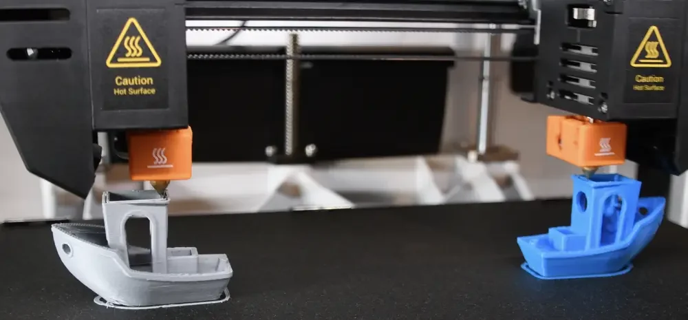

Il piano di stampa può essere riscaldato fino a 100 °C ed è fissato tramite un meccanismo di aggancio rapido. Visto che arriva già montato di solito è già calibrato, in ogni caso è bene controllare e, se necessario, effettuare una veloce **calibrazione**, **assistita dal software**, che si effettua **su tre punti**. Non è necessario ricalibrare spesso perché la struttura chiusa mantiene bene la posizione del piatto.

Nelle stampanti 3D con due estrusori, la precisione dei movimenti di un estrusore rispetto all’altro è fondamentale. Quindi, dopo aver regolato l'asse z, il passo successivo è **calibrare il piano xy**. La cosa comoda della Snapmaker J1s è che l'intero processo è completmente **automatico**; si esegue facendo esplorare agli estrusori i bordi esterni di un quadrato sulla piastra di stampa.

Per quanto riguarda il **volume di stampa**, abbiamo un piano di **300x200x200mm,** non piccolo ma un po’ inferiore rispetto ad altre stampanti a doppio estrusore, purtroppo è una caratteristica che accomuna un po’ tutte le stampanti a camera chiusa, che viene però compensata dalla stabilità e robustezza di questo tipo di stampanti.

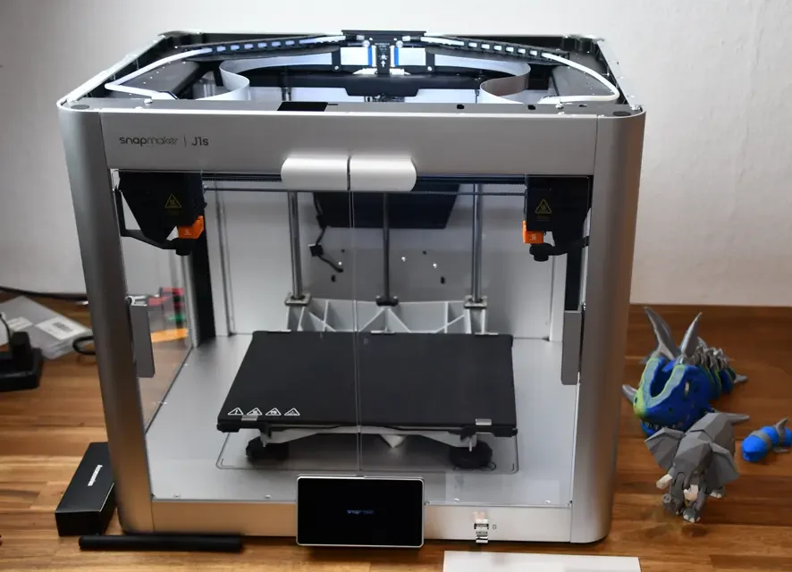

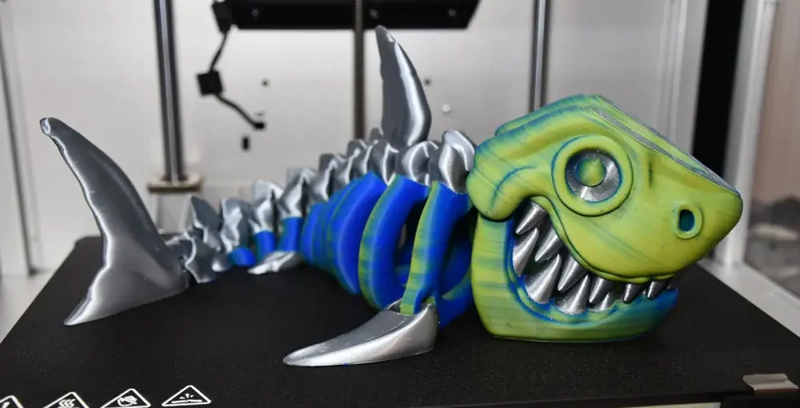

Il **_case_** della Snapmaker J1s è in **lega di alluminio**, leggera e robusta, resiste bene all vibrazioni prodotte dal processo di stampa. È possibile aprire e chiudere il _case_ tramite le **porte anteriori** e il **coperchio superiore**, il quale è fissato da magneti. Questo dà la possibilitá di lasciare chiusa la stampante per mantenere meglio il calore in caso di stampe con ABS, che necessitano di una temperatura costante durante tutto il processo. Allo stesso tempo è possibile aprirla in caso si utilizzino altri materiali che hanno bisogno di più ricircolo d’aria, come il PLA.

Per finire, abbiamo uno **schermo** da 5 pollici con risoluzione (1280x720) a **colori** e **_touch_** con un software della casa produttrice abbastanza facile e intuitivo e **connettività USB e Wi-Fi**. Sono presenti anche le utili **funzioni di recupero** dell’attività di stampa dopo interruzione di corrente e **sensori di fine filamento**.

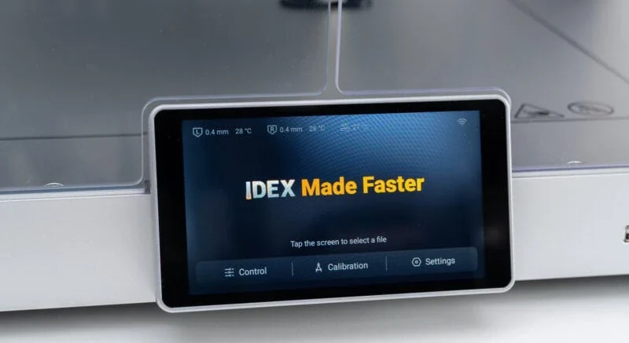

**PRO**

- Camera chiusa robusta in alluminio

- Stampante IDEX con perfetto allineamento estrusori

- Alta velocitá di stampa (350mm/s)

**CONTRO**

- Area di stampa non molto grande

- Non economica

[VEDI IN AMAZON](https://amzn.to/3J79SDX)

* * *
