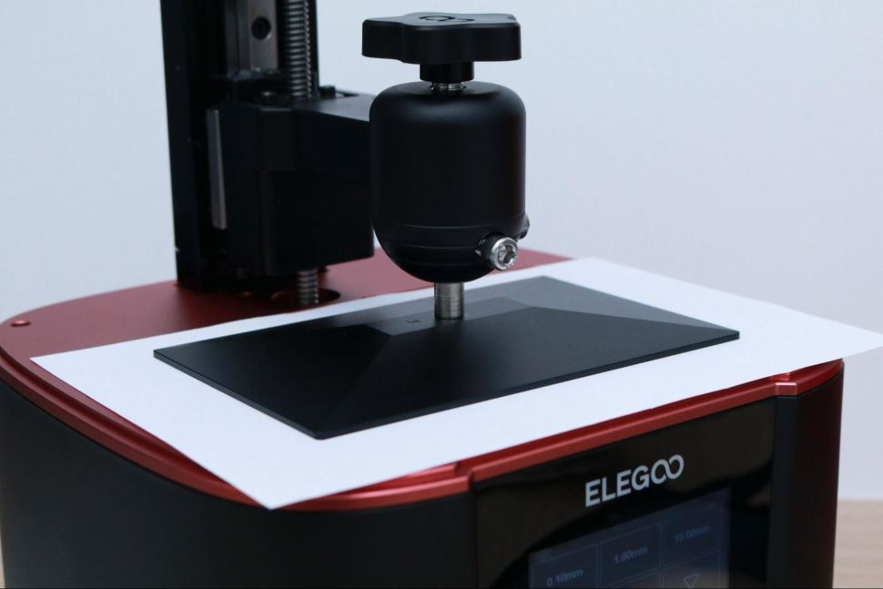
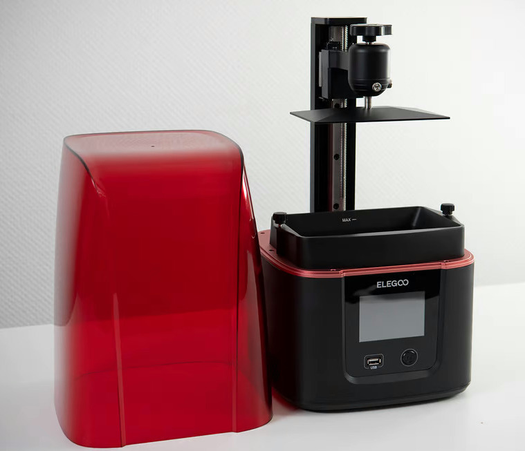
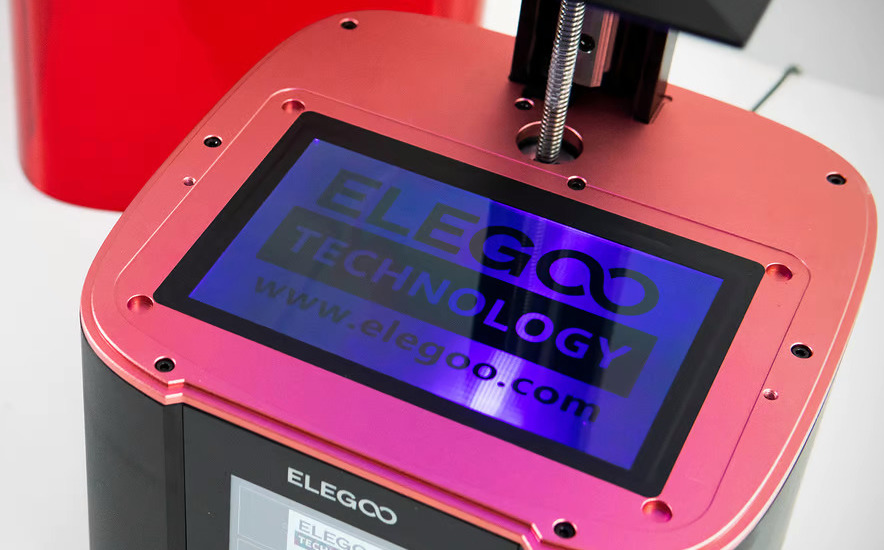
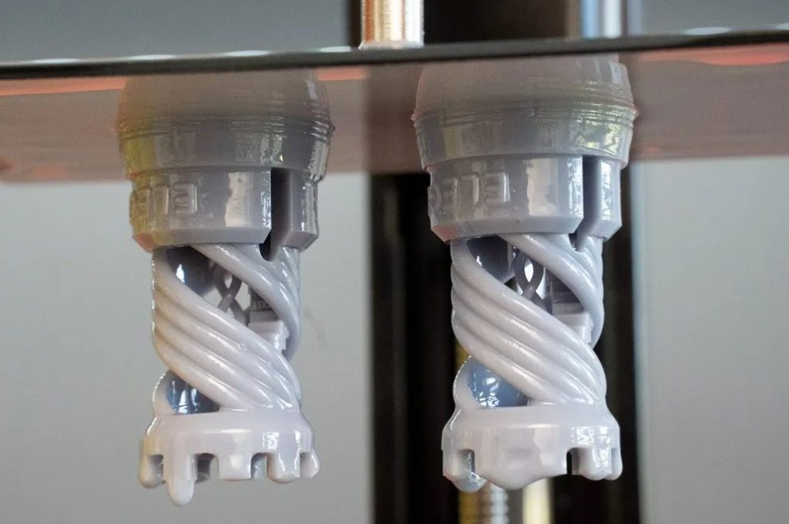
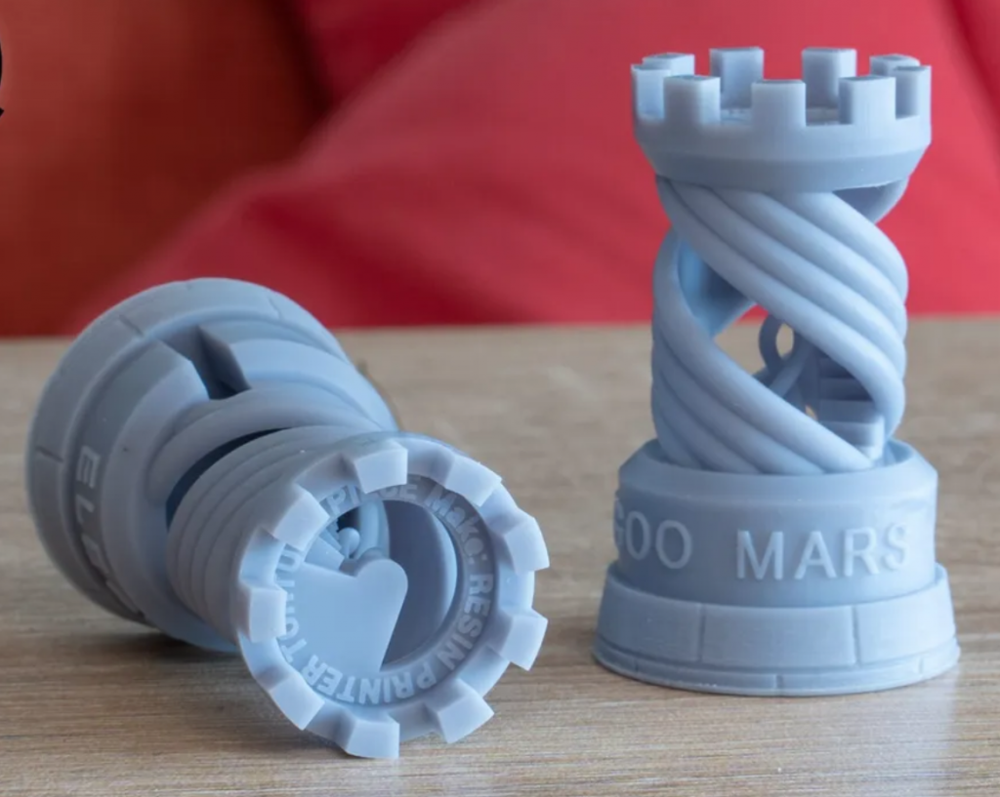
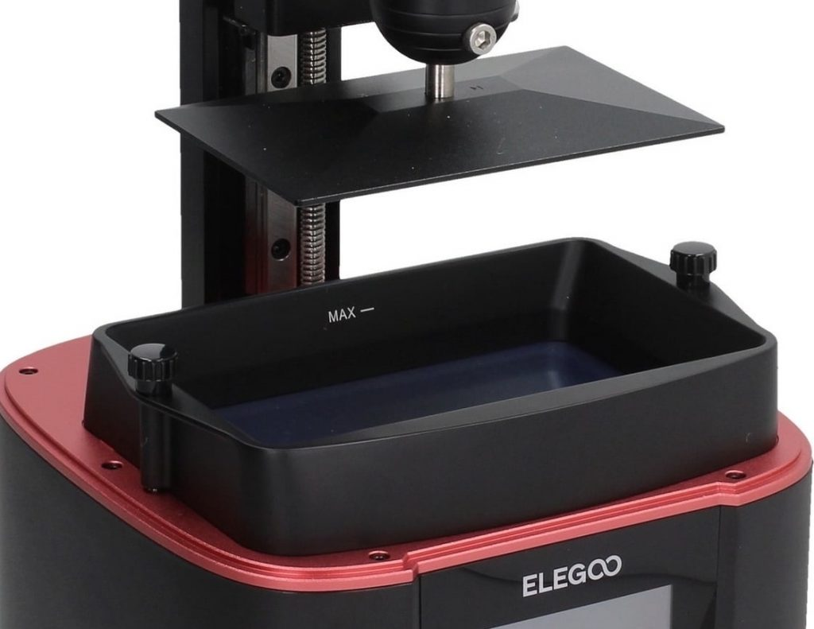
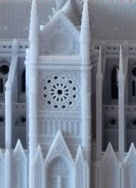
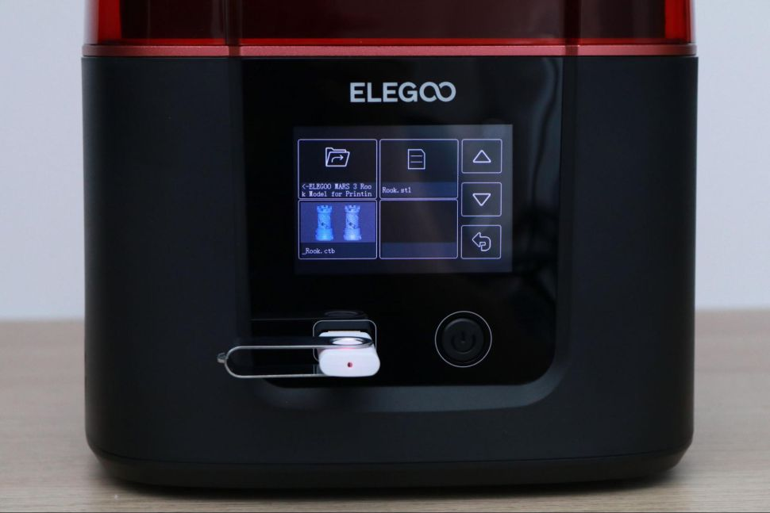
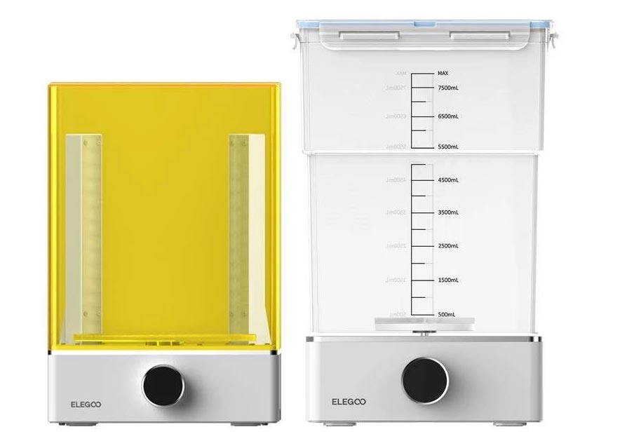
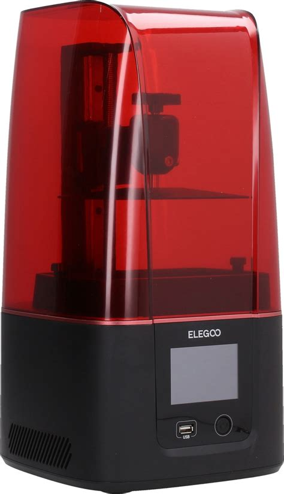

La **[Mars 3](https://amzn.to/3FjnvNY)** è la **sesta versione** della popolare **stampante a resina** di casa **Elegoo**, oltre ad essere al momento la piú stilosa. A parte l’upgrade in termini di design, la stampante ha anche alcuni **seri vantaggi in termini di prestazioni:** il suo **volume di costruzione** di **143 x 90 x 165 mm** la posiziona piuttosto in alto nel segmento di stampanti a resina di medie dimensioni e con l’aggiunta di una **matrice 4K** (finalmente!), si può stampare a una **risoluzione ultra-fine di 35 micron**. 



## Caratteristiche principali:

### Installazione

Proprio come per tutte le altre stampanti della serie Mars, l’installazione di **Elegoo Mars 3** è semplice: **la stampante funziona praticamente con plug-and-play**. 

L’unica **operazione previa richiesta** é **calibrare il piano di stampa** con l'aiuto di un foglio di carta. 

Si tratta di rimuovere la vasca, posizionare un foglio di carta sull'LCD e allentare le viti che bloccano la piastra in modo che si possa muovere liberamente. A questo punto si fa scendere la piastra, usando l’apposito comando sullo schermo, fino alla sua posizione piú bassa. Se cerchiamo di muovere il foglio di carta dovremmo notare che si muove a fatica. SI stringono di nuovo le viti con la chiave a brugola e il gioco é fatto.

### Design e Struttura

In termini di **design e struttura**, come abbiamo appena accennato, la Mars 3 ha un **nuovo case molto aerodinamico**; a dirla tutta, questo potrebbe essere un vantaggio solo se hai intenzione di stampare in una galleria del vento (ma ti sconsiglio caldamente), altrimenti il cambio è puramente estetico. 

La **base della stampante** è la stessa, partendo dal design angolare del vecchio modello e optando peró per un case **in plastica stampata a iniezione invece che metallica**, una scelta dettata probabilmente dall’esigenza di contenere i costi. La base in plastica non danneggia l'aspetto generale della stampante ma personalmente non mi piace, preferivo l’effetto robusto e solido e (perché no?) piú “lussuoso” delle basi metalliche di Mars 2 e Saturn. 

Una scelta di design piccola ma intelligente invece è il **posizionamento dei pulsanti**: il **pulsante di accensione** e la **presa USB** (si, ha cambiato di nuovo posizione, ormai manca solo che la mettano sul fondo) sono **in posizione frontale, sotto lo schermo**. 

Vale anche la pena sottolineare che lo **schermo touchscreen** **da 3,5 pollici** non é piú angolato, come nei precedenti modelli, dal punto di vista del design non fa molta differenza, ma se lavori in un ambiente pieno di sole (fortunato te), potrebbe renderti più difficile utilizzare schermo.

Come altre stampanti 3D MSLA in resina, la Mars 3 utilizza una combinazione di un'**asta filettata** e una **guida lineare** per il movimento sull'**asse Z**. La guida è rigida e robusta ed **Elegoo dichiara una precisione di posizionamento di 0,00125 mm**, una frazione dell'altezza dello strato normalmente utilizzata durante la stampa. Non ho alcun modo di verificare un tale livello di precisione con un calibro, perché stiamo parlando di spessori quasi di un capello, ma é indubbiamente vero che **Mars 3 è una stampante eccezionalmente precisa** quando si creano dettagli e trame fini.

### Risoluzione e Volume di stampa

La **vera novitá** di questa stampante e il suo upgrade piú notevole è la **risoluzione della matrice LED di stampa** e, con essa, la migliore qualità di stampa. Per Mars 3, Elegoo ha abbandonato gli schermi 2K installati nelle versioni precedenti ed é passata (finalmente!) a una **matrice con risoluzione 4K**. Mars 3 può stampare con una **precisione di 35 micron**, sebbene su un'**area più ampia di 143 x 90 mm**, per fare ciò, ospita ancora più pixel: **4098 x 2560**.

Una **risoluzione di 35 micron** è, in teoria, **circa un terzo in meno di quella che si trova nella maggior parte delle stampanti a resina 2K** sul mercato, resta da vedere se una tale differenza nella risoluzione di stampa può essere individuata ad occhio nudo e se l'aumento ha qualche effetto sulla qualità degli oggetti stampati, ma è sicuramente un passo nella giusta direzione. 

Presumibilmente molti concorrenti seguiranno l'esempio, proprio come con gli schermi monocromatici più veloci di qualche tempo fa. A questo proposito, la Mars 3, per accoppiare precisione e velocitá, é ovviamente dotata di **matrice monocromatica**. 

Lo schermo monocromatico consente il **passaggio di una maggiore intensità di luce**, riducendo i tempi di polimerizzazione dello strato fino a 1-2 secondi, inoltre presenta una **maggiore durata** nel tempo, rispetto agli schermi standard.

Pur mantenendo all'incirca le stesse dimensioni dei precedenti modelli di Mars (227 x 227 x 440 mm rispetto a 200 x 200 x 400 mm), Mars 3 ha **ingrandito il volume di stampa**. 

Con **volume di 143 x 90 x 165 mm**, che offre **circa un terzo in più di spazio rispetto alle precedenti Mars**, Mars 3 offre attualmente **il volume di stampa più grande di quelle che possiamo  descrivere come "piccole" stampanti 3D a resina** (a differenza della [**Saturn**](https://amzn.to/3KCWFBr), per intenderci).

### Piatto di stampa e serbatoio

L’aumento di dimensione della matrice LED, da 6,08 pollici a  6,6 pollici, su Mars 3 ha portato a un **aumento delle dimensioni** sia del **piatto di stampa** che della **capienza del serbatoio**.

La corretta adesione è fondamentale nella stampa 3D in resina, in particolare considerando la maggiore forza di trazione dovuta alle dimensioni di costruzione maggiori. Il **piatto di stampa** della Mars 3 è **più grande** rispetto ai precedenti modelli (143x90mm), realizzato in **alluminio con finitura sabbiata** per favorire l’adesione.

Anche il **serbatoio per la resina** é costruito in **alluminio**, ha un design arrotondato come il supporto, è dotato di un **sistema di bloccaggio a vite** e un **indicatore di livello del massimo di riempimento**.  A differenza della Mars 2 **la vasca si posiziona sulla stampante dall’alto** invece che scorrere orizzontalmente, cosa che rende molto piú facile l’operazione quando é piena. 

Nella parte inferiore troviamo quattro protuberanze sporgenti in cui incastrare la vasca che servono anche a proteggere la pellicola FEP da detriti. Purtroppo **manca un “aiuto” per il versamento della resina** residua, sarebbe stato bello avessero fatto uno degli angoli un po’ piú svasato per facilitare l’operazione.

Una **funzione del software molto utile** é l’opzione “**pulisci serbatoio**” per **togliere l’avanzo di resina** che resta dopo aver versato di nuovo nella bottiglia la resina non utilizzata. Si illumina tutto il serbatoio per 15 secondi, in questo modo sul fondo rimane una pellicola di resina che si puó rimuovere facilmente evitando la noia di lavare il serbatoio.

### Matrice LED e sistema di raffreddamento

Se non sei completamente nuovo alla stampa 3D in resina, saprai già quanto sia fondamentale la **luce UV**. Se sei nuovo, la versione breve è che la luce ultravioletta emessa dalla matrice led polimerizza, cioé indurisce, la resina fotosensibile che si trova al di sopra, creando cosí la stampa.

Per la **[Mars 3](https://amzn.to/3FjnvNY)**, Elegoo ha scelto una nuova e potente **sorgente di luce LED COB** (**_Chip-on-Board_**). Questa innovazione, abbastanza recente, ha una serie di vantaggi rispetto ai **LED SMD** (_Surface Mounted Device_) utilizzati in precedenza, perché **impacchetta gruppi di LED insieme in _cluster_ direttamente sul circuito stampato**. 

Si tratta infatti di **chip di led multipli**, legati fra loro a formare un unica unità,  la **natura compatta** di questa tecnologia porta ad una **maggiore capacità di flusso di luce** e ad una **superiore efficienza** sia dal punto di vista **dei lumen emessi** (potenza) che dal **punto di vista termico**.

A proposito del **sistema di raffreddamento**, sebbene la nuova matrice LED COB riduca notevolmente l'energia sprecata come calore indesiderato, ne genera comunque abbastanza con le luci che lampeggiano ogni due secondi per ore alla volta. Per ovviare a questo effetto  Mars 3 é equipaggiata con un **sistema di dissipazione del calore nuovo e migliorato**. 

Tuttavia, la stampante è leggermente più rumorosa delle macchine precedenti: puoi ringraziare le **nuove ventole** per questo. 

Elegoo dichiara anche di aver **migliorato la pellicola FEP**, che si trova sul fondo del contenitore di resina. Lo **spessore** é stato **ridotto** a 0,127 mm e la pellicola dovrebbe essere **piú trasparente**, consentento il passaggio del 95 % della luce UV, il che dovrebbe avere un effetto positivo sulla velocità di stampa e dare risultati migliori rispetto ai precedenti.

### Qualitá di Stampa

Come ho giá detto nel paragrafo sulla risoluzione di stampa la Mars 3 con la sua **matrice 4K** è capace di **dettagli ancora più definiti** delle precedenti versioni. È doveroso dire che le altre Mars con matrice a 2K con risoluzione di 50 micron sono comunque in grado di fornire già un dettaglio così elevato che per la maggior parte delle stampe quotidiane e dei modelli stampabili, la definizione è più che sufficiente. 

<figure>

<figcaption>

Elegoo Mars 2

</figcaption>

</figure>

<figure>

<figcaption>

Elegoo Mars 3

</figcaption>

</figure>

Guardando da vicino, **l'aumento della qualità di stampa è più evidente sui bordi poiché il numero di pixel più elevato consente margini più nitidi** e anche nelle **superfici lisce** non si hanno praticamente segni degli strati. Non aspettarti peró differenze di salto quantico, specialmente a occhio nudo. Diciamo che se hai modelli altamente dettagliati o hai bisogno di un'alta risoluzione per applicazioni professionali, Mars 3 e i suoi 35 micron sono sicuramente una quello che fa per te. Se invece hai problemi di budget o sei alle prime armi, la **[Mars 2 pro](https://amzn.to/37eQ8iH)** é ancora una opzione perfettamente valida. 

### Connettivitá e UI (User Interface)

Una delle più grandi attrattive della prima Mars é stata la sua **accessibilità** e **facilità d'uso**, qualcosa che l'azienda è riuscita a preservare e perfezionare in tutte le sue iterazioni successive. Si nota come il **software** sia stato progettato per essere il più possibile intuitivo e di facile utilizzo. Durante la stampa, ad esempio, viene visualizzato sullo schermo il **layer in corso**, la **percentuale di stampa completata** e il **tempo totale e restante**. 

Una **funzione utilissima** che ti consiglio di usare é quella di “**pause**”: mette **in pausa** la stampa **il piatto si solleva sopra la resina e permette di vedere praticamente da subito se i pezzi hanno aderito**. Toccando di nuovo il tasto Pause la stampa riprenderá poi dal punto in cui di era fermata.

Questa funzione è molto utile soprattutto se si stanno utilizzando resine nuove o modelli molto lunghi per sapere da subito se il processo di stampa sta andando bene o se ci sono problemi di adesione invece di scoprirlo dopo parecchie ore a fine stampa. 

Per quanto riguarda la **connettivitá**, la Mars 3 dispone solo della **presa USB**, in una posizione comoda e frontale. Purtroppo anche in questo modello manca l’accesso WiFi che la renderebbe perfetta, resta la speranza lo aggiungano in una versione Pro che arriverà più avanti. 

Non so per quanto ma al momento la Mars 3 viene venduta con una copia del software di Slicing (per creare o adattare modelli da stampare) **Chitubox** in **versione PRO**, quella a pagamento per intenderci, di **un anno**.

### Sistema di filtraggio fumi resina

Inutile girarci intorno, **non c’é nessun sistema di filtraggio dei fumi**. Ad essere onesti, mi aveva entusiasmato quando lo vidi sulla Mars 2 Pro ma ad oggi ho cambiato un po’ idea. Il sistema di filtraggio della Mars 2 Pro non prevede un modo per cambiare il filtro a carbone attivo, che é noto esaursi, per cui non lo ritengo piú una soluzione pratica. Mi piacerebbe ci fosse, peró fatto con piú senso, magari con uno sportellino di facile accesso e dei filtri di ricambio. C’è da dire che con il coperchio chiuso l’odore della resina si nota appena.

### Contenuto della scatola

La **Mars 3** arriva con tutto quello che ti serve per iniziare a stampare, esclusa la resina. Come per le altre stampanti di casa Elegoo la stampante viene spedita **ben imballata tra strati di schiuma di polietilene** a prova di urto in una scatola di cartone. 

Oltre alla stampante, all’adattatore e ai cavi di alimentazione sono inclusi nella scatola:

- **Due pellicole FEP** di ricambio
- **Raschietto di metallo** per rimuovere i pezzi stampati dal piatto di stampa
- **Raschietto di plastica** per rimuovere residui solidificati dal serbatoio
- **Cesoia** per rimuovere i supporti
- **Chiavi a brugola e viti** di ricambio
- Libretto di istruzioni per installare e calibrare il piatto di stampa
- **Imbuti di carta** per filtrate la resina, **guanti di lattice** e **mascherine**
- **Chiavetta USB** con una stampa di prova, un anno di software di slicing **Chitubox livello PRO** e una copia digitale del manuale di istruzioni.

## ELEGOO MERCURY X - Il perfetto complemento per la MARS 3

La **post-elaborazione di un modello in resina** può essere un processo complicato e di solito comporta un **solvente** (alcool isopropilico o acqua, a seconda del tipo di resina) per rimuovere la resina in eccesso da un modello stampato e una **sorgente di luce UV** per **polimerizzare**, ovvero indurire, **completamente la resina dopo la stampa**. 

Elegoo ha da poco messo sul mercato la **[Mercury X](https://amzn.to/3s8Wl76)**,  una **stazione di lavaggio e polimerizzazione** progettata per **completare la Elegoo Mars 3** e per **rendere la post-elaborazione un processo semplice e pulito**.

La **stazione di lavaggio** é costituita da una **base** con un **agitatore magnetico** che crea un **vortice** **nel solvente** contenuto nel **recipiente** soprastante. All’interno del recipiente si trova un cestello in cui posizionare il pezzo stampato. La manopola sulla parte anteriore del Mercury X viene utilizzata come quadrante per impostare il tempo di lavaggio (di solito sui due minuti) e esegue automaticamente il conto alla rovescia mentre la stazione è in funzione. **La direzione dell'agitazione cambia periodicamente,** quindi tutte le parti del modello stampato vengono raggiunte e ripulite dagli avanzi di resina liquida.

La **stazione di polimerizzazione** é indipendente da quella di lavaggio e ha una disco girevole in cui posizionare la stampa. Oltre ai **due array verticali di LED UV,** la stazione di polimerizzazione Mercury X ha **un array orizzontale** situato sotto la piattaforma di stampa che **illumina dal basso**, utile per polimerizzare pezzi piatti di grandi dimensioni difficili da inclinare. Si **impostano i tempi** e si lasciano agire gli UV. 

Sicuramente prevede una spesa in piú ma se ne hai la possibilitá te lo consiglio, rende tutto il processo infinitatamente piú semplice con risultati nettamente migliori.

Non é prettamente specifico per la Mars 3, ma penso che sia un’informazione interessante: Elegoo produce una **[resina lavabile in acqua](https://amzn.to/38SPO9u)** invece che alcool isopropilico che ha il **doppio vantaggio** di **risparmiarti il costo dell’alcool e** anche **i fumi** durante la fase di lavaggio. Te la consiglio senza dubbio.

## Specifiche tecniche:

- **Volume di stampa**: 143 x 90 x 165 mm 
- **Spessore dello strato**: 10 micron
- **Risoluzione XY**:35 micron (4098 x 2560 pixel)
- **Accuratezza di posizionamento dell’asse Z**: 0.00125 mm
- **Velocitá di stampa**: 1,5-3 s/strato
- **Display**: touchscreen da 3,5 pollici
- **Materiale utilizzato**: Resina UV da 405 nm
- **Tipi di file utilizzati**: STL, SLC, OBJ
- **Connettività**: USB
- **Dimensioni della stampante**: 227 x 227 x 440 mm

## Tabella Pro/Contro

**👍 PRO**
- Risoluzione 4K (35 micron)
- Ottima definizione dei dettagli
- Volume di stampa notevole
- Velocitá di stampa
- Design elegante

**👎 CONTRO**
- Le ventole di raffreddamento un po’ rumorose
- (Ancora) niente Wi-Fi
- Base in plastica

## Elegoo Mars 3 - Verdetto finale

La **[Elegoo Mars 3](https://amzn.to/3FjnvNY)** è una **stampante 3D ben progettata** che offre una **risoluzione 4K**, un **tempo di polimerizzazione rapido** di circa 2 secondi per strato e **un volume di stampa decisamente generoso**, per un prezzo inferiore ai 400€. 

Ci sono **alcune funzionalitá e caratteristiche che ancora mancano**, ad esempio nessun sistema di filtraggio dei fumi, l’accesso Wi-fi e la base in plastica anziché in metallo, ma sono tutte preoccupazioni secondarie rispetto alla velocità e alla precisione.

Se non ti interessa fare stampe di dimensioni molto grandi (nel qual caso ti consiglio la **[Elegoo Saturn](https://amzn.to/3KCWFBr)**, di cui puoi trovare [qui](/blog/recensione-stampante-3d-elegoo-saturn/) una recensione), per il **rapporto qualitá-prezzo**, la **qualitá di stampa** e la **affidabilitá** al momento **Mars 3** é una delle **stampanti migliori sul mercato**: **promossa a pieni voti**.

[🫰Vedi Prezzo](https://amzn.to/3FjnvNY)
