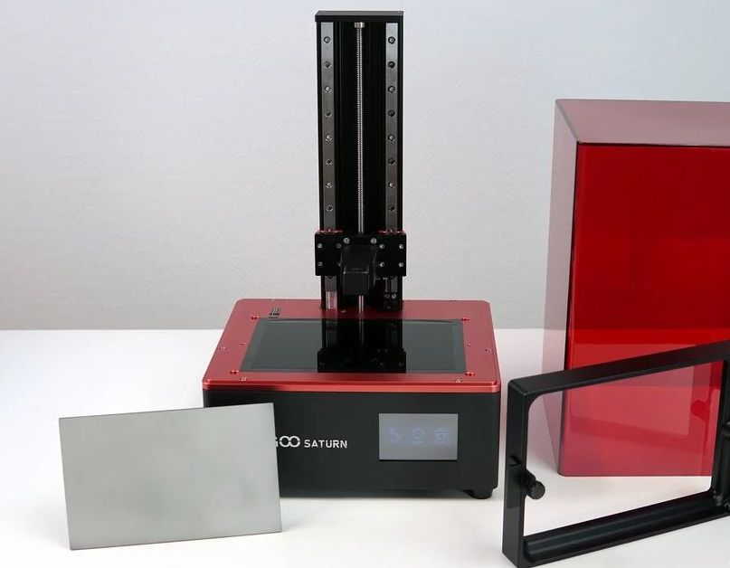
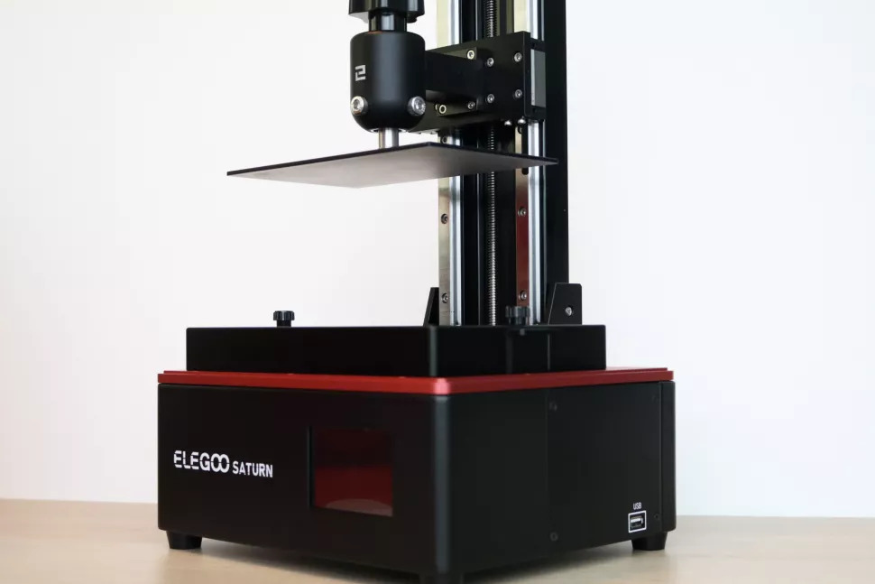
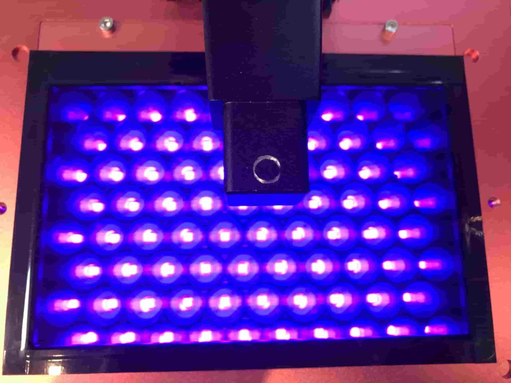
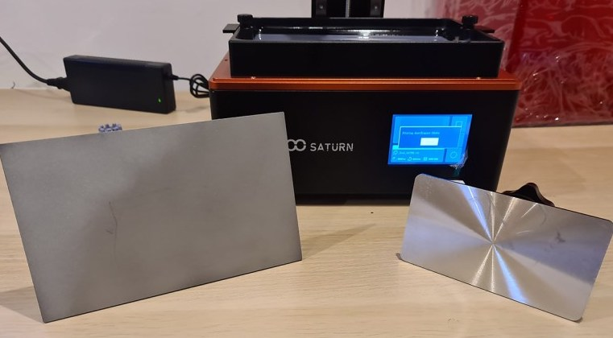
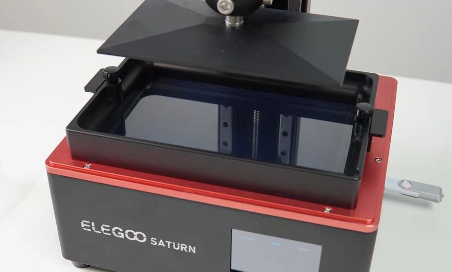
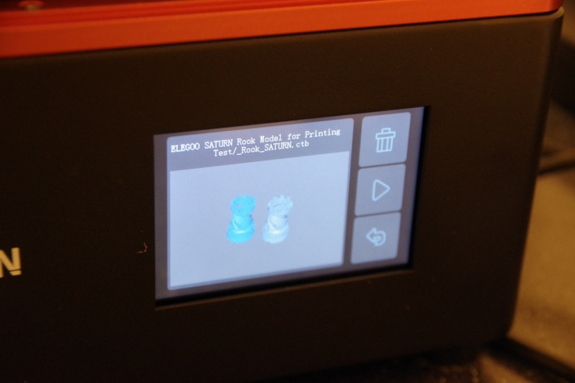
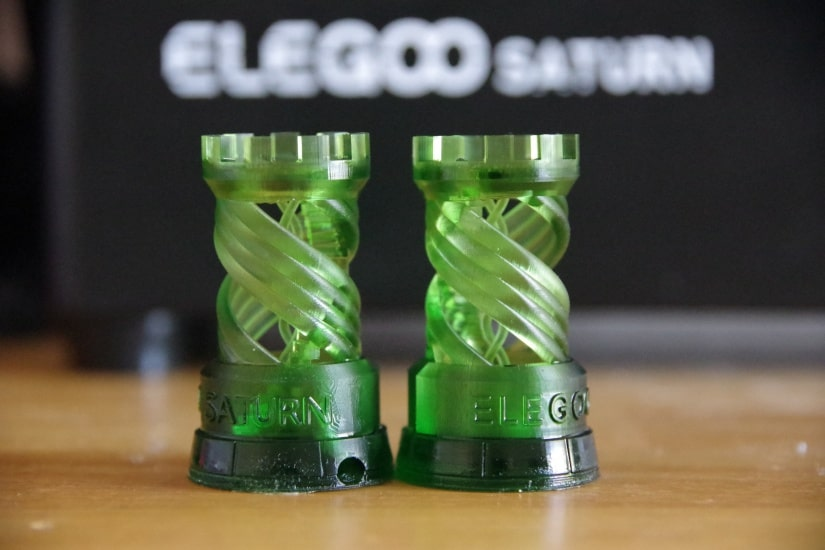
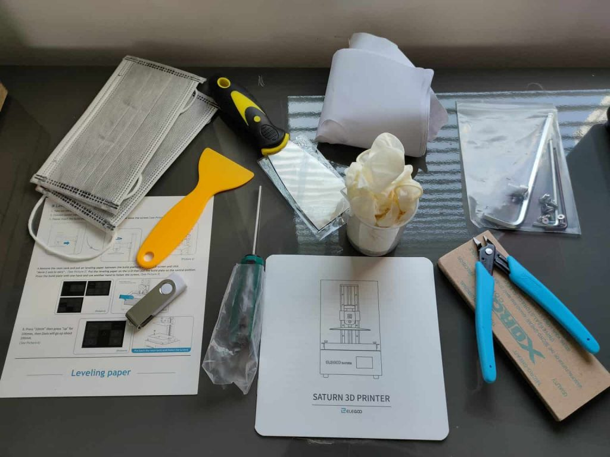
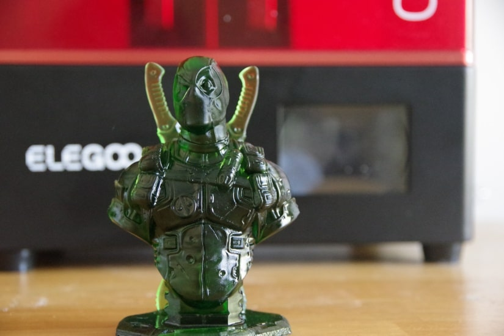
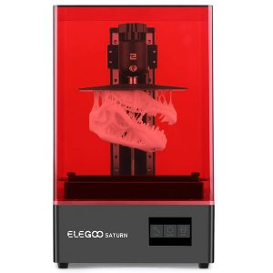

Dopo vari annunci, attese e ritardi è finalmente uscita sul mercato la nuova [**Elegoo** **Saturn**](https://amzn.to/3wEeDfU), una delle stampanti 3D più attese di casa Elegoo, dopo il grande successo della serie Mars.

Volendo **riassumere** in due parole le due **caratteristiche principali della Elegoo Saturn** potremmo dire che finalmente abbiamo una **stampante 3D a resina con un grande volume di stampa** e una **matrice con definizione 4K**. 

Se la recensione finisse qui sarebbe abbastanza scarsa e inutile, quindi andiamo con ordine e analizziamo le varie **caratteristiche** e **funzionalitá**, descrivendo quelli che, secondo me, sono i **pregi** e i **difetti** di questo nuovo modello.



## Caratteristiche principali

### Design e Struttura

Come tutte le stampanti 3D a resina della Elegoo la Saturn è una **stampante pronta all’uso**, dovrai solo togliere i vari imballaggi e avvitare e calibrare il piatto di stampa; anche un utente alle prime armi di solito è in grado di lanciare la prima stampa nel giro di una mezz’ora.

Anche se a prima vista può sembrare solo una versione ingrandita della Mars e Mars 2 Pro, la Elegoo Saturn nasconde una serie di migliorie interessanti, vediamole in dettaglio.

Per quanto riguarda il **design** e la **costruzione**, il **corpo della stampante** ha un’apparenza solida e compatta, con un ingombro di 280x240mm, è **interamente in metallo** e comprende uno **schermo frontale touch a colori da 3,5 pollici**, due **ventole posteriori** e una **porta USB** sul lato destro.

L’**aumento di dimensioni del volume di stampa** ha reso indispensabili una serie di **accorgimenti per migliorare la stabilità**, il principale dei quali è l'aggiunta di **due guide lineari**, che fiancheggiano la vite di comando dell’**_asse Z_** e muovono saldamente il piatto di stampa sue e giù lungo l’asse Z, durante il processo di stampa. Questo aumenta la **precisione di movimento** e, di conseguenza, la **qualità delle stampe**.

### Matrice LED e Risoluzione di Stampa 

L’upgrade piú notevole della Saturn rispetto ai vecchi modelli Mars è, come ho già accennato, la matrice LCD che proietta la luce per indurire la resina. **Elegoo Saturn** è dotata di una **matrice LCD monocromatica da 8,9 pollici (23 cm) con risoluzione 4K**.

Lo **schermo monocromatico** consente il **passaggio di una maggiore intensità di luce**, **riducendo i tempi di polimerizzazione dello strato fino a 1-2 secondi**, in contrasto con i probabili 6-8 secondi degli schermi non monocromatici montati su stampanti più economiche. In sintesi questa caratteristica porta alla Saturn una **velocità di stampa maggiore di oltre il 60%**, senza perdere in definizione.

A proposito della **risoluzione di stampa**, lo **schermo 4K** ha una **definizione di 3840 x 2400 pixel**, confrontandolo con lo schermo 2K del modello precedente sembrerebbe quasi il doppio dei pixel, ma in realtà **bisogna rapportare il numero dei pixel all’area di costruzione**.

Visto che l’**area di stampa della Saturn è di 192 x 120 mm**, si ottiene una **dimensione complessiva dei pixel X/Y** di **50 micron** (0,05mm). 

La **qualità di stampa** è quindi **comparabile con quella del modello precedente Mars 2 Pro**, che comunque era già ottima, però con un’area di stampa molto piú grande. 

Se l’area di stampa fosse rimasta la stessa avremmo avuto una risoluzione di meno di 20 micron, anche se penso che sarebbe stata difficile da apprezzare a occhio nudo.

Un ulteriore **vantaggio della matrice monocroma** è la sua **maggiore durata** nel tempo, rispetto agli schermi standard.

### Volume di Stampa e Piatto di stampa

Il **volume di stampa** della Saturn è di **192x120x200 mm**, **quasi tre volte più grande del volume dei precedenti modelli di Mars**, questo apre la possibilità di fare **stampe** decisamente più **grandi**, così come di **stampare** molti **più oggetti contemporaneamente**.

<figure>

<figcaption>

Piatto Elegoo Saturn vs piatto Elegoo Mars

</figcaption>

</figure>

Il **piatto di stampa** è di alluminio fresato, con una microlavorazione superficiale che permette un’ottima adesione dei pezzi, come già visto nei precedenti modelli.

### Serbatoio

Il **serbatoio** ha una **capacità aumentata**, per permettere di sopperire al maggior volume di stampa, è tenuto in posizione da manopoline a vite e si può **rimuovere dall’alto**, cosa molto più comoda rispetto allo scorrimento laterale delle versioni Mars. 

Ci sono inoltre **quattro protuberanze che sporgono sugli angoli inferiori**, tipo dei piedini, che permettono di **appoggiarlo** quando non è sulla stampante **senza timore di danneggiare la pellicola FEP** sul fondo, un accorgimento che trovo molto utile. La vasca presenta anche una **scanalatura ad un angolo per aiutare a versare la resina non utilizzata**, rendendo il processo un po’ meno complicato.

### Sistema di raffreddamento della matrice e Sistema di filtraggio fumi resina

Gli schermi LCD si deteriorano e durano meno se esposti al calore, per questo motivo l’Elegoo Saturn ha una **ventola aggiuntiva per raffreddare la macchina durante il funzionamento** che dovrebbe **allungare la vita utile del pannello monocromatico**, a scapito però della silenziosità durante il funzionamento. Non si arriva ai livelli di stampanti a filamento ma è un pochino più rumorosa delle Mars.

Purtroppo, probabilmente per l’ingombro interno dei componenti aggiuntivi, **manca il sistema di filtraggio dell’aria** che era stato inserito nella Mars 2 Pro.

Anche considerando aprendo la stampante per togliere il pezzo l’odore della resina comunque esce, personalmente trovavo molto utile il sistema di filtraggio con ventola e filtro a carboni attivi, per ridurre la fuoriuscita di vapori almeno durante la stampa.

Elegoo ha fatto sapere che ha intenzione di ri-aggiungerlo come aggiornamento separato in versioni successive, ad oggi non è così, aggiornerò la recensione nel caso succedesse.

### Schermo e connettivitá

Il **display** e il **software** sono del tutto simili a quelli delle versioni precedenti, con uno **schermo touch a colori da 3,5 pollici** e un’**ottima interfaccia utente** facile e intuitiva.

Si nota come il **software** sia stato progettato per essere il più possibile intuitivo e utile. Durante la stampa, ad esempio, viene visualizzato sullo schermo il layer in corso, la percentuale di stampa completata e il tempo totale e restante. Inoltre, se si mette **in pausa** la stampa **il piatto si solleva sopra la resina e permette di vedere praticamente da subito se i pezzi hanno aderito**. Questa funzione è molto utile soprattutto se si stanno utilizzando resine nuove o modelli molto lunghi per sapere da subito se il processo di stampa sta andando bene o se ci sono problemi.

La **presa USB** della stampante non trova pace e cambia ancora di posizione, sembra essere ormai una tradizione di Elegoo scegliere un lato nuovo della stampante a ogni modello. Siamo passati dalla terribile posizione sul retro della stampante della prima Mars, al pannello frontale nelle Mars Pro e 2 Pro (ottimale, secondo me), al lato destro per la Saturn, accettabile.

Oltre alla porta USB è presente anche una **presa Ethernet** sul retro, equipaggiata con un **hard disk integrato da 4 GB**, che consente il trasferimento rapido di file attraverso la rete locale, non molto utile a mio avviso per il singolo utente, ma sicuramente più utile in caso di attivitá professionali in cui ci siano molte stampanti in uso.

### Qualitá di stampa

Come già detto nel paragrafo che descrive la matrice LED, la **qualità di stampa** della [**Elegoo Saturn**](https://amzn.to/3wEeDfU) è del tutto **paragonabile a quella** della sua predecessora **Mars 2 Pro**, che è ottima, anche se le dimensioni del volume di stampa sono quasi triplicate.

La **matrice monocroma UV composta da 54 LED** ultravioletti garantisce un'**estrema uniformità della luce** e una **risoluzione** complessiva di **50 micron** (0,05mm), con un **tempo di cura di 1-2 secondi per strato**, è una delle stampanti più veloci e precise presenti sul mercato.

## Contenuto della scatola

La stampante viene spedita **ben imballata** tra **strati di schiuma di polietilene a prova di urto** in una scatola di cartone. 

**Oltre alla stampante**, all’adattatore e ai cavi di alimentazione **sono inclusi nella scatola**:

- **Raschietto di metallo** per rimuovere i pezzi stampati dal piatto di stampa
- **Raschietto di plastica** per rimuovere residui solidificati dalla membrana FEP
- **Cesoia** per rimuovere i supporti
- **Chiavi a brugola** e **viti** di ricambio
- **Istruzioni** per installare e calibrare il piatto di stampa
- Alcuni **imbuti di carta** per filtrate la resina
- **Guanti in lattice** e **mascherine**
- **Chiavetta USB** con una stampa di prova, il software di slicing Chitubox, una copia digitale del manuale di istruzioni.

Al momento **non è inclusa** nella scatola **una bottiglia di resina di prova**, anche se questo può variare col tempo, ti consiglio quindi di procurarti resina e alcool isopropilico insieme alla stampante, per poter avviare subito una prova di stampa.

## Tabella Pro/Contro

**👍 PRO**

- Grande volume di impressione
- Ottima definizione dei dettagli
- Velocitá di stampa
- Software intuitivo
- Ottimo rapporto qualitá prezzo
- Presa Ethernet per stampe in remoto
- Corpo in metallo con doppio binario lineare per l’asse Z

**👎 CONTRO**

- Manca il sistema di filtraggio dei fumi
- Le ventole di raffreddamento possono essere un po’ rumorose
- Difficile reperimento per l’acquisto

## Specifiche tecniche

- **Volume di stampa**: 192 x 120 x 200 mm 
- **Spessore dello strato**: 10 micron
- **Risoluzione XY**: 0.05 mm (3840 x 2400 pixels)
- **Accuratezza di posizionamento dell’asse Z**: 0,00125 mm
- **Velocitá di stampa**: 30-40 mm/h
- **Display**: touchscreen da 3,5 pollici
- **Materiale utilizzato**: Resina UV da 405 nm
- **Tipi di file utilizzati**: STL, SLC, OBJ
- **Connettività**: USB, Ethernet
- **Dimensioni della stampante**: 280 x 240 x 446 mm

## Elegoo Saturn - Verdetto finale

La mia **valutazione complessiva** sulla stampante 3D a resina [**Elegoo Saturn**](https://amzn.to/3wEeDfU) è **molto positiva**, la matrice 4K monocroma apporta un’**ottima qualità** ed una **elevata velocità di stampa** a fronte di un prezzo non bassissimo ma decisamente inferiore ad altre stampanti con le stesse caratteristiche. 

[VEDI DISPONIBILITÀ](https://amzn.to/3wEeDfU)

Una nota importante a proposito del **tempo di stampa** è che, a differenza delle stampanti a filamento dove se si vuole fare piú di un pezzo per volta i tempi si sommano, **nelle stampanti a resina si possono fare piú modelli in contemporanea perché la luce indurisce tutto quello che si trova nell’area di stampa allo stesso tempo**, quindi l’unica discriminante sui tempi è l’altezza dei pezzi lungo l’asse z.

In quest’ottica, il grande **volume di costruzione** della **Elegoo Saturn** le permette di non essere vincolata dai limiti della maggior parte delle stampanti 3D a resina di dimensioni standard, sia in termini di **dimensione** che di **numero** dei pezzi.

La **porta Ethernet** e i **4 GB di spazio di archiviazione** la rendono una buona opzione anche nel caso di servizi di stampa di tipo professionale.

Sarebbe stato bello avere anche un sistema di filtraggio dell’aria integrato, ma possiamo sperare che venga aggiunto nelle attualizzazioni successive.

Ciò detto, la qualità e la velocità di stampa sono molto simili a quelle della **[Elegoo Mars 2 Pro](https://amzn.to/2VMn6Rl)**, quindi se non hai (e non pensi di avere in futuro) necessità di un volume di stampa così grande, puoi risparmiare qualche centinaio di euro comprando la [Mars 2 Pro](https://amzn.to/2VMn6Rl). Se ti interessa una **recensione sulla Mars 2 Pro**, la puoi trovare [qui](/blog/elegoo-mars-vs-elegoo-mars-2-pro/).

[🫰Vedi Prezzo](https://amzn.to/3wEeDfU)
