In questo articolo ho pensato di fare un **elenco dei migliori siti gratuiti** che conosco per **scaricare gratuitamente progetti di stampa 3D** sia in formato STL che in altri formati di file. 

Di seguito troverai una tabella con la mia **selezione** dei vari siti, ho cercato di metterli in un **ordine di importanza decrescente** per quanto riguarda la **quantità e la qualità di modelli scaricabili**.

Ci sono sia raccolte di archivi **di modelli 3D con la possibilitá di fare ricerche** per tematica o parole chiave, che **siti che includono vetrine per la vendita di progetti di stampa**, quindi se sei un creatore di modelli questa potrebbe essere una buona occasione per mostrare il tuo lavoro e guadagnare qualche soldo in piú.

Oltre agli archivi ho pensato di mettere anche qualche **motore di ricerca specifico per i modelli di stampa 3D**, che ti permette di fare ricerche incrociate tra vari siti.

Dopo la tabella troverai una **breve descrizione di ciascun sito**, con **informazioni** sulla **dimensione del database** di file e della **tipologia di modelli** che ospita, se ad esempio sono piú indirizzati al gaming o invece alla divulgazione scientifica o professionale, per aiutarti nella scelta.

Se mi sono perso il tuo sito preferito per i download gratuiti o hai suggerimenti e correzioni, fammelo sapere nei commenti e aggiorneró l’articolo.



## 1 - Thingiverse

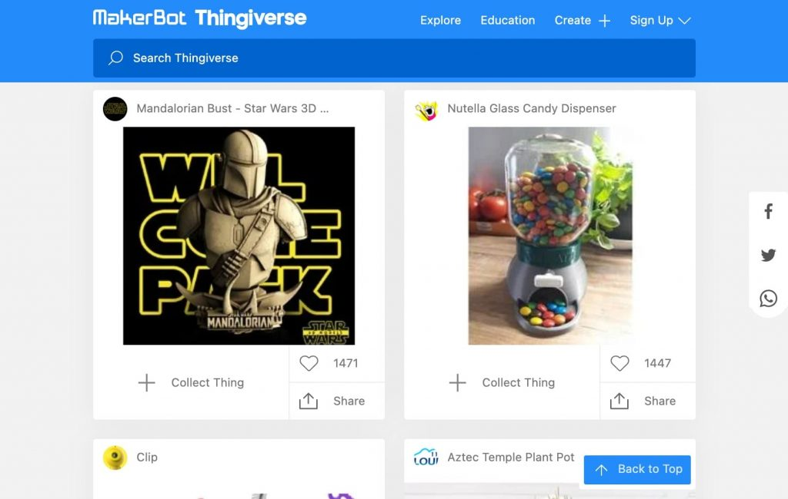

**Thingiverse** è il **maggiore database con collezione di modelli gratuiti che esista in rete**, sicuramente ne avrai sentito giá parlare, offre **piú di due milioni di file STL**.

Il sito ospita una **vasta community di creatori** che **offrono file gratuiti da scaricare** di varie categorie e complessitá, una volta effettuato l’accesso oltre a scaricare potrai anche condividere i tuoi progetti, se ti fa piacere farlo.

Il sito è gestito da MakerBot Industries, i costruttori delle serie di stampanti 3D Replicator e Method ed ha avuto un **restyling importante nel 2020** per migliorare sia il design che la velocità di ricerca.

Indirizzo del sito: [Thingiverse](https://www.thingiverse.com/)

## 2 - Cults

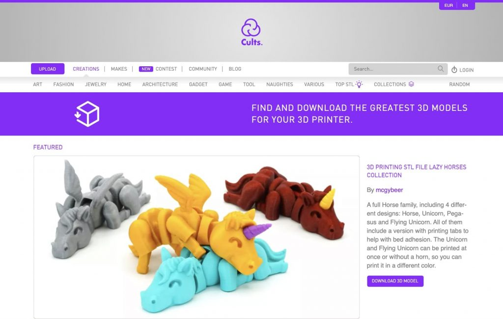

**Cults** é un **database di modelli 3D in parte gratis e in parte a pagamento**, su cui è possibile vendere le proprie creazioni. La qualità è di solito abbastanza alta e degli oltre 320.000 modelli presenti all’incirca la metà sono scaricabili gratuitamente.

Gli utenti possono inserire i designer preferiti in una lista e ricevere notifiche quando vengono pubblicati nuovi file.

Sono inoltre presenti, cosa molto interessante a mio avviso, collezioni di modelli basati su marchi famosi, come _hack_ IKEA, LEGO, GoPro o accessori per droni.

Indirizzo del sito: [Cults](https://cults3d.com)

## 3 - MyMiniFactory

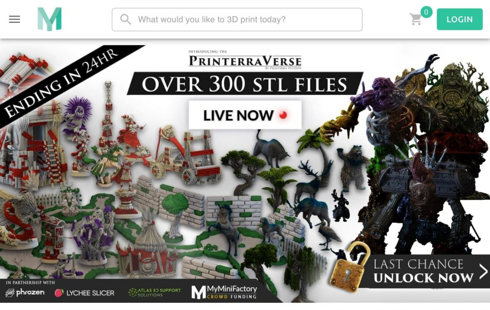

Anche **MyMiniFactory** funziona sia come **archivio di file sia gratis che a pagamento**, realizzati da designer professionisti, con più di 100.000 modelli orientati per la maggior parte su **giochi** e **cultura geek**. È uno dei siti migliori per scaricare **progetti per stampanti a resina**. Se ti interessa una recensione delle migliori stampanti a resina, la puoi trovare [qui](/blog/migliori-stampanti-3d-resina).

Indirizzo del sito: [MyMiniFactory](https://www.myminifactory.com)

## 4 - Pinshape

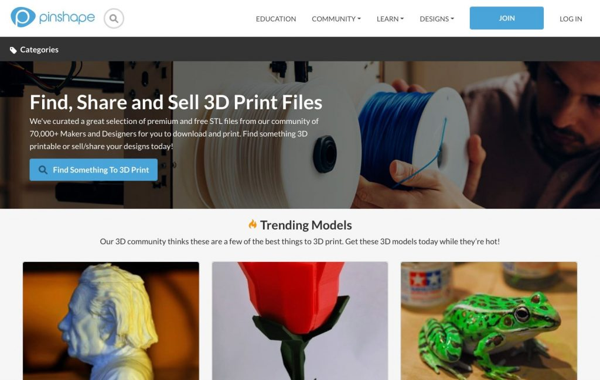

**Pinshape**, di proprietá della casa produttrice 3D Formlabs, offre una selezione di 60-70mila modelli e funziona sia come **database gratuito** che come **piattaforma per acquistare e vendere** modelli di stampanti 3D. È un sito interessante se cerchi file STL gratuiti per **giochi**, **miniature**, gioielli, moda e **gadget**.

Indirizzo del sito: [Pinshape](https://pinshape.com)

## 5 - CG Traider

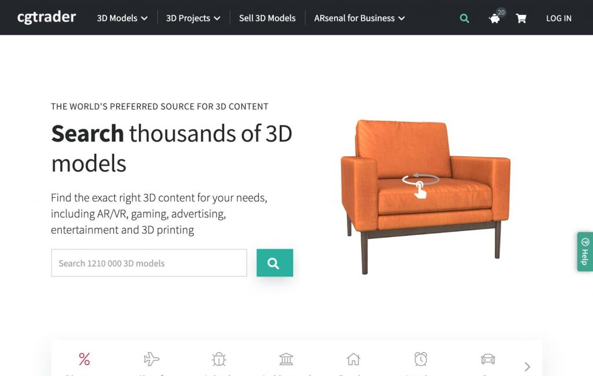

**CGTrader** piú che un archivio gratuito è un **mercato per l'acquisto e la vendita di progetti 3D e file CAD** con oltre un milione di files di cui un 300.000 sono descritti come stampabili in 3D.

La maggior parte è a pagamento ma si trovano anche abbastanza modelli scaricabili gratuitamente dopo la creazione di un account sul sito.

Indirizzo del sito: [CGTrader](https://www.cgtrader.com)

## 6 - TurboSquid

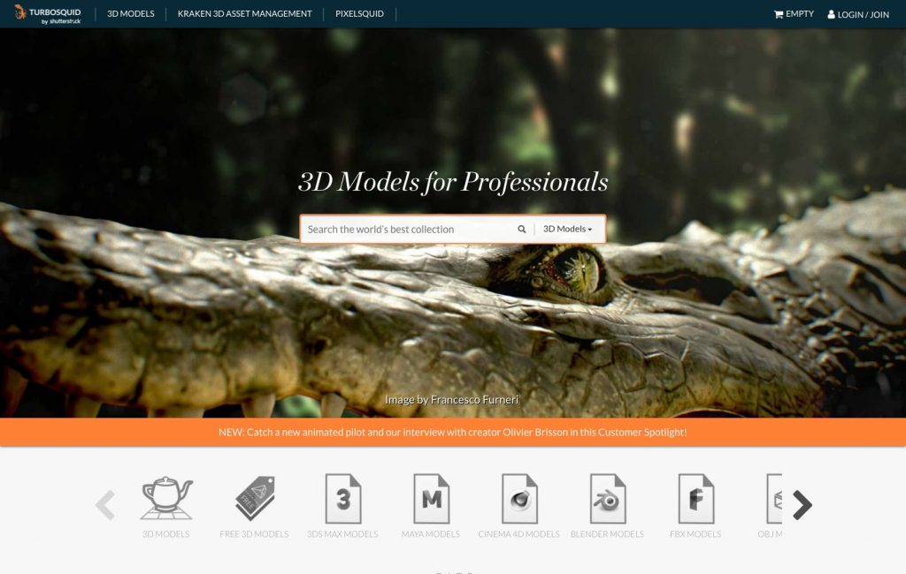

Un sito orientato più alla **diffusione di contenuti digitali** che alla stampa 3D, è però **totalmente gratuito** e presenta oltre 52.000 modelli 3D scaricabili tra i quasi un milione di modelli presenti. Per trovarli è possibile filtrare per tipo di file, selezionando la casella “STL” nella sezione “Formats” del menù.

Indirizzo del sito: [TurboSquid](https://www.turbosquid.com)

## 7 - 3DExport

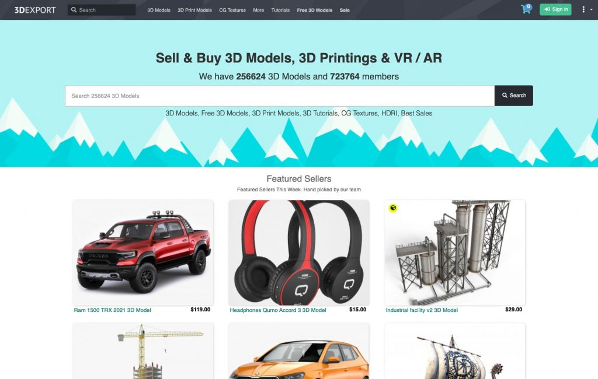

**3DExport** è principalmente un _**marketplace**_ a pagamento con **modelli di alta qualità** per designer professionisti e artisti 3D. È però possibile trovare una piccola selezione di modelli gratuiti, per la maggior parte mirati sulle categorie di gioielli e ornamenti.

Indirizzo del sito: [3DExport](https://3dexport.com)

## 8 - YouMagine

Storico sito web con **archivio di modelli 3D scaricabili gratuitamente** creato e gestito da Ultimaker, nota casa produttrice di stampanti e creatrice del software di slicing Cura, **Youmagine** offre più di 18.000 modelli gratuiti tra cui navigare.

Indirizzo del sito: [Youmagine](https://www.youmagine.com)

## 9 - PrusaPrinters

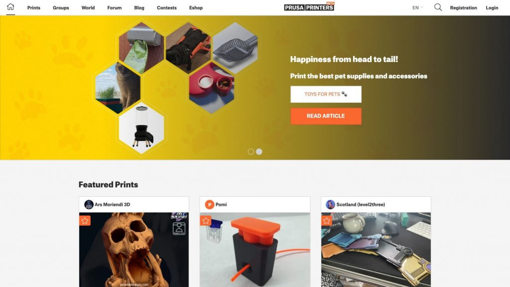

**PrusaPrinters**, dal creatore Josef Prusa che con la sua iconica Prusa i3 ha cambiato il concetto di stampanti 3D FDM, è un database totalmente gratuito di modelli 3D scaricabili. Contiene **più di 40.000 modelli gratuiti per stampanti a filamento** che possono essere scaricati come file STL.

Indirizzo del sito: [PrusaPrinters](https://www.prusaprinters.org)

## 10 - NIH 3D Print Exchange

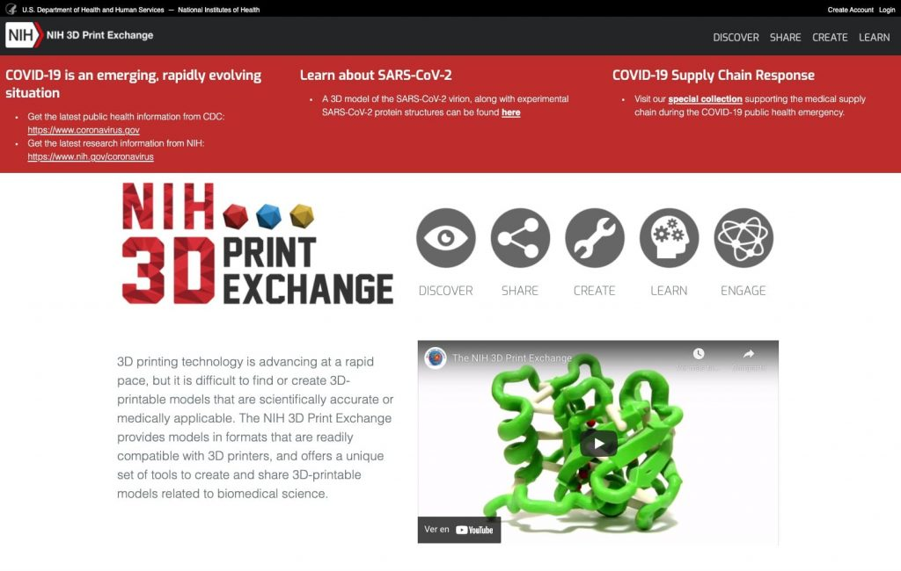

**NIH 3D Print Exchange** è una **piattaforma gratuita** per lo scambio, la condivisione e la distribuzione di **modelli 3D scientificamente accurati** dal punto di vista biologico, medico, tecnologico e di ingegneria. Offre una raccolta di più di 10.000 file STL che vanno dalla stampa di molecole e modelli biologici per uso didattico (c’è ad esempio una sezione sul COVID), alle neuroscienze e, persino, a protesi 3D a basso costo.

Indirizzo del sito: [NIH 3D Print Exchange](https://3dprint.nih.gov)

## 11 - NASA

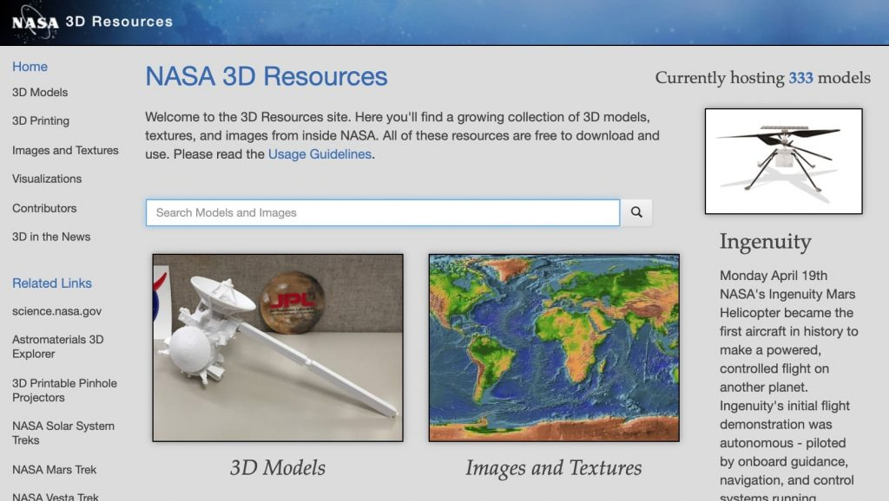

Un archivio piccolo, contiene poco più che un centinaio di modelli, ma molto interessante. Il sito, come si può intuire dal nome, è di proprietà della **NASA** e i file STL sono resi gratuitamente disponibili per scopi educativi. Potrai trovare il **modulo lunare Apollo**, il modellino del **Curiosity Rover** o anche modellini del sito di atterraggio dell’Apollo 11.

Indirizzo del sito: [NASA](https://nasa3d.arc.nasa.gov)

## 12 - Libre3D

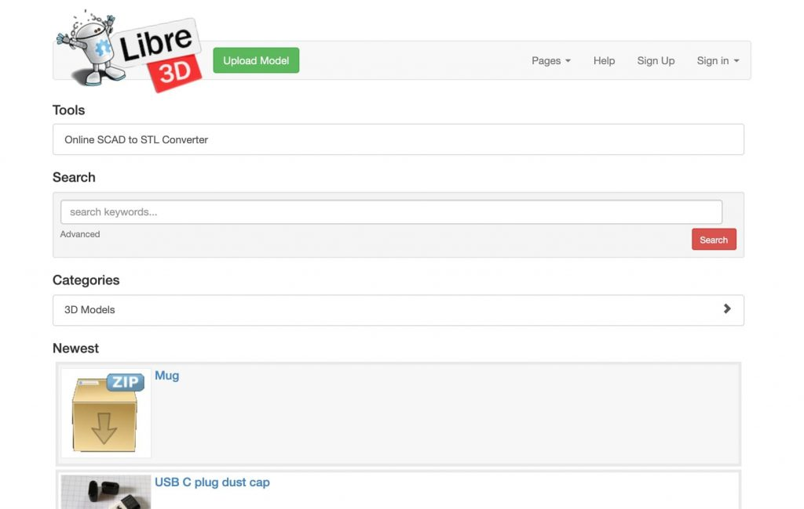

Come si può intuire dal nome, **Libre3D** è un archivio gratuito di file 3D orientato al movimento di stampa 3D **opensource**. Il sito è costituito da una community entusiasta che condivide e scambia informazioni e contiene anche un ottimo convertitore online gratuito di file da SCAD a STL. Libre3D offre una selezione di circa 500 modelli 3D in formato STL, liberamente scaricabili. 

Indirizzo del sito: [Libre3D](https://libre3d.com)

# Motori di Ricerca

Come ti dicevo all’inizio del paragrafo, ho pensato che fosse interessante includere anche qualche **sito di motori di ricerca specializzati in modelli di stampa 3D**. Questi siti non ospitano i modelli che ti propongono come risultati dalle ricerche ma ti possono indirizzare su uno o piú siti che li contengano, risparmiandoti la fatica di cercare su ognuno degli vari siti disponibili.

## 13 - Yeggi

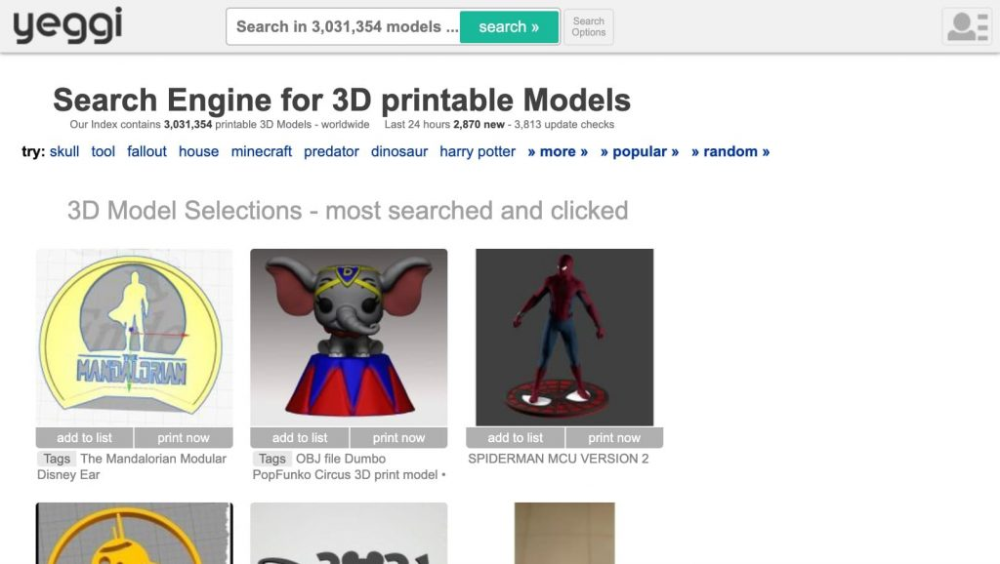

**Yeggi** è un **motore di ricerca** con un’interfaccia non curatissima ma molto efficiente. Immettendo una o più parole chiave esegue una scansione dei maggiori siti web di stampa 3D dove trovare **modelli gratuiti scaricabili** (la base di dati di ricerca dichiarata è di oltre tre milioni di modelli). È possibile anche accedere a una **sezione dei risultati più ricercati e cliccati** che permette di avere un’idea sulle ultime tendenze o modelli che interessano la comunità di makers.

Indirizzo del sito: [Yeggi](https://www.yeggi.com)

## 14 - Thangs

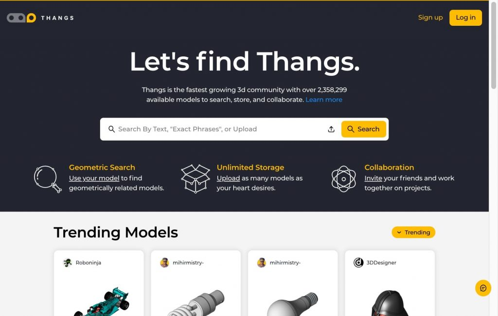

Efficiente **motore di ricerca** che attraverso parole chiave offre risultati di modelli gratuiti, **Thangs** ha in aggiunta una **funzione** interessante, che è quella di **trovare modelli 3D geometricamente correlati** attraverso un complicato algoritmo di ricerca.

È inoltre possibile invitare amici a lavorare insieme su progetti comuni.

Indirizzo del sito: [Thangs](https://www.thangs.com)

## 15 - STLFinder

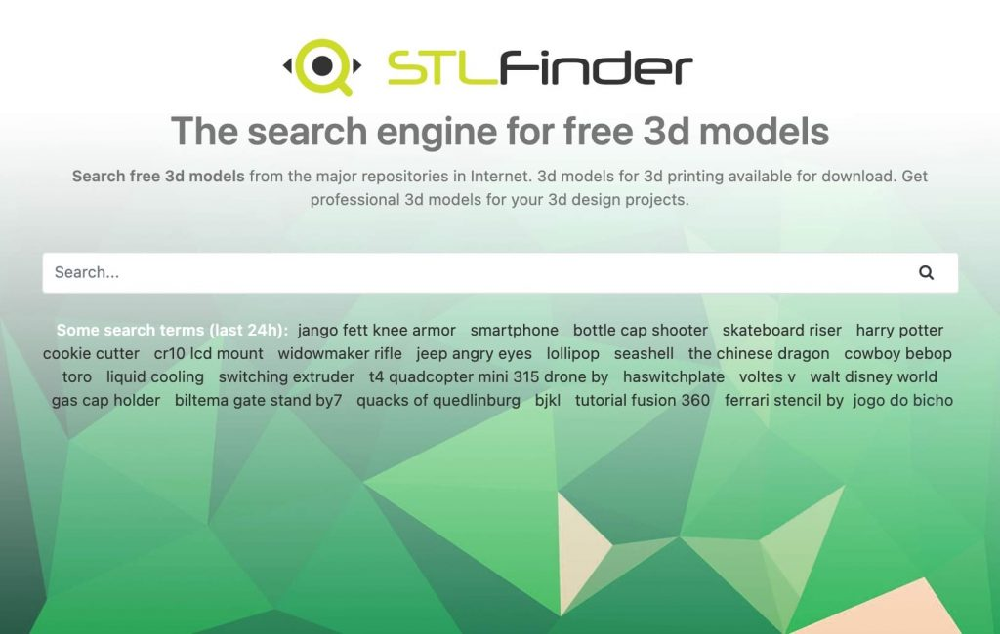

**STLFinder** è un **motore di ricerca** per file STL e modelli di stampa 3D, come si può facilmente intuire dal nome, che presenta l’opzione di filtrare tra file gratuiti e a pagamento. 

Indirizzo del sito: [STLFinder](https://www.stlfinder.com)
