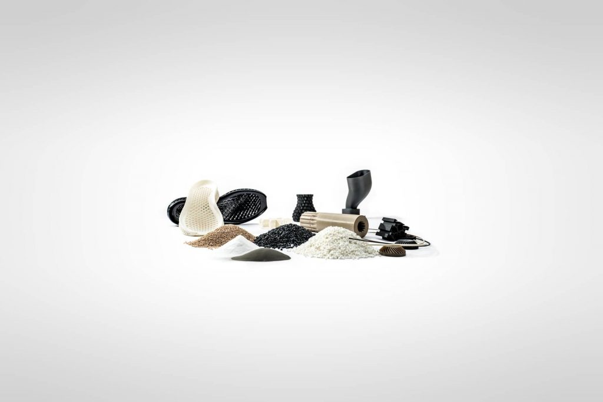
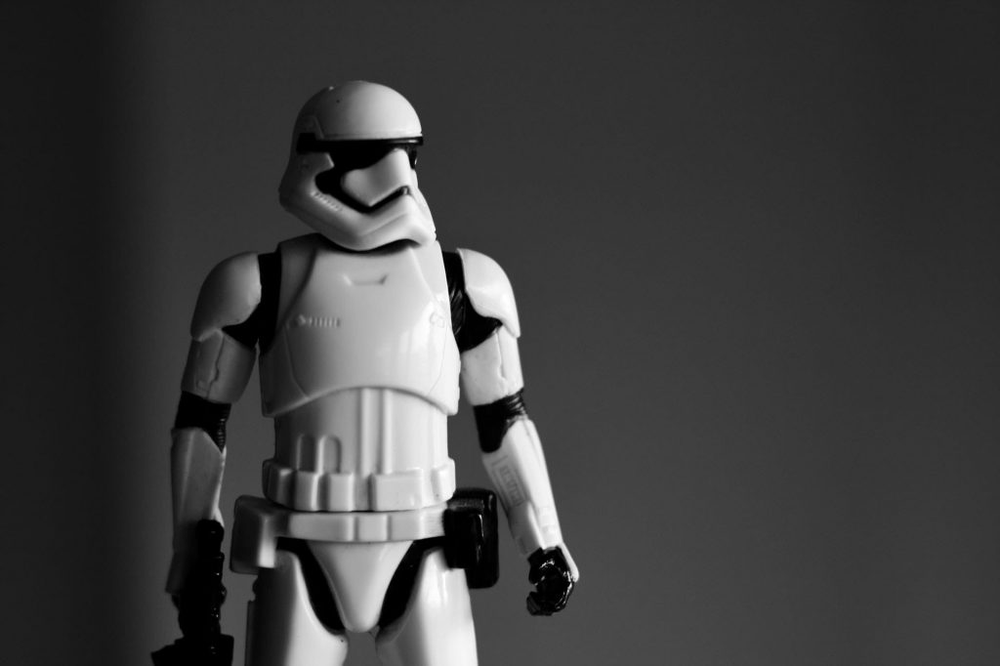
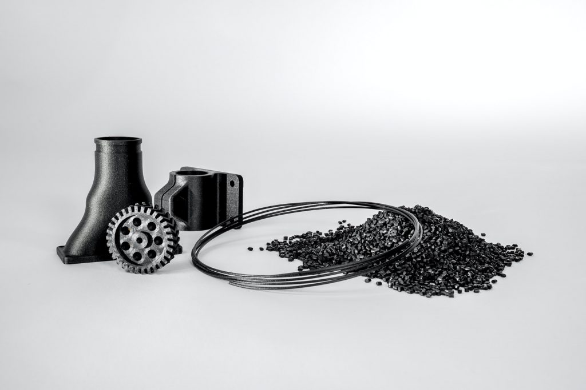

#### conosciamoci

# su di me

* * *

#### TECNOLOGIA, CREATIVITÀ

## CHI SONO

Benvenut@ su Model to Real!

Sono Alex e sono da sempre appassionato di **tecnologia**. Al tempo stesso mi piace **creare** e **sperimentare**. Nelle **stampanti 3D** ho trovato il connubio perfetto tra tecnologia e creatività.

Quando ho iniziato, mi sono trovato in difficoltà a destreggiarmi in questo nuovo mondo e ho pensato di raccogliere le mie conoscenze e la mia esperienza in un blog di modo che potesse essere di aiuto a più persone.

Questo sito è nuovo ed in continuo aggiornamento. Il contenuto crescerà col tempo, ti invito a tornarci di tanto in tanto.

Spero che ti sia utile, buona lettura :)

[contattami](mailto:toraeden@gmail.com)

## Una collezione delle GUIDE COMPARATIVE

Cerco di dare una visione complessiva di ogni prodotto, facendo uno studio approfondito e analizzando ogni dettaglio, nelle guide fornisco il riassunto esaustivo delle caratteristiche più importanti, ma con un linguaggio chiaro ed accessibile anche ai principianti. Questa collezione di guide comparative ti aiuterà a scegliere il prodotto migliore per le tue esigenze.

[**VAI ALLE GUIDE**](/tag/guide-comparative-stampanti-3d/)
